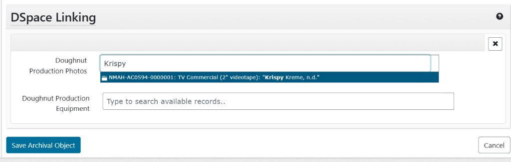

# **Bidirectional Linking Between ArchivesSpace and Dspace**

## Technical Specification

*Linking DSpace Digital Object records to ArchivesSpace finding aid components*

Document Status: DRAFT  
Version: 0.4  
Date: July 2026  
Source Stories: [A1](https://github.com/lyrasisorghome/InteroperabilityProject/issues/7) and [A2](https://github.com/lyrasisorghome/InteroperabilityProject/issues/44)  
Project: LYRASIS Interoperability Project  
Systems: ArchivesSpace SUI, ArchivesSpace PUI, DSpace REST API (7.x / DSpace 9.x contract), ArchivesSpace REST API

# **Table of Contents** {#table-of-contents}

[Table of Contents](#table-of-contents)

[Purpose and Scope](#purpose-and-scope)

[Background](#background)

[Normative references](#normative-references)

[Stakeholders and Roles](#stakeholders-and-roles)

[System Overview](#system-overview)

[DSpace Linking UI](#dspace-linking-ui)

[Feature Modes](#feature-modes)

[Metadata Mappings](#metadata-mappings)

[DSpace API Operations](#dspace-api-operations)

[Linking Specifications](#linking-specifications)

[End-to-end flows](#end-to-end-flows)

[Algorithms](#algorithms)

[Behavior Scenarios](#behavior-scenarios)

[Error Scenarios](#error-scenarios)

[User Configuration Requirements](#user-configuration-requirements)

[User Interface Requirements](#user-interface-requirements)

[Open Questions and Specification Gaps](#open-questions-and-specification-gaps)

# **Purpose and Scope** {#purpose-and-scope}

This specification defines the functional and behavioral requirements for an ArchivesSpace Staff UI (SUI) feature that enables staff users to search DSpace and associate selected DSpace items with ArchivesSpace archival objects under a host **Resource** or **Archival Object** record. Linking is bidirectional: ArchivesSpace **finds or creates** a Digital Object (Identifier = File URI = DSpace public URI; clickable File Version on create) and links it to the child archival object(s); the corresponding DSpace item receives an ArchivesSpace URI. Multiple archival objects may share one Digital Object.

The feature lives as a new section under **Instances**, tentatively named **DSpace Linking**, and offers two complementary search/association modes that may be used together in one edit session. Persist happens when the staff user clicks the host record's native **Save Archival Object** / **Save Resource**; until then, selections are held only in the open form.

Out of scope for this specification: changes to the DSpace data model, discovery layer integrations, batch import via spreadsheet, use of legacy/EOL APIs, standalone Digital Object edit screens, Digital Object Components, background-job orchestration of the link write (may be introduced later; see [jobs_example](https://github.com/archivesspace/archivesspace/tree/81f7c21b7c249f7d6438d3f2d9583aa501cb5762/plugins/jobs_example)), or any administrative workflow not triggered from within the ArchivesSpace SUI.

# **Background** {#background}

Staff who manage digitized and born-digital archival collections in DSpace need to reflect those digital objects in ArchivesSpace finding aids so that end users can see what is available online and access it directly. The reverse is also true: DSpace records benefit from links back to ArchivesSpace, which carries richer, more accurate archival description (context, relationships, provenance) than DSpace's bibliographic model can accommodate.

Current workarounds are manual and error-prone:

* Copying and pasting URIs one by one between systems.  
* Exporting links from DSpace, reformatting them to the ArchivesSpace Digital Object specification, and batch-importing via a spreadsheet importer.  
* The reverse path – getting the ArchivesSpace URI into DSpace – has no defined current workflow.

This feature replaces those workarounds with a **DSpace Linking** section on the host Resource or Archival Object edit view. Staff search DSpace (typeahead per child, and/or collection-scoped search with drag-and-drop), maintain provisional links next to immediate child archival objects, then save the host record to **find-or-create** ArchivesSpace Digital Objects, attach instance links, and write ArchivesSpace URIs back to DSpace. Organizations without a shared discovery layer are the primary beneficiaries, though the feature is useful for any institution maintaining both systems.

UI and host-record patterns are aligned with lessons from A3–4 (SWORD deposit): host record = Resource or Archival Object; child list under Instances; Identifier + File Version required for a clickable PUI link.

# **Normative references** {#normative-references}

* [DSpace REST API intro](https://wiki.lyrasis.org/spaces/DSDOC9x/pages/379126848/REST+API)  
* [DSpace RestContract](https://github.com/DSpace/RestContract/blob/main/README.md)  
* [DSpace search endpoint](https://github.com/DSpace/RestContract/blob/main/search-endpoint.md)  
* [DSpace metadata PATCH](https://github.com/DSpace/RestContract/blob/main/metadata-patch.md)  
* [ArchivesSpace API](https://archivesspace.github.io/archivesspace/api/)

# **Stakeholders and Roles** {#stakeholders-and-roles}

## User Narratives {#user-narratives}

1. I created a finding aid in ArchivesSpace for a collection that has a small number of archival objects associated with it. I deposited the digital content to DSpace already. Now I need to put the DSpace URI in ArchivesSpace, and add the ArchivesSpace URI to DSpace.  
2. A patron requested digitization of one folder of a collection, and our digitization unit has completed digitization and deposited the content to DSpace. From a parent Resource or Archival Object, I need to link several child components to their DSpace items in one edit session.  
3. I need to configure my ArchivesSpace repository to connect with a DSpace repository. My institution may host several DSpace and ArchivesSpace repositories.

| Role | Responsibility in This Feature | Notes |
| :---- | :---- | :---- |
| ArchivesSpace Administrator | Configures the DSpace integration settings per repository. | Must also hold Collection Administrator level access in DSpace. |
| ArchivesSpace Staff User | Searches for DSpace items and maintains links from the host-record SUI. | Uses Mode A (typeahead) and/or Mode B (collection search + drag-and-drop). |
| ArchivesSpace End User (PUI) | Views finding aid records with links to digital content. | Does not interact with the integration directly. |
| DSpace Collection Administrator | Provides configuration details; owns records that receive ArchivesSpace URI links. |  |
| DSpace service account | Single shared DSpace service user; makes authenticated API calls on behalf of any ArchivesSpace staff user (G-03). | Per-user DSpace identity / OnBehalfOf out of scope |

# **System Overview** {#system-overview}

The integration operates as a plugin or extension within the ArchivesSpace Staff User Interface (SUI). It communicates outbound with a configured DSpace instance via the DSpace REST/Search API v7 (DSpace 9.x RestContract). Earlier versions of the DSpace REST API will not be supported. No middleware or separate service is required; all orchestration occurs within the ArchivesSpace application layer.

**Starting point — a Resource or an Archival Object (host record):** the feature is available only on the staff edit view of a **Resource** or an **Archival Object**. Both expose the same **Instances** group and sit on the same resource tree. The term **host record** means "the Resource or Archival Object currently being edited." For a **Resource**, immediate children are its **top-level Archival Objects**; for an **Archival Object**, immediate children are its **child Archival Objects**. The feature is **not** available on standalone Digital Object edit views, and Digital Object Components are out of scope.

| Component | Role | Development Interface |
| :---- | :---- | :---- |
| ArchivesSpace SUI | Staff-facing interface; hosts the **DSpace Linking** section under Instances, and the repository configuration UI. | Browser / ArchivesSpace plugin framework |
| ArchivesSpace PUI | Public-facing finding aid interface; displays clickable File Version links created by this feature. | ArchivesSpace indexing pipeline |
| DSpace REST API | Search (items/collections) and metadata PATCH to write the ArchivesSpace URI onto the DSpace item. | HTTPS / JSON (DSpace REST API) |

## DSpace Linking UI {#dspace-linking-ui}

Under **Instances** on the host record, the plugin adds a section tentatively named **DSpace Linking**. The section contains two panels that work together; both Mode A and Mode B feed the same provisional link state.

### Panel: New DSpace Links

Lists every **immediate child archival object** of the host record. Each row shows the child title (or display string) and an input that can hold a provisional link to one DSpace item.

* Inputs reuse or extend ArchivesSpace's existing token/search linker pattern (the component used when linking archival objects to digital objects internally): type-to-search, select a result, clear (X) a selection.
* Leaving a row empty means that child is skipped on Save.
* It is valid to save with **no** provisional links maintained; the plugin then does nothing.

**Mode A — typeahead search (per child input):**

1. The staff user types in any child input.
2. After a short debounce pause, the plugin searches DSpace using the typed text as `query` (items; first page / top N results — see G-20).
3. A dropdown lists matching DSpace items (title/handle highlights as available).
4. Selecting a result maintains that DSpace item as the provisional link for that child; the dropdown closes. **Nothing is persisted yet.**

Mockup (Mode A typeahead on New DSpace Links):



### Panel: DSpace Search

Supports **Mode B — collection-scoped search with drag-and-drop**:

| Control | Required | Behavior |
| :---- | :---- | :---- |
| Collection | Yes | Select populated from `GET /api/discover/search/objects?dsoType=collection`. Chosen UUID becomes `scope` on item search. |
| Query | Yes (for Search) | Free-text query string. |
| Search | — | Runs `GET /api/discover/search/objects?dsoType=item&query={query}&scope={collectionUuid}` (plus paging params). |

Results render in this panel. The staff user may **drag** an individual result onto a New DSpace Links input; that creates the same provisional link state as Mode A selection. Mode A and Mode B are **both available and not mutually exclusive** in one session.

### Clearing and saving

* **Clear:** X on a maintained link returns that input to empty.
* **Save:** Clicking **Save Archival Object** / **Save Resource** on the host record begins the linking process for every child that still has a provisional DSpace link. Children without a selection are skipped.

## Feature Modes {#feature-modes}

Both modes share configuration, DSpace session bootstrap, and the same Save → LinkBatch path.

| Mode | Where | How a link is chosen | Persist |
| :---- | :---- | :---- | :---- |
| **A — Typeahead** | New DSpace Links input next to a child AO | Debounced DSpace item search from typed text; select from dropdown | Host-record Save |
| **B — Collection search + drag-and-drop** | DSpace Search panel → drop onto a New DSpace Links input | Required Collection (`scope`) + Query; drag result onto a child input | Host-record Save |

## Metadata Mappings {#metadata-mappings}

When Save resolves links, each distinct DSpace item's public URI is the Digital Object Identifier. **Create** writes that URI to **both** required/link fields; **reuse** is link-only (G-04):

| ASpace Digital Object Field | DSpace source / value | Repeatable? | Notes |
| :---- | :---- | :---- | :---- |
| Title | `dc.title` (or child AO display string fallback) | No | Prefer DSpace title when present |
| Identifier (`digital_object_id`) | Public DSpace item URI (e.g. `{baseUrl}/handle/{handle}`) | No | **Required** on create; canonical location |
| File Version → File URI (`file_uri`) | **Same URI as Identifier** | No | Required so the PUI shows a clickable "view online" link (Identifier alone is plain text) |
| Languages | `dc.language` | Yes | See G-27 |
| *(DSpace side)* configured AS URI field (default `dc.identifier.uri`) | ArchivesSpace public URI of the new DO (or configured source) | Yes | Written via PATCH after AS create |

Optional/extra Digital Object fields from DSpace metadata remain subject to G-16.

## DSpace API Operations {#dspace-api-operations}

See also:

[https://wiki.lyrasis.org/spaces/DSDOC9x/pages/379126848/REST+API](https://wiki.lyrasis.org/spaces/DSDOC9x/pages/379126848/REST+API) 

[https://github.com/DSpace/RestContract/blob/main/README.md](https://github.com/DSpace/RestContract/blob/main/README.md) 

| Operation | DSpace Endpoint | Outcome |
| :---- | :---- | :---- |
| CSRF token GET | /api/security/csrf  | Gets an initial CSRF Token for API usage for a specific session |
| Log in POST | /api/authn/login | Login via a DSpace service user with JSON Web Token & refresh the CSRF token |
| Log out POST | /api/authn/logout | Log out with DSpace service user |
| Search GET | /api/discover/search/objects | Search items and collections. Mode A: `dsoType=item&query=…`. Mode B collections: `dsoType=collection`. Mode B items: `dsoType=item&query=…&scope={collectionUuid}`. |
| Items PATCH | items/\<uuid\> (op: add, path:/metadata/dc.identifier/-/uri/-) | Use add operation to add DSpace links. See also G-09 |

## Linking Specifications {#linking-specifications}

## Actors {#actors}

![][image1]

| Actor | Role |
| :---- | :---- |
| **Link orchestrator** | Integration code (AS plugin or external service) that sequences API calls. |
| **AS REST API** | Source of truth for digital object records. |
| **DSpace REST API** | Search target; receives AS URI via metadata PATCH. |

### Configuration (minimum)

Stored per AS repository (same model as A1):

| Key | Example | Used for |
| :---- | :---- | :---- |
| `dspace.base_url` | `https://dspace.example.edu/server` | DSpace API root |
| `dspace.service_user` / `password` | — | DSpace auth |
| `dspace.as_uri_field` | `dc.identifier.uri` | DSpace metadata field for AS link |
| `dspace.as_uri_source` | `digital_object` \| `archival_object` | Which AS URI to write. If `archival_object`, multiple AOs sharing one DO may yield multiple URI values on the same DSpace item (accepted). Preferring `digital_object` only may replace this setting later. |
| `dspace.default_scope` | collection UUID (optional) | Default Discovery `scope` param |
| `as.public_base_url` | `https://as.example.edu` | PUI base for public URIs |

### Data contracts

#### **LinkMap (built on Save from provisional UI state)**

On Save, the plugin reads every New DSpace Links row that still has a maintained DSpace selection (empty rows omitted). **No LinkMap duplicate rejection:** the same DSpace item may be selected for multiple child archival objects in one Save; those children will share one ArchivesSpace Digital Object (G-04).

Processing has two phases:

1. **Resolve Digital Objects** — for each **distinct** DSpace public item URI, **search the ArchivesSpace repository** for a Digital Object whose Identifier (`digital_object_id`) equals that URI. If none, **create** one (Identifier = File URI = that URI). If found, **reuse as-is (link-only)** — do not refresh title or File Versions.
2. **Build link rows** — map each child archival object → the resolved (found or newly created) Digital Object, then attach digital-object instances and PATCH DSpace.

If there are no provisional selections, the plugin performs **no** AS or DSpace writes.

```json
{
  "repository_id": 1,
  "host_ref": "/repositories/1/archival_objects/10",
  "links": [
    {
      "as_ref": "/repositories/1/archival_objects/11",
      "dspace_item_href": "/api/core/items/9f3288b2-f2ad-454f-9f4c-70325646dcee",
      "digital_object_ref": "/repositories/1/digital_objects/55",
      "do_was_created": true,
      "publish": false
    },
    {
      "as_ref": "/repositories/1/archival_objects/12",
      "dspace_item_href": "/api/core/items/9f3288b2-f2ad-454f-9f4c-70325646dcee",
      "digital_object_ref": "/repositories/1/digital_objects/55",
      "do_was_created": false,
      "publish": false
    }
  ]
}
```

| Field | Required | Description |
| :---- | :---- | :---- |
| `repository_id` | yes | AS repository numeric ID |
| `host_ref` | yes | AS URI of the host Resource or Archival Object being saved |
| `links[].as_ref` | yes | AS URI of the **child archival object** receiving the Digital Object instance |
| `links[].dspace_item_href` | yes | DSpace item self link from search |
| `links[].digital_object_ref` | yes (after resolve) | AS URI of the found or newly created Digital Object |
| `links[].do_was_created` | no | `true` if created this Save; `false` if reused |
| `links[].publish` | no | If true, publish the DO / instance after successful link |

**Sharing rule (G-04):** Many archival objects MAY reference the same Digital Object. One DSpace public URI maps to at most one Digital Object Identifier in the repository (find-or-create). There is **no** requirement that `as_ref` or `dspace_item_href` be unique within a LinkMap.

#### **SearchResultItem (extracted from DSpace search)**

From `GET /api/discover/search/objects`:

```json
{
  "dspace_item_uuid": "9f3288b2-f2ad-454f-9f4c-70325646dcee",
  "dspace_item_href": "/api/core/items/9f3288b2-f2ad-454f-9f4c-70325646dcee",
  "name": "test result",
  "handle": "10673/4",
  "dso_type": "item"
}
```

Extraction rule:

```
uuid  ← _embedded.indexableObject.uuid
href  ← _links.indexableObject.href
name  ← _embedded.indexableObject.name
handle← _embedded.indexableObject.handle (if present)
```

#### **Field mapping (DSpace item → AS digital object)**

Applied **only when creating** a new Digital Object (not when reusing an existing one — link-only, G-04):

| AS field | DSpace source | Notes |
| :---- | :---- | :---- |
| `title` | `metadata.dc.title[0].value` | Fallback: child AO `display_string` (first AO that triggered create is fine) |
| `digital_object_id` | Public item URI (e.g. `{baseUrl}/handle/{handle}`) | **Required**; same value as `file_uri`; repo-wide unique key for find-or-create |
| `file_versions[].file_uri` | **Same public item URI as Identifier** | Required for clickable PUI link |
| `lang_materials[].language_and_script.language` | `metadata.dc.language[*].value` | Optional; map ISO codes (G-27) |

### DSpace API operations

#### **Session bootstrap**

![][image2]

| Step | Method | Endpoint | Notes |
| :---- | :---- | :---- | :---- |
| 1 | GET | `/api/security/csrf` | Capture `X-CSRF-TOKEN` |
| 2 | POST | `/api/authn/login` | Basic auth; capture JWT |
| 3 | POST | `/api/authn/logout` | End session (optional) |

#### **Search objects**

**Endpoint:** `GET /api/discover/search/objects`

| Parameter | Example | Purpose |
| :---- | :---- | :---- |
| `query` | `test` / typed Mode A text | Solr query string |
| `dsoType` | `item` \| `collection` | Mode A/B item search uses `item`; Collection select uses `collection` |
| `scope` | `{collectionUuid}` | **Required for Mode B** item search; optional elsewhere |
| `page`, `size` | `0`, `20` | Pagination / top N (G-20) |

#### **Example request:**

```
GET /api/discover/search/objects?query=test&dsoType=item&page=0&size=20
Authorization: Bearer {jwt}
```

#### **Example response** (abbreviated; matches RestContract)**:**

```
{
  "query": "test",
  "_embedded": {
    "searchResults": {
      "_embedded": {
        "objects": [
          {
            "hitHighlights": {
              "dc.description.abstract": "test result"
            },
            "_links": {
              "indexableObject": {
                "href": "/api/core/items/9f3288b2-f2ad-454f-9f4c-70325646dcee"
              }
            },
            "_embedded": {
              "indexableObject": {
                "uuid": "9f3288b2-f2ad-454f-9f4c-70325646dcee",
                "name": "test result",
                "handle": "10673/4"
              }
            }
          }
        ]
      },
      "page": { "size": 20, "totalElements": 1, "totalPages": 1, "number": 0 }
    }
  }
}

```

#### **Resolve item metadata**

```
GET /api/core/items/{uuid}
Authorization: Bearer {jwt}
```

Use full `metadata` map for field mapping and to build public item URI.

#### **Write AS URI to DSpace**

```
PATCH /api/core/items/{uuid}
Authorization: Bearer {jwt}
X-CSRF-TOKEN: {token}
Content-Type: application/json
If-Match: {etag from GET item}

[
  {
    "op": "add",
    "path": "/metadata/dc.identifier.uri/-",
    "value": {
      "value": "https://as.example.edu/repositories/1/digital_objects/1"
    }
  }
]
```

### ArchivesSpace API operations

**Important:** AS has **no PATCH**. Updates use `POST/repositories/:repo_id/digital_objects/:id` with a **full** JSONModel body. Always `GET` → merge → `POST`.

#### **Session**

```
POST /session
Content-Type: application/json

{"user": "...", "password": "..."}
```

Response header: `X-ArchivesSpace-Session` — send on all subsequent requests.

#### **Link mode: `append_file_version` (existing digital object)**

Your example targets `/repositories/1/digital_objects/1`.

![][image3]

#### **GET digital object:**

```
GET /repositories/1/digital_objects/1
X-ArchivesSpace-Session: {session}
```

#### **POST update** (minimal delta shown; payload must include full record):

```
{
  "jsonmodel_type": "digital_object",
  "title": "Existing title",
  "digital_object_id": "DO-001",
  "file_versions": [
    {
      "jsonmodel_type": "file_version",
      "file_uri": "https://dspace.example.edu/handle/10673/4",
      "publish": true,
      "xlink_actuate_attribute": "onRequest",
      "xlink_show_attribute": "new"
    }
  ]
}
```

```
POST /repositories/1/digital_objects/1
X-ArchivesSpace-Session: {session}
Content-Type: application/json
```

### **Link mode: find-or-create Digital Object (primary Save path)**

Used when Save resolves a DSpace public URI to an ArchivesSpace Digital Object for one or more child archival objects.  
![][image4]

1. **Find** (repo-wide): search Digital Objects in the repository where Identifier (`digital_object_id`) equals the DSpace public item URI.
2. **If found:** reuse that Digital Object **link-only** — do not update title or File Versions (G-04).
3. **If not found — Create:**

```
POST /repositories/1/digital_objects
X-ArchivesSpace-Session: {session}
```

Body includes:

* `title` from DSpace (or a child AO display string)
* `digital_object_id` = public DSpace item URI (**required**)
* `file_versions[0].file_uri` = **the same URI** (so the PUI renders a clickable link)

4. **Link:** attach the found or created DO as a digital-object **instance** on each selected child archival object (`links[].as_ref`). Multiple children MAY share the same DO.

> **Note:** `append_file_version` (above) remains for API completeness / edge cases. The DSpace Linking Save path does **not** append File Versions to an existing DO on reuse — it only adds instance links.

## End-to-end flows {#end-to-end-flows}

### Flow 0 — Open host record (common)

| Step | Action |
| :---- | :---- |
| 0 | Config present; Integration Enabled for the repository |
| 1 | Staff opens a **Resource** or **Archival Object** (host record) in the SUI |
| 2 | Under **Instances**, the **DSpace Linking** section lists immediate children in **New DSpace Links**; **DSpace Search** Collection select is populated via `dsoType=collection` |
| 3 | Staff optionally uses Mode A and/or Mode B to maintain provisional links (nothing persisted yet) |

### Flow 1 — Mode A typeahead (one or more children)

| Step | Action |
| :---- | :---- |
| 1 | User types in a New DSpace Links input; after debounce, `GET …/search/objects?query={text}&dsoType=item&page=0&size=N` |
| 2 | User selects a result → input holds provisional link; dropdown clears |
| 3 | Repeat for other children as needed; clear with X if wrong |
| 4 | User clicks **Save** on the host record |
| 5 | Plugin collects provisional rows → **ResolveDigitalObjects** (find-or-create by Identifier) → **LinkBatch** (AO → DO instances + DSpace PATCH) |
| 6 | Multiple children selecting the same DSpace item share one DO; reused DOs are link-only |
| 7 | Return / surface per-link result report |

### Flow 2 — Mode B collection search + drag-and-drop

| Step | Action |
| :---- | :---- |
| 1 | User chooses Collection (required) and Query; clicks Search |
| 2 | `GET …/search/objects?scope={collectionUuid}&dsoType=item&query={query}` (paginate as needed) |
| 3 | Results appear in DSpace Search; user drags a result onto a New DSpace Links input |
| 4 | Same provisional link state as Mode A; may mix with Mode A selections |
| 5 | Save → ResolveDigitalObjects → LinkBatch (same as Flow 1 steps 4–7) |

![][image5]

### Flow 3 — Save with no provisional links

| Step | Action |
| :---- | :---- |
| 1 | User saves the host record with every New DSpace Links input empty |
| 2 | Plugin builds an empty LinkMap and **does nothing** (no AS DO creates, no DSpace PATCH) |

## Algorithms {#algorithms}

### ResolveDigitalObjects(provisionalRows)

```

INPUT:  provisionalRows[] { as_ref, dspace_item_href }
OUTPUT: uriToDo  map DS_URI → { digital_object_ref, do_was_created, dspace_item, errors? }

1. Group provisionalRows by distinct DSpace public URI (after resolving each href → DS_ITEM → DS_URI)
2. FOR EACH distinct DS_URI:
     EXISTING ← search AS repository for digital_object where digital_object_id == DS_URI
                 // repo-wide find (G-04)
     IF EXISTING found:
       uriToDo[DS_URI] ← { ref: EXISTING, do_was_created: false }
       // link-only: do not update title or file_versions
     ELSE:
       NEW_DO ← {
         title: mapTitle(DS_ITEM, first child AO for this URI),
         digital_object_id: DS_URI,
         file_versions: [ newFileVersion(DS_URI) ]
       }
       CREATED ← POST(/repositories/{repo}/digital_objects, NEW_DO)
       IF POST fails:
         record error for this DS_URI; skip linking rows that need it
       ELSE:
         uriToDo[DS_URI] ← { ref: CREATED, do_was_created: true }
3. RETURN uriToDo

```

### LinkEntry(link, uriToDo)

```

INPUT:  link { as_ref, dspace_item_href }, uriToDo
OUTPUT: LinkResult { as_ref, digital_object_ref, dspace_item_uuid, status, do_was_created, errors[] }

1. CHILD_AO ← GET(link.as_ref)
2. DS_ITEM  ← GET(link.dspace_item_href)       // includes ETag
3. DS_URI   ← buildItemPublicUri(DS_ITEM)
4. RESOLVED ← uriToDo[DS_URI]
   IF missing / failed resolve:
     record error; RETURN failed LinkResult
5. Attach RESOLVED.digital_object_ref as digital-object instance on CHILD_AO
   // multiple AOs may share the same DO
6. AS_URI ← buildAsPublicUri(RESOLVED.ref or CHILD_AO, config.as_uri_source)
7. PATCH(DS_ITEM, add configured AS URI field = AS_URI)
   // If as_uri_source = archival_object, shared DOs may add multiple AS URIs (accepted)
   IF PATCH fails:
     record error; optionally rollback AS change (policy TBD — G-29)
8. IF link.publish:
     publish as configured
9. RETURN LinkResult

```

### LinkBatch(provisionalRows)

```

IF provisionalRows is empty:
  RETURN { total: 0, succeeded: 0, failed: 0, results: [] }  // no-op

uriToDo ← ResolveDigitalObjects(provisionalRows)
results ← []
FOR EACH row IN provisionalRows:
  results.append(LinkEntry(row, uriToDo))
RETURN { total, succeeded, failed, results }
```

**Bulk semantics:** No special bulk endpoint is required for v0.4. Shared DSpace URIs resolve once, then fan out to N archival-object instance links. Background-job wrapping (ArchivesSpace `jobs_example` pattern) is deferred.

## Example Walkthrough {#example-walkthrough}

**Given:** AS repository `1`, host archival object `/repositories/1/archival_objects/10` with child `/repositories/1/archival_objects/11` ("Doughnut Production Photos"), DSpace configured.

**Mode A search** (after typing "Krispy"):

```
GET {dspace}/api/discover/search/objects?query=Krispy&dsoType=item&page=0&size=20
```

**LinkMap** (after selection and Save; find-or-create resolved):

```
{
  "repository_id": 1,
  "host_ref": "/repositories/1/archival_objects/10",
  "links": [
    {
      "as_ref": "/repositories/1/archival_objects/11",
      "dspace_item_href": "/api/core/items/9f3288b2-f2ad-454f-9f4c-70325646dcee",
      "digital_object_ref": "/repositories/1/digital_objects/55",
      "do_was_created": true,
      "publish": false
    }
  ]
}
```

**AS resolve:** Search repository for DO with Identifier `https://dspace.example.edu/handle/10673/4`. If missing, `POST /repositories/1/digital_objects` with `digital_object_id` and `file_versions[0].file_uri` both set to that URI. Attach as instance on AO 11 (and any other children that selected the same DSpace item).

**DSpace update:** `PATCH /api/core/items/9f3288b2-f2ad-454f-9f4c-70325646dcee` with AS URI per `as_uri_source` (DO and/or each AO).

## Result report (LinkBatch output) {#result-report-(linkbatch-output)}

```
{
  "total": 2,
  "succeeded": 1,
  "failed": 1,
  "results": [
    {
      "as_ref": "/repositories/1/archival_objects/11",
      "digital_object_ref": "/repositories/1/digital_objects/55",
      "do_was_created": true,
      "dspace_item_uuid": "9f3288b2-f2ad-454f-9f4c-70325646dcee",
      "status": "linked",
      "as_uri_written": "https://as.example.edu/repositories/1/digital_objects/55",
      "dspace_uri_written": "https://dspace.example.edu/handle/10673/4"
    },
    {
      "as_ref": "/repositories/1/archival_objects/12",
      "dspace_item_uuid": "ff7ec3a4-0aab-418b-94fc-d0e8189084db",
      "status": "failed",
      "errors": ["DSpace PATCH 403: insufficient permissions"]
    }
  ]
}
```

# **Behavior Scenarios** {#behavior-scenarios}

## Configuration {#configuration}

### BS-01: Administrator configures the DSpace integration

| Step | Description |
| :---- | :---- |
| Given | The user has Administrator-level access to ArchivesSpace. |
|  | The user has Collection Administrator-level access to DSpace. |
| When | The administrator navigates to System \> Manage Repositories in the ArchivesSpace SUI. |
|  | The administrator selects the repository to configure. |
|  | The administrator opens the DSpace Integration Settings field group. |
|  | The administrator enters the required configuration fields and saves. |
| Then | The DSpace integration is active for the repository. |
|  | The **DSpace Linking** section under Instances becomes available on Resource and Archival Object edit views for that repository. |

## Host record and DSpace Linking section {#host-record-and-dspace-linking-section}

### BS-02: User opens DSpace Linking on a Resource or Archival Object

| Step | Description |
| :---- | :---- |
| Given | DSpace integration is configured and enabled. |
|  | A Resource or Archival Object (host record) has one or more immediate child Archival Objects. |
| When | The user opens the host record in the SUI and navigates to **Instances**. |
| Then | A **DSpace Linking** section is visible. |
|  | **New DSpace Links** lists each immediate child with an empty link input. |
|  | **DSpace Search** shows Collection (required), Query, and Search. |
|  | Collection options are loaded from DSpace (`dsoType=collection`). |

### BS-03: Save with no provisional links is a no-op

| Step | Description |
| :---- | :---- |
| Given | The user is editing a host record with DSpace Linking visible. |
|  | No New DSpace Links inputs have a maintained selection. |
| When | The user clicks Save Archival Object / Save Resource. |
| Then | The plugin does not create Digital Objects and does not PATCH DSpace. |

## Mode A — Typeahead linking {#mode-a-—-typeahead-linking}

### BS-04: User typeahead-searches DSpace from a child input

| Step | Description |
| :---- | :---- |
| Given | DSpace Linking is open on a host record. |
|  | A DSpace session can be bootstrapped (CSRF + login) on first search in the session. |
| When | The user types text into a New DSpace Links input and pauses (debounce). |
| Then | The plugin calls DSpace search with `dsoType=item` and `query` = the typed text (first page / top N). |
|  | A dropdown lists matching results (reuse/extend the AS digital-object linker pattern). |
|  | No AS or DSpace records are written yet. |

### BS-05: User selects a typeahead result

| Step | Description |
| :---- | :---- |
| Given | Mode A search results are visible for a child input. |
| When | The user selects a result. |
| Then | That DSpace item is maintained as the provisional link for that child. |
|  | The same DSpace item may already be (or later be) selected on other child rows — allowed (G-04). |
|  | The results dropdown is removed. |
|  | No AS or DSpace records are written yet. |

### BS-06: User clears a provisional link

| Step | Description |
| :---- | :---- |
| Given | A New DSpace Links input holds a maintained DSpace selection. |
| When | The user clicks X (clear) on that selection. |
| Then | The input returns to empty (placeholder ready for Mode A or Mode B). |

## Mode B — Collection search and drag-and-drop {#mode-b-—-collection-search-and-drag-and-drop}

### BS-07: User searches DSpace within a required Collection

| Step | Description |
| :---- | :---- |
| Given | DSpace Linking is open; Collection options are loaded. |
| When | The user selects a Collection, enters a Query, and clicks Search. |
| Then | The plugin calls `GET /api/discover/search/objects` with `dsoType=item`, `query={query}`, and `scope={collectionUuid}`. |
|  | Matching items are displayed in the DSpace Search panel. |
|  | Search without a Collection is blocked (Collection required). |

### BS-08: User drag-and-drops a search result onto a child input

| Step | Description |
| :---- | :---- |
| Given | Mode B results are visible in DSpace Search. |
| When | The user drags an individual result onto a New DSpace Links input. |
| Then | That input maintains the same provisional link type as Mode A selection. |
|  | Mode A and Mode B selections may coexist across different children in one session. |
|  | No AS or DSpace records are written yet. |

## Save and bidirectional link {#save-and-bidirectional-link}

### BS-09: User saves; find-or-create Digital Objects and link children

| Step | Description |
| :---- | :---- |
| Given | One or more New DSpace Links inputs hold provisional DSpace selections. |
| When | The user clicks Save Archival Object / Save Resource. |
| Then | For each **distinct** DSpace public item URI, the plugin searches the AS repository for a Digital Object whose Identifier equals that URI. |
|  | If none is found, ArchivesSpace **creates** a Digital Object with **Identifier** and **File Version File URI** both set to that URI; title from DSpace when available. |
|  | If one is found, the plugin **reuses** it **link-only** (no title / File Version refresh). |
|  | Each selected child Archival Object receives a digital-object **instance** pointing at the resolved DO. |
|  | **Multiple children may share the same Digital Object** when they selected the same DSpace item (G-04). |
|  | There is **no** LinkMap 1:1 duplicate rejection. |
|  | Each distinct DSpace item is PATCHed to add the ArchivesSpace URI per configuration (`as_uri_source`; multiple AO URIs accepted if that source is chosen). |
|  | Children without a selection are skipped. |
|  | Failures are **recorded** with other link errors (no dedicated error UX in this spec). |
|  | A per-link result report reflects success and failure (fail-forward for partial batches — G-29). |

### BS-10: First DSpace API use in a session bootstraps auth

| Step | Description |
| :---- | :---- |
| Given | The user has not yet called DSpace in this ArchivesSpace session. |
| When | The user triggers Mode A typeahead or Mode B Search. |
| Then | CSRF token GET and service-user login run before search. |
|  | Token refresh behavior follows configuration / G-11. |

# **Error Scenarios** {#error-scenarios}

## Error scenarios (API-level) {#error-scenarios-(api-level)}

| ID | Condition | Expected behavior |
| :---- | :---- | :---- |
| ES-01 | DSpace auth failure (401) | Abort LinkBatch; no AS mutations for this Save's link phase |
| ES-02 | Search returns 0 results | Empty dropdown / empty Mode B results; no mutations |
| ES-03 | Mode B Search without Collection | UI validation error; no search call |
| ES-04 | AS GET child AO fails (404) | Skip link; record error for that entry |
| ES-05 | AS POST digital object fails (400) on create | Record error for that DSpace URI; skip instance links and DSpace PATCH for rows that needed the new DO (no dedicated error UX) |
| ES-06 | DSpace PATCH fails after AS success | Record partial state; surface rollback need (G-29) |
| ES-07 | Same DSpace item selected for multiple children | **Allowed** (G-04) — one find-or-create DO; multiple AO instance links |
| ES-08 | Drag onto an input that already has a selection | Replace provisional selection, or reject — confirm UX (G-34) |

# **User Configuration Requirements** {#user-configuration-requirements}

## User Configuration Fields {#user-configuration-fields}

The following fields are proposed for the DSpace Integration Settings field group. Exact field names and validation rules are subject to developer review (see Open Questions).

| Field | Type | Required | Description |
| :---- | :---- | :---- | :---- |
| Integration Enabled | Boolean (toggle) | Yes | Master switch; controls whether DSpace Linking appears under Instances for this repository. |
| DSpace Base URL | URL | Yes | Root URL of the target DSpace instance (e.g., https://dspace.example.edu). |
| DSpace Display Name | Text | No | Human-readable label for the DSpace connection. See also G-28 |
| DSpace Service User | Text | Yes | Username for the single shared DSpace service account (G-03) |
| DSpace Service Password | Text | Yes | Password for the single shared DSpace service account |
| DSpace Link Field | Text | Yes | DSpace metadata field that receives the ArchivesSpace URI (default `dc.identifier.uri`) |
| ASpace Link Field | Select (Digital Object URI or Parent Object URI) | Yes | Which ArchivesSpace URI to write to DSpace |
| DSpace Display Fields | Text | Yes | Fields shown in Mode A dropdown / Mode B results (see G-15) |
| DSpace Max Results | Number | Yes | Top N / page size for Mode A typeahead and Mode B results (see G-20) |
| Typeahead Debounce (ms) | Number | No | Pause before Mode A search; default TBD |

## New SUI Screen: DSpace Integration Configuration {#new-sui-screen:-dspace-integration-configuration}

Configuration is **per ArchivesSpace repository** (G-01), managed by an Administrator. Each ArchivesSpace repository has **exactly one** DSpace connection (G-02). Institutions that need multiple DSpace targets use multiple ArchivesSpace repositories.

### Configuration Location

System \> Manage Repositories \> \[Select Repository\] \> DSpace Integration Settings.

The field group should be collapsible. Saving the configuration should trigger a validation check (connectivity test to the DSpace base URL).

**Buttons**

| Button | Action | Notes |
| :---- | :---- | :---- |
| Save | Saves Changes |  |
| Cancel | Reverts Changes |  |

![][image6]

# **User Interface Requirements** {#user-interface-requirements}

## DSpace Linking section (under Instances) {#dspace-linking-section-(under-instances)}

Visible on **Resource** and **Archival Object** edit views when Integration Enabled. Tentative section title: **DSpace Linking**.

### New DSpace Links panel

| Element | Behavior |
| :---- | :---- |
| Child rows | One row per immediate child AO (Resource → top-level AOs; AO → child AOs) |
| Link input | Token/search input reusable from AS's internal digital-object linker: typeahead, select, clear (X) |
| Mode A | Debounced DSpace item search from typed text; dropdown of top N results |
| Shared selections | The same DSpace item **may** be maintained on multiple child rows; Save shares one DO (G-04) |
| Empty state | Placeholder e.g. "Type to search available records.." |
| No required links | Zero selections is valid |

See mockup: [images/A1-2-dspace-linking-new-links-mockup.png](images/A1-2-dspace-linking-new-links-mockup.png)

### DSpace Search panel

| Element | Behavior |
| :---- | :---- |
| Collection | Required select; options from `dsoType=collection` search |
| Query | Text input |
| Search | Runs scoped item search (`scope` + `dsoType=item` + `query`) |
| Results | List suitable for drag-and-drop onto New DSpace Links inputs |
| Mode B | Drag result → child input maintains provisional link |

### Host-record actions

| Control | Action |
| :---- | :---- |
| Save Archival Object / Save Resource | ResolveDigitalObjects (find-or-create) → LinkBatch (instances + DSpace PATCH); persist host record as usual |
| Cancel | Discard unsaved host-record edits including provisional DSpace selections |

## Existing SUI Screens {#existing-sui-screens}

| UI Section | UI Element | Specification |
| :---- | :---- | :---- |
| System \> Manage Repositories \> \[Select Repository\] | DSpace Integration Settings | Configuration field group (see above) |
| Resources \> \[Resource\] \> Instances | DSpace Linking | New section with New DSpace Links + DSpace Search |
| Resources \> Archival Object \> Instances | DSpace Linking | Same section; children = that AO's immediate children |
| Digital Object (standalone) | — | **Out of scope** — no DSpace Linking injection |

# **Open Questions and Specification Gaps**

| \# | Functional Areas | Description | Who |
| :---- | :---- | :---- | :---- |
| **~~G-01~~** | ~~Configuration~~ | ~~Per AS repository or per AS instance?~~ **Resolved:** Configuration is **per ArchivesSpace repository**. | — |
| **~~G-02~~** | ~~Configuration~~ | ~~Multiple DSpace repos for end-user selection?~~ **Resolved:** **No** — only **one** DSpace connection per ArchivesSpace repository. | — |
| **~~G-03~~** | ~~Authentication~~ | ~~Service user vs per end-user / OnBehalfOf?~~ **Resolved:** Use a **single DSpace service user** for all API calls. Per-user identity mapping and OnBehalfOf are out of scope. *(Future note: a related complication exists and will be captured later.)* | — |
| **~~G-04~~** | ~~Linking~~ | ~~Duplicate detection / unique Identifier?~~ **Resolved:** No LinkMap 1:1 checks. On Save, **find-or-create** by Identifier (DSpace public URI), **repo-wide**. Reuse is **link-only**. Multiple AOs may share one DO. UI may assign the same DSpace item to multiple children. | — |
| **G-05** | Configuration, Linking | Is the proposed solution for identifying the ArchivesSpace URI to add to DSpace sufficient? (e.g. configuration option to choose Digital Object or Parent record as the source) | ASpace Program Manager, ASpace Devs |
| **~~G-06~~** | ~~Linking, Search~~ | ~~Bulk “whole collection → AS” matching.~~ **Superseded in v0.4:** linking is per immediate child via Mode A typeahead and/or Mode B collection-scoped search + drag-and-drop; Save builds a LinkMap of 0..N provisional links. | — |
| **G-07** | Configuration | Should the content-types supported for linking be configurable? | ASpace Program Manager |
| **G-08** | Linking | Add Behavior Scenario for handling of multi-valued language when populating Digital Object metadata (But see also G-27) | Jess |
| **G-09** | Linking | Review behavior for when DSpace object already has linked identifiers and whether we need to support different PATCH operators | Maybe can wait for implementation? |
| **G-10** | Linking, Search | DSpace search field behavior needs further investigation — can we search multiple fields at a time? What operators are available? Do we need to let the users choose? | Jess |
| **G-11** | Authentication | Confirm feasibility of token refresh behavior | ASpace Devs |
| **G-12** | Linking | Should Save also publish new Digital Objects / instances, or remain unpublished until staff publish separately? (Old “Publish button per search result” UX removed in v0.4.) | ASpace Program Manager, ASpace Devs |
| **G-13** | Linking | What transaction support is required (e.g. if writing the link to DSpace fails, does the AS Digital Object also fail / roll back?) | ASpace Program Manager, ASpace Devs |
| **G-14** | Configuration | Do Mode A search fields / query construction need to be configurable beyond free text? | ASpace Program Manager |
| **G-15** | Configuration | Do search result display fields need to be configurable? Items returns dc.title, UUID, handle, owningCollection, mappedCollections (plus more). | ASpace Program Manager |
| **G-16** | Configuration | Should any other fields in the ASpace Digital Object record besides title, identifier, File URI and language be populatable from the DSpace metadata? | ASpace Program Manager, ASpace Devs |
| **G-17** | Linking | Is there ever a scenario where anything other than the DSpace metadata (plus child AO display string fallback) is used to create a new Digital Object? | ASpace Program Manager |
| **~~G-18~~** | ~~Linking~~ | ~~File Version vs Identifier.~~ **Resolved in v0.4 (aligned with A3–4):** on **create**, write **Identifier = File URI = DSpace public item URI**; on **reuse**, link-only (G-04). | — |
| **G-19** | Linking | Is confirmation required before Save creates multiple ArchivesSpace Digital Objects? | ASpace Program Manager, ASpace Devs |
| **G-20** | Linking, Configuration | Mode A: first page / top N only, or full pagination? Mode B pagination? Max results enforced via DSpace Max Results? | ASpace Program Manager, ASpace Devs |
| **~~G-21~~** | ~~Configuration~~ | ~~Is collection scope useful?~~ **Resolved in v0.4:** Mode B **requires** Collection (`scope=UUID`). Mode A typeahead is not collection-scoped by default (confirm whether optional scope should be added). | — |
| **G-22** | UI | Does anything need to be changed about the System \> System Information page? | ASpace Devs |
| **G-23** | Error handling & Logging | Do we need to capture errors in the ArchivesSpace logs? | ASpace Program Manager, ASpace Devs |
| **G-24** | Error handling & Logging | What details about link actions need to be recorded in the ArchivesSpace logs? | ASpace Program Manager, ASpace Devs |
| **~~G-26~~** | ~~User Stories~~ | ~~Copy the nice user story narratives from the GitHub issues into the overview~~ | ~~Jess~~ |
| **G-27** | Linking, Configuration | Do DSpace and ArchivesSpace use different language codes? How do we handle this mapping? | ASpace Program Manager, ASpace Devs |
| **G-28** | Configuration, UI | Do we want to allow for use of DSpace Display Name from configuration in the UI (section title, buttons, etc.)? | ASpace Program Manager, ASpace Devs |
| **G-29** | Linking | Rollback AS when DSpace PATCH fails? Default for v0.4 = Fail-forward; report partial state | ASpace Program Manager, Devs |
| **~~G-30~~** | ~~Linking~~ | ~~Attach new DO to archival_object.instances?~~ **Resolved in v0.4:** Required — attach the find-or-create DO as a digital-object instance on each selected child AO (shared DO allowed). | — |
| **G-31** | Linking | Proposed plugin endpoint wrapping LinkBatch? Optional `POST /repositories/:id/integrations/dspace/links` — not required if orchestrator stays in-plugin on Save | ASpace Devs |
| **G-32** | Linking | Exact timing of LinkBatch vs native host-record Save (before, after, or interleaved with AS form POST)? | ASpace Devs |
| **G-33** | Linking | Exact DSpace metadata field for AS URI? Default = `dc.identifier.uri`. What if there are multiple URIs? | ASpace Program Manager, Devs |
| **G-34** | UI | Drag-and-drop onto an input that already has a provisional selection: replace or reject? | UX / ASpace Devs |
| **G-35** | Linking | Move AS create + DSpace PATCH to a background job after Save? Deferred for now ([jobs_example](https://github.com/archivesspace/archivesspace/tree/81f7c21b7c249f7d6438d3f2d9583aa501cb5762/plugins/jobs_example)); specify later if needed. | ASpace Program Manager, Devs |
| **G-36** | UI | Final label for the Instances section (“DSpace Linking” vs configured Display Name) and panel titles (“New DSpace Links”, “DSpace Search”). | UX / PM |

