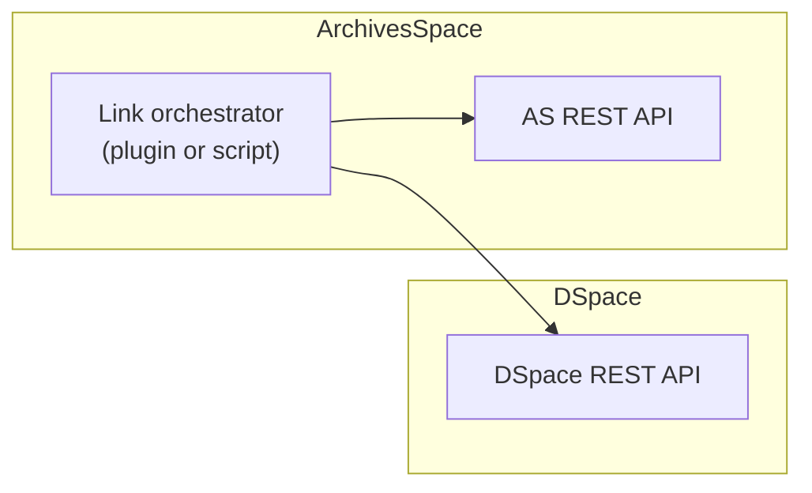
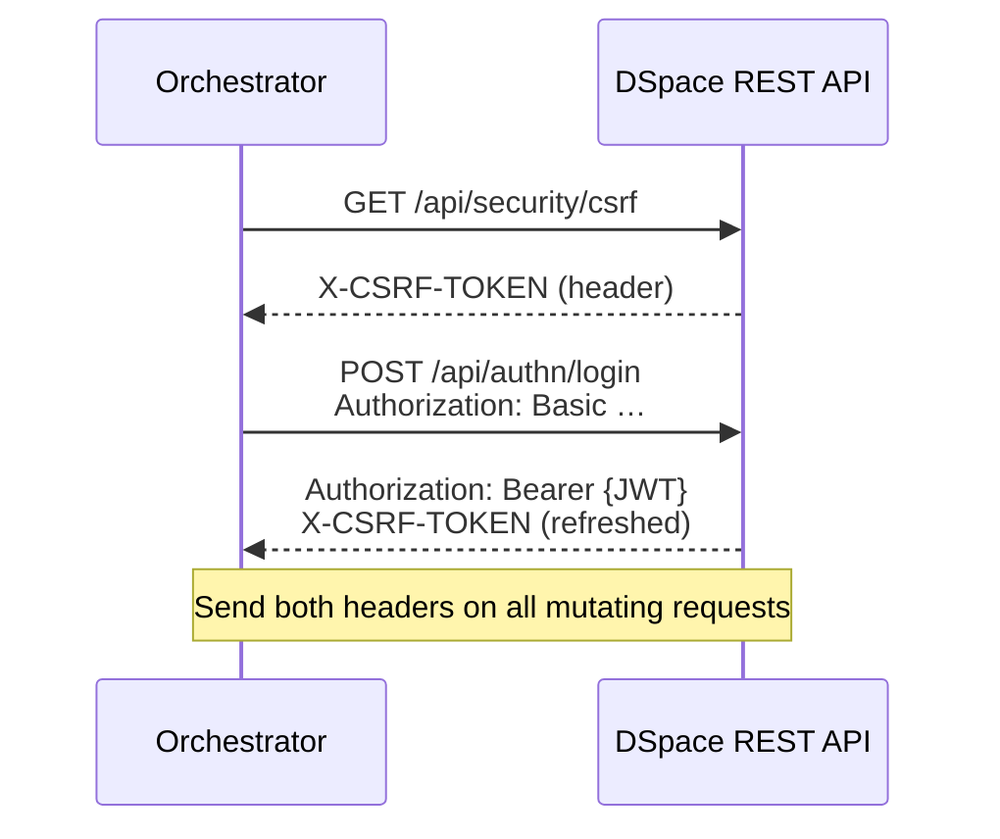
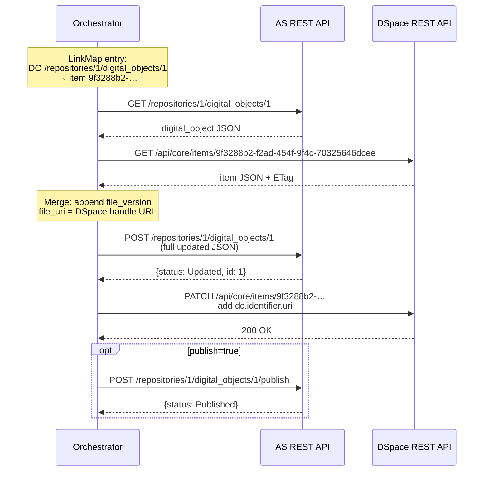
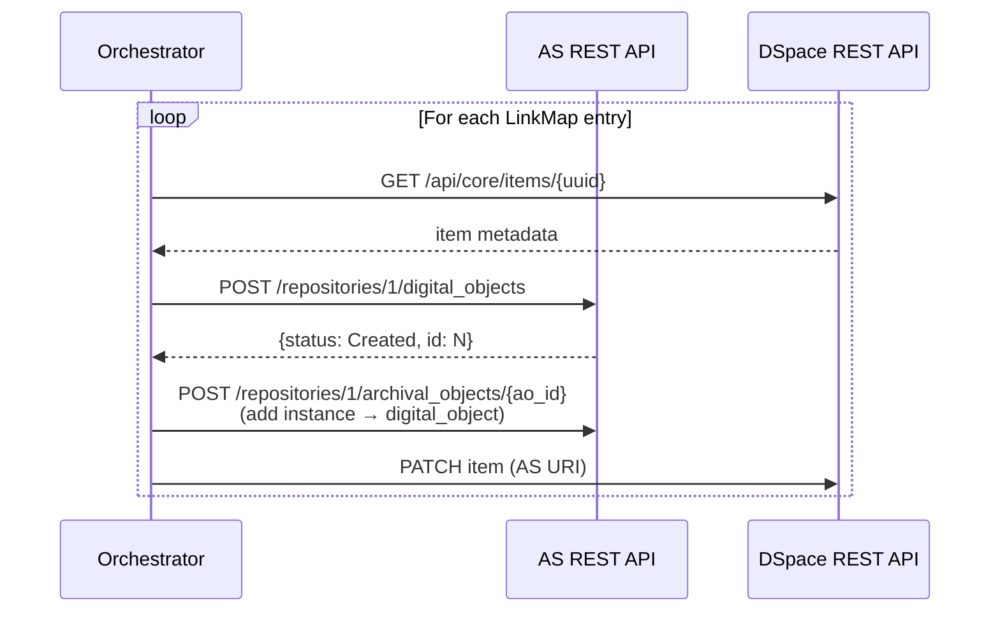
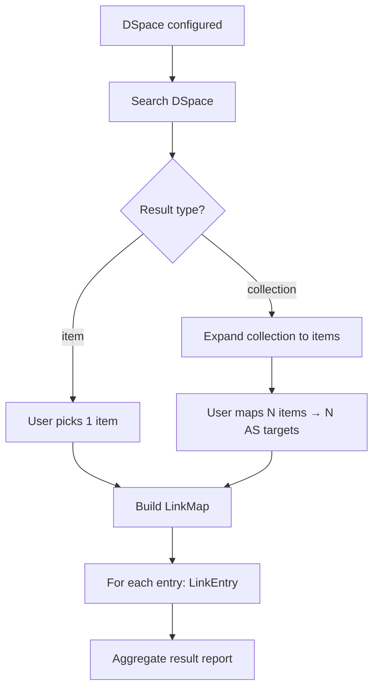

# A2: Link DSpace Items to ArchivesSpace Digital Objects

## Technical specification (API-first draft)

**Scenario:** [A2 — Link a collection in DSpace to many digital object records in ArchivesSpace](https://github.com/lyrasisorghome/InteroperabilityProject/issues/44)

**Status:** Draft v0.1 — implementation-oriented; UI out of scope.

**Systems:** ArchivesSpace REST API, DSpace REST API (7.x / DSpace 9.x contract)

**Normative references:**

- [DSpace REST API intro](https://wiki.lyrasis.org/spaces/DSDOC9x/pages/379126848/REST+API)
- [DSpace RestContract](https://github.com/DSpace/RestContract/blob/main/README.md)
- [DSpace search endpoint](https://github.com/DSpace/RestContract/blob/main/search-endpoint.md)
- [DSpace metadata PATCH](https://github.com/DSpace/RestContract/blob/main/metadata-patch.md)
- [ArchivesSpace API](https://archivesspace.github.io/archivesspace/api/)

---

## Purpose and scope

Define the **API-level behavior** for bidirectional linking between ArchivesSpace (AS) records and DSpace items, using a **1:1 cardinality rule**: each AS archival object or digital object links to **at most one** DSpace item, and each DSpace item receives **at most one** configured AS URI per link operation.

This document is **self-contained**. It covers:

- DSpace Discovery search (items and collections)
- Resolving DSpace item metadata
- Writing the DSpace URI into AS (`file_versions.file_uri`)
- Writing the AS URI into DSpace (`dc.identifier.uri` by default)
- **Bulk orchestration** as repeated application of the same link contract (`n = 1 … N`)

Out of scope for v0.1:

- SUI / widget behavior
- Creating DSpace items from AS metadata (issue #44 BS02)
- Duplicate detection across records (noted as future constraint)
- Publish vs Save UX (API supports optional publish step)

---

## Assumptions

| ID | Assumption |
|----|------------|
| A-01 | DSpace integration is configured for the AS repository (base URL, service credentials, field mappings). |
| A-02 | Orchestrator holds a valid AS session (`X-ArchivesSpace-Session`) and DSpace JWT + CSRF token. |
| A-03 | Cardinality is **1:1** per link operation: one AS target ↔ one DSpace item UUID. |
| A-04 | User (or future UI) supplies the **LinkMap** after search; this spec does not define search-to-match heuristics. |
| A-05 | DSpace item URI written to AS uses `{dspaceBaseUrl}/handle/{handle}` unless configured otherwise. |
| A-06 | AS URI written to DSpace uses `{asPublicBaseUrl}{asRecordUri}` where `asRecordUri` is configurable (`digital_object` or parent `archival_object`). |

---

## Actors



| Actor | Role |
|-------|------|
| **Link orchestrator** | Integration code (AS plugin or external service) that sequences API calls. |
| **AS REST API** | Source of truth for digital object records. |
| **DSpace REST API** | Search target; receives AS URI via metadata PATCH. |

---

## Configuration (minimum)

Stored per AS repository (same model as A1):

| Key | Example | Used for |
|-----|---------|----------|
| `dspace.base_url` | `https://dspace.example.edu/server` | DSpace API root |
| `dspace.service_user` / `password` | — | DSpace auth |
| `dspace.as_uri_field` | `dc.identifier.uri` | DSpace metadata field for AS link |
| `dspace.as_uri_source` | `digital_object` \| `archival_object` | Which AS URI to write |
| `dspace.default_scope` | collection UUID (optional) | Default Discovery `scope` param |
| `as.public_base_url` | `https://as.example.edu` | PUI base for public URIs |

---

## Data contracts

### LinkMap (input to link phase)

The LinkMap is the handoff between **search/selection** (future UI) and **link execution**. A single entry covers A1; an array covers A2.

```json
{
  "repository_id": 1,
  "links": [
    {
      "as_ref": "/repositories/1/digital_objects/1",
      "dspace_item_href": "/api/core/items/9f3288b2-f2ad-454f-9f4c-70325646dcee",
      "mode": "append_file_version",
      "publish": false
    }
  ]
}
```

| Field | Required | Description |
|-------|----------|-------------|
| `repository_id` | yes | AS repository numeric ID |
| `links[].as_ref` | yes | AS URI of target record (`digital_objects`, `archival_objects`, or `resources`) |
| `links[].dspace_item_href` | yes | DSpace item self link from search (or full item GET) |
| `links[].mode` | yes | `append_file_version` \| `create_digital_object` |
| `links[].publish` | no | If true, call AS publish after successful link |

**1:1 rule:** Each `as_ref` and each `dspace_item_href` MUST appear at most once per LinkMap.

### SearchResultItem (extracted from DSpace search)

From `GET /api/discover/search/objects`:

```json
{
  "dspace_item_uuid": "9f3288b2-f2ad-454f-9f4c-70325646dcee",
  "dspace_item_href": "/api/core/items/9f3288b2-f2ad-454f-9f4c-70325646dcee",
  "name": "test result",
  "handle": "10673/4",
  "dso_type": "item"
}
```

Extraction rule:

```
uuid  ← _embedded.indexableObject.uuid
href  ← _links.indexableObject.href
name  ← _embedded.indexableObject.name
handle← _embedded.indexableObject.handle (if present)
```

### Field mapping (DSpace item → AS digital object)

Applied when `mode = create_digital_object` or when refreshing metadata on update:

| AS field | DSpace source | Notes |
|----------|---------------|-------|
| `title` | `metadata.dc.title[0].value` | Required |
| `digital_object_id` | `metadata.{configured_pid_field}[0].value` or `handle` | Institution-specific |
| `file_versions[].file_uri` | `{baseUrl}/handle/{handle}` | Primary link |
| `lang_materials[].language_and_script.language` | `metadata.dc.language[*].value` | Optional; map ISO codes |

---

## DSpace API operations

### Session bootstrap



| Step | Method | Endpoint | Notes |
|------|--------|----------|-------|
| 1 | GET | `/api/security/csrf` | Capture `X-CSRF-TOKEN` |
| 2 | POST | `/api/authn/login` | Basic auth; capture JWT |
| 3 | POST | `/api/authn/logout` | End session (optional) |

### Search objects (your step 3)

**Endpoint:** `GET /api/discover/search/objects`

| Parameter | Example | Purpose |
|-----------|---------|---------|
| `query` | `test` | Solr query string |
| `dsoType` | `item` \| `collection` \| `all` | Limit result types |
| `scope` | `{collectionUuid}` | Limit to community/collection |
| `page`, `size` | `0`, `20` | Pagination |

**Example request:**

```http
GET /api/discover/search/objects?query=test&dsoType=item&page=0&size=20
Authorization: Bearer {jwt}
```

**Example response** (abbreviated; matches RestContract):

```json
{
  "query": "test",
  "_embedded": {
    "searchResults": {
      "_embedded": {
        "objects": [
          {
            "hitHighlights": {
              "dc.description.abstract": "test result"
            },
            "_links": {
              "indexableObject": {
                "href": "/api/core/items/9f3288b2-f2ad-454f-9f4c-70325646dcee"
              }
            },
            "_embedded": {
              "indexableObject": {
                "uuid": "9f3288b2-f2ad-454f-9f4c-70325646dcee",
                "name": "test result",
                "handle": "10673/4"
              }
            }
          }
        ]
      },
      "page": { "size": 20, "totalElements": 1, "totalPages": 1, "number": 0 }
    }
  }
}
```

### Resolve item metadata

```http
GET /api/core/items/{uuid}
Authorization: Bearer {jwt}
```

Use full `metadata` map for field mapping and to build public item URI.

### Write AS URI to DSpace

```http
PATCH /api/core/items/{uuid}
Authorization: Bearer {jwt}
X-CSRF-TOKEN: {token}
Content-Type: application/json
If-Match: {etag from GET item}

[
  {
    "op": "add",
    "path": "/metadata/dc.identifier.uri/-",
    "value": {
      "value": "https://as.example.edu/repositories/1/digital_objects/1"
    }
  }
]
```

> **Note:** A1 draft used path `/metadata/dc.identifier/-/uri/0`; RestContract canonical form is `/metadata/dc.identifier.uri/-` for append. Confirm against target DSpace version during implementation.

---

## ArchivesSpace API operations

> **Important:** AS has **no PATCH**. Updates use `POST /repositories/:repo_id/digital_objects/:id` with a **full** JSONModel body. Always `GET` → merge → `POST`.

### Session

```http
POST /session
Content-Type: application/json

{"user": "...", "password": "..."}
```

Response header: `X-ArchivesSpace-Session` — send on all subsequent requests.

### Link mode: `append_file_version` (existing digital object)

Your example targets `/repositories/1/digital_objects/1`.



**GET digital object:**

```http
GET /repositories/1/digital_objects/1
X-ArchivesSpace-Session: {session}
```

**POST update** (minimal delta shown; payload must include full record):

```json
{
  "jsonmodel_type": "digital_object",
  "title": "Existing title",
  "digital_object_id": "DO-001",
  "file_versions": [
    {
      "jsonmodel_type": "file_version",
      "file_uri": "https://dspace.example.edu/handle/10673/4",
      "publish": true,
      "xlink_actuate_attribute": "onRequest",
      "xlink_show_attribute": "new"
    }
  ]
}
```

```http
POST /repositories/1/digital_objects/1
X-ArchivesSpace-Session: {session}
Content-Type: application/json
```

### Link mode: `create_digital_object` (A2 bulk path)

Used when AS has archival structure but no digital objects yet.



**Create:**

```http
POST /repositories/1/digital_objects
X-ArchivesSpace-Session: {session}
```

Body includes mapped `title`, `digital_object_id`, and initial `file_versions[0].file_uri` from DSpace.

---

## End-to-end flows

### Flow 1 — Single link (A1-compatible subset)

Covers your numbered example.

| Step | Action |
|------|--------|
| 0 | Config present (A-01) |
| 1 | Bootstrap DSpace session |
| 2 | `GET /api/discover/search/objects?query=test&dsoType=item` |
| 3 | Build LinkMap with one entry (user selection assumed) |
| 4 | Execute **LinkEntry** algorithm (below) |
| 5 | Return per-link result report |

### Flow 2 — Bulk link from DSpace collection (A2)

| Step | Action |
|------|--------|
| 1 | Search collection: `GET …/search/objects?query={title}&dsoType=collection` |
| 2 | User selects collection → extract `collectionUuid` |
| 3 | List member items: `GET …/search/objects?scope={collectionUuid}&dsoType=item&query=*&size=100` (paginate) |
| 4 | User maps each item to an AS target → LinkMap with N entries |
| 5 | Execute **LinkBatch** (sequential or parallel with rate limit) |



---

## Algorithms

### LinkEntry(link)

```
INPUT:  link ∈ LinkMap.links
OUTPUT: LinkResult { as_ref, dspace_item_uuid, status, errors[] }

1. AS_RECORD ← GET(link.as_ref)
2. DS_ITEM    ← GET(link.dspace_item_href)   // includes ETag
3. DS_URI     ← buildItemPublicUri(DS_ITEM)
4. AS_URI     ← buildAsPublicUri(AS_RECORD, config.as_uri_source)

5. IF link.mode == "append_file_version":
     AS_RECORD.file_versions.append(newFileVersion(DS_URI))
     POST(link.as_ref, AS_RECORD)             // full body
   ELSE IF link.mode == "create_digital_object":
     NEW_DO ← mapDspaceToDigitalObject(DS_ITEM)
     CREATED ← POST(/repositories/{repo}/digital_objects, NEW_DO)
     optionally attach CREATED to archival_object.instances
     AS_URI ← buildAsPublicUri(CREATED, …)

6. PATCH(DS_ITEM, add dc.identifier.uri = AS_URI)
   IF PATCH fails:
     record error; optionally rollback AS change (policy TBD)

7. IF link.publish:
     POST({as_ref}/publish)

8. RETURN LinkResult
```

### LinkBatch(linkMap)

```
results ← []
FOR EACH link IN linkMap.links:
  results.append(LinkEntry(link))
RETURN { total, succeeded, failed, results }
```

**Bulk semantics:** No special bulk endpoint required. `LinkBatch` with `len(links) == 1` is the single-link case.

---

## Example: your walkthrough

**Given:** AS repository `1`, existing digital object `/repositories/1/digital_objects/1`, DSpace configured.

**Search:**

```http
GET {dspace}/api/discover/search/objects?query=test&dsoType=item
```

**LinkMap** (after user selection):

```json
{
  "repository_id": 1,
  "links": [
    {
      "as_ref": "/repositories/1/digital_objects/1",
      "dspace_item_href": "/api/core/items/9f3288b2-f2ad-454f-9f4c-70325646dcee",
      "mode": "append_file_version",
      "publish": false
    }
  ]
}
```

**AS update:** `GET` DO 1 → append `file_uri` → `POST /repositories/1/digital_objects/1`

**DSpace update:** `PATCH /api/core/items/9f3288b2-f2ad-454f-9f4c-70325646dcee` with AS public URI.

---

## Error scenarios (API-level)

| ID | Condition | Expected behavior |
|----|-----------|-------------------|
| ES-01 | DSpace auth failure (401) | Abort batch; no AS mutations |
| ES-02 | Search returns 0 results | Return empty result set; no mutations |
| ES-03 | AS GET fails (404) | Skip link; record error for that entry |
| ES-04 | AS POST fails (400) | Skip DSpace PATCH; record validation errors |
| ES-05 | DSpace PATCH fails after AS success | Record partial state; surface rollback need |
| ES-06 | Duplicate `as_ref` or `dspace_item_href` in LinkMap | Reject batch at validation (1:1 rule) |
| ES-07 | DSpace item missing `dc.date.issued` when creating in DSpace | N/A for this spec (BS02 out of scope) |

---

## Result report (LinkBatch output)

```json
{
  "total": 2,
  "succeeded": 1,
  "failed": 1,
  "results": [
    {
      "as_ref": "/repositories/1/digital_objects/1",
      "dspace_item_uuid": "9f3288b2-f2ad-454f-9f4c-70325646dcee",
      "status": "linked",
      "as_uri_written": "https://as.example.edu/repositories/1/digital_objects/1",
      "dspace_uri_written": "https://dspace.example.edu/handle/10673/4"
    },
    {
      "as_ref": "/repositories/1/digital_objects/2",
      "dspace_item_uuid": "ff7ec3a4-0aab-418b-94fc-d0e8189084db",
      "status": "failed",
      "errors": ["DSpace PATCH 403: insufficient permissions"]
    }
  ]
}
```

---

## Open items (minimal)

| ID | Question | Default for v0.1 |
|----|----------|------------------|
| Q-01 | Rollback AS when DSpace PATCH fails? | Fail-forward; report partial state |
| Q-02 | Exact DSpace metadata field for AS URI? | `dc.identifier.uri` |
| Q-03 | Attach new DO to archival_object.instances in same transaction? | Required for `create_digital_object` mode |
| Q-04 | Proposed plugin endpoint wrapping LinkBatch? | Optional `POST /repositories/:id/integrations/dspace/links` — not required if orchestrator is external |

---

## Relationship to A1

| Topic | A1 spec | This spec (A2) |
|-------|---------|----------------|
| Search | Single item focus | Same endpoint; adds collection scope + pagination |
| Link | BS-10, BS-11 | Formalized as `LinkEntry` / `LinkMap` |
| Bulk | BS-12 (partial) | `LinkBatch` over N entries |
| Config | BS-01 | Referenced; duplicated minimum keys above |
