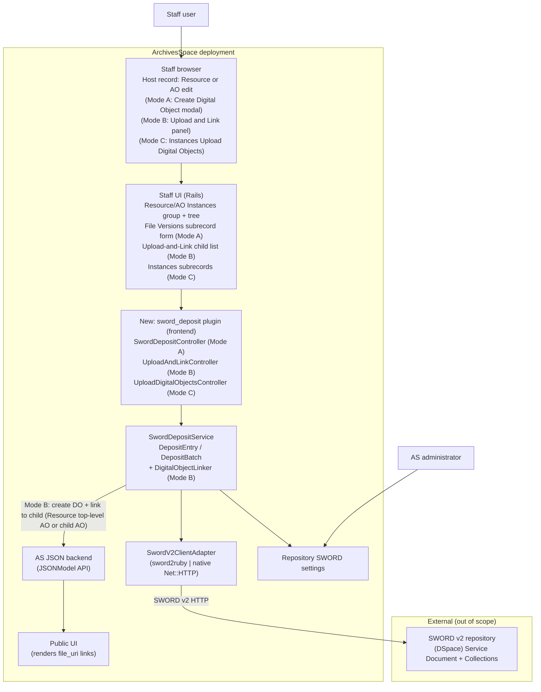
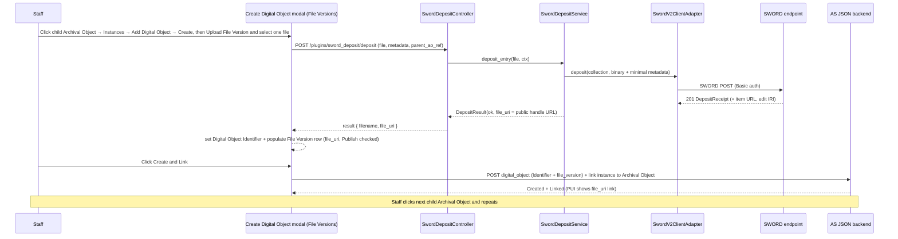
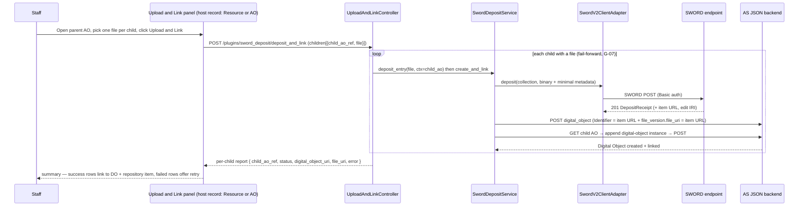
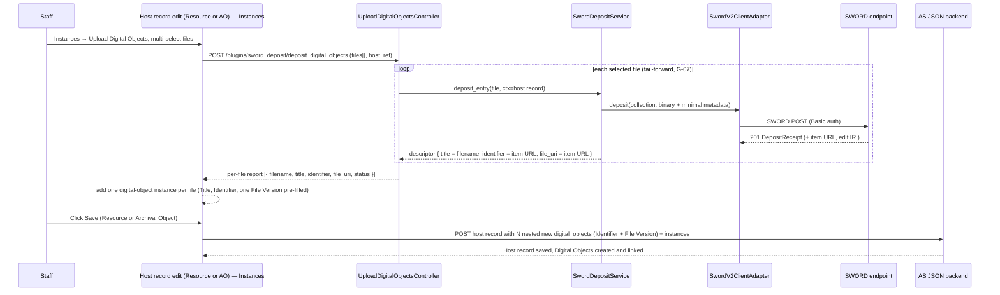

# A3-4: ArchivesSpace SWORD Deposits — High-Level Feature Design

## Technical specification (architecture-first draft)

**Scenarios:** [A3](https://github.com/lyrasisorghome/InteroperabilityProject/issues/45) and [A4](https://github.com/lyrasisorghome/InteroperabilityProject/issues/52)

**Status:** Draft v0.8 — high-level feature design; closes the *where-in-the-codebase* and *where-does-it-initiate* gaps in [`A3-4-as-sword-deposit.md`](A3-4-as-sword-deposit.md) (notably Gap G-03). Defines **three deposit modes** sharing one SWORD primitive: **Mode A** — single deposit (in-form population; verified against the ArchivesSpace sandbox, 2026-07-19); **Mode B** — a **"Upload and Link"** panel that deposits one local file per immediate child and creates+links a Digital Object for each (server-side); **Mode C** — an **"Upload Digital Objects"** button that multi-selects files and creates one Digital Object per file. **The feature is available only on Resource and Archival Object edit views** (v0.8): both expose the same Instances group and tree (A-20). It is **not** shown on standalone Digital Object edit screens, and **Digital Object Components are out of scope** (A-21 / D-17). **All modes write the returned URI to both fields** (v0.6): the Digital Object **Identifier** (`digital_object_id`, a *required* field — the canonical/original URI) **and** a **File Version** `file_uri` (so the PUI renders a clickable link; sandbox-verified 2026-07-20).

**Systems:** ArchivesSpace staff UI (SUI, Rails) and JSON backend API; ArchivesSpace PUI (display only); DSpace SWORD v2 endpoint (7.x/9.x contract); extensible to other SWORD-compliant repositories and SWORD v3.

**Normative references:**

- [SWORD v2 Profile](https://swordapp.github.io/SWORDv2-Profile/SWORDProfile.html)
- [SWORD v2 specification](https://swordapp.github.io/SWORDv2/SWORDv2.html)
- [swordapp/sword2ruby](https://github.com/swordapp/sword2ruby) (candidate client; see maintenance note)
- [ArchivesSpace API](https://archivesspace.github.io/archivesspace/api/)
- [ArchivesSpace plugin development](https://archivesspace.github.io/tech-docs/customization/plugins.html)
- Parent requirements: [`A3-4-as-sword-deposit.md`](A3-4-as-sword-deposit.md)
- Companion designs: [`V1-dev-high-vivo-sword-deposit.md`](V1-dev-high-vivo-sword-deposit.md), [`A1-2-dev-high-bidirectional-linking-as-ds.md`](A1-2-dev-high-bidirectional-linking-as-ds.md)
- Metadata mapping: [`as-dc-mapping.html`](../references/as-dc-mapping.html)

---

## Purpose and scope

Define **how ArchivesSpace would implement** a workflow in which a staff user deposits local files to a configured SWORD v2 repository and records the returned **public item URL(s)** on ArchivesSpace records. All three modes below share the same SWORD deposit primitive (`DepositEntry`) and the same per-file granularity — one file → one repository item → one Digital Object — differing only in **which record the Digital Object links to** and **how it is persisted**.

**Starting point — a Resource or an Archival Object (A-20):** all three modes initiate from the **staff edit view of a Resource *or* an Archival Object**. Both record types expose the same **Instances** group (including "Add Digital Object → Create") and both sit on the same resource **tree**, so the modes work identically regardless of which one the staff user is editing. **Sandbox-confirmed 2026-07-20:** a Resource has the same Instances options as an AO, and a Resource in the top tree shows its AO children. The term **host record** below means "the Resource or Archival Object currently being edited." The only type-dependent detail is Mode B's notion of *immediate children*: for a **Resource** those are its **top-level Archival Objects**; for an **Archival Object** those are its **child Archival Objects**. The feature is **not** available on standalone Digital Object edit views, and **Digital Object Components are out of scope** (A-21 / D-17).

**Where the returned URI is written (all modes, v0.6):** each deposited file yields a Digital Object whose **Identifier** (`digital_object_id`) is set to the returned URI — this is a *required* field and holds the canonical/original location — **and** which carries a **File Version** whose `file_uri` is the same URI, so the ArchivesSpace PUI renders a clickable "view online" link (sandbox-verified 2026-07-20: an Identifier-only Digital Object shows the URI as plain text, whereas a File Version renders a clickable button). See A-19 and D-14.

### Three deposit modes

| Mode | Entry point | Scope | Result per file | AS write path |
|------|-------------|-------|-----------------|---------------|
| **A — Single deposit** | The **host record** (Resource or AO) → Instances → Add Digital Object → **Create** modal | One file for the host record, repeated manually across records | The Digital Object being created gets **Identifier = URI** + a **File Version** (`file_uri` = URI) | **In-form population**, persisted on the modal's "Create and Link" (A-11) |
| **B — Batch "Upload and Link"** | A new panel on the **host record** (Resource or AO) listing its **immediate children**, one file input each | One file per child, all in a single action | One **Digital Object** (Identifier = URI + a File Version) linked to each child AO | **Server-side create + link** (the plugin creates a Digital Object and links it to each child) |
| **C — "Upload Digital Objects"** | A new button in the **Instances** section of the **host record** (Resource or AO), beside "Add Digital Object" | **Multiple files** for the **host record**, in one multi-select | One **Digital Object** per file (Title = filename without extension, Identifier = URI + a File Version), each linked to the host record | **In-form instance population**, persisted on the native **Save** (A-18) |

Mode A is the primary, lowest-risk flow. Mode B populates many *children* quickly. Mode C populates many *Digital Objects on one* host record quickly. All three are `DepositBatch` = N × the same `DepositEntry` primitive (N = 1 for Mode A), and all three write the URI to **both** the Digital Object Identifier and a File Version (A-19). They differ only in write-back mechanics: Mode A and Mode C use **in-form population** persisted by a native Save; Mode B uses **server-side create + link** (see [Mode B write path](#mode-b-write-path-server-side-create--link)).

### Mode A — single deposit (host record: Resource or Archival Object)

The staff user selects the **host record** — a Resource or an Archival Object — then opens **Instances → Add Digital Object → Create**, which renders the native **"Create Digital Object"** modal containing the standard **File Versions** subrecord form. The deposit control lives in that File Versions form. Although the same subrecord form is *also* reused on the standalone Digital Object edit screen (and on Digital Object Components), the plugin **scopes the control to the host-record context** so it renders only inside the Resource/AO Create Digital Object modal — it is deliberately **not** injected on the standalone `digital_objects` controller, and Digital Object Components are out of scope (A-21 / D-17). This costs one context guard rather than a global subrecord injection.

**Observed workflow (from user studies; shown for a child Archival Object, identical on a Resource):**

1. Staff user browses to a Resource or an Archival Object; the tree (upper panel) shows the hierarchy.
2. For the per-child pattern: if a needed child Archival Object does not exist, the staff user creates one per binary they intend to deposit (**records always exist before a deposit is attempted**), then returns to the host record.
3. Staff user clicks the **host record** (a Resource, or a child Archival Object) in the tree.
4. Staff user does **Instances → Add Digital Object → Create → "Upload File Version"** → the plugin deposits the single file via SWORD and populates the File Version's `file_uri` (and the Digital Object Identifier, A-19).
5. Staff user clicks **"Create and Link"**.
6. Staff user moves to the **next record** in the tree and repeats.

Mode A optimizes for **one binary per host record, quickly repeated** — not for attaching many binaries to a single Digital Object. Tree navigation is native ArchivesSpace behavior; Mode A adds no special multi-object mode.

### Mode B — batch "Upload and Link" (host record: Resource or Archival Object)

To populate many children in one pass, the plugin adds an **"Upload and Link"** panel (proposed placement: a new section under **Instances** on the host record). It lists the host record's **immediate children**, each with its own file input. For a **Resource** the immediate children are its **top-level Archival Objects**; for an **Archival Object** they are its **child Archival Objects** (A-20).

**Observed workflow (client ask):**

1. Staff user browses to the host record (a **Resource** or a **parent Archival Object**); its children appear in the resource tree (upper panel) **and** as rows in the new "Upload and Link" section.
2. For each child they want to populate, the staff user selects a **local file** in that child's file input. (Children left blank are skipped.)
3. Staff user clicks a single **"Upload and Link"** button for the whole group.
4. For every child with a chosen file, the plugin **deposits the file via SWORD**, then **creates a Digital Object** (Identifier = returned URI, plus a single File Version `file_uri` = same URI — A-19) and **links it to that child Archival Object** as a digital-object instance.
5. A per-child result summary reports success/failure; failures are **fail-forward** (successful children are created and linked; failed children are listed for retry — parent G-07).

Mode B still honors **1:1:1** (one file → one Digital Object with one File Version → one child AO) and **A-13** (children pre-exist). It does **not** attach multiple binaries to a single child, and it is **not** the deferred drag-and-drop wizard (see Out of scope).

### Mode C — batch "Upload Digital Objects" (host record: Resource or Archival Object)

Mode C resembles the original v0.1 multi-select idea, but each selected file becomes its **own Digital Object** linked to the **host record** (Resource or AO) — not multiple File Versions on a single Digital Object. The plugin adds an **"Upload Digital Objects"** button in the **Instances** section, beside the existing **"Add Digital Object"** button.

**Observed workflow (client ask):**

1. Staff user is on a **Resource** or **Archival Object** edit page (e.g. `…/resources/16/edit` or `…/resources/16/edit#tree::archival_object_1654`).
2. Staff user scrolls down to the **Instances** section.
3. Staff user clicks the **new "Upload Digital Objects"** button (next to "Add Digital Object").
4. A **multi-select** file dialog opens.
5. Staff user selects **one or more** files.
6. The plugin **deposits each file via SWORD**, then prepares **one new Digital Object per returned URI**. Each Digital Object has its **Title** set to the **file name without extension**, its **Identifier** (`digital_object_id`, required) set to the **returned URI**, and a **File Version** whose `file_uri` is the same URI (so the PUI shows a clickable link — A-19). Each is added to the host record as a digital-object instance.
7. Staff user clicks **"Save"** on the host record, which persists the new Digital Objects (with their File Versions) and their instance links.

Mode C preserves **one file → one repository item → one Digital Object** (still 1:1). It **reintroduces multi-select** — but only in the sense of *many files → many Digital Objects on one host record*; attaching many File Versions to a single Digital Object remains out of scope (each Digital Object gets exactly one File Version, mirroring its Identifier). Because the host record is the one open in the editor, persistence rides its native **Save** (like Mode A's in-form population, A-11/A-18).

This document is the bridge from the behavior spec ([`A3-4-as-sword-deposit.md`](A3-4-as-sword-deposit.md), which defines *what*: roles, config table, BS01–BS03, ES01–ES04, gaps G-01–G-10) to implementation planning (*which plugin, controllers, JSONModels, and client library would change*).

**In scope for v0.1–v0.8:**

1. ArchivesSpace deployment/plugin context and where HTTP requests land
2. **Host record = a Resource or an Archival Object** (A-20): all three modes start from the staff edit view of either, since both expose the Instances group and the same tree
3. **Mode A** — entry from the **host record → Instances → Add Digital Object → Create** modal, on **Resource and Archival Object edit views only** (the control is scoped to that context — A-21 / D-17)
4. An **"Upload File Version"** control aligned with the existing **"Add File Version"** button, injected **only** where the File Versions subrecord form renders **within a Resource/AO Create Digital Object modal** (scoped away from the standalone Digital Object controller — A-21)
5. **Mode B** — an **"Upload and Link"** panel on the **host record** (Resource or AO) listing immediate children with one file input each, and a single action that deposits + creates + links a Digital Object per child (server-side)
6. **Mode C** — an **"Upload Digital Objects"** button in the Instances section of the **host record** (Resource or AO) that multi-selects files and creates one Digital Object per file (Title = filename, Identifier = returned URI, plus one File Version — A-19), linked to the host record and saved with it
7. The `DepositEntry` contract (one file → one repository item); `DepositBatch` = N × `DepositEntry`, realized by Modes B and C (fail-forward, G-07)
8. A version-abstracted SWORD client (v2 now; v3 adapter stub)
9. Two write-back paths: **in-form population** (Modes A and C) and **server-side create + link** (Mode B)
10. Configuration model at the repository level
11. Error handling mapped to parent ES01–ES04, including partial-batch failure for Modes B and C

**Out of scope for v0.1–v0.8 (deferred or excluded):**

- **Standalone Digital Object edit views as an entry point** (v0.8, D-17): the deposit controls are **not** shown on the `digital_objects` controller. Staff editing a Digital Object directly still get the native "Add File Version" only. The feature initiates exclusively from a Resource or Archival Object (A-20 / A-21).
- **Digital Object Components** are excluded entirely (v0.8, D-17): no deposit control, no create/link, no Mode B/C handling for DOCs.
- **Multiple File Versions on a single Digital Object from one multi-select** (de-prioritized: Mode C multi-select yields *one Digital Object per file*, not many File Versions on one Digital Object)
- The multi-page **deposit wizard** with **drag-and-drop** file→archival-object mapping described in parent BS02/BS03 (*explicitly deferred at client direction*). Mode B covers one file per immediate child; Mode C covers many files onto one AO; the free-form drag-drop mapping across arbitrary tree depth remains deferred, but reuses the same `DepositBatch` machinery.
- **Non-immediate descendants**: Mode B lists only the parent's **direct** children (A-15); deep/recursive selection is deferred.
- Full descriptive-metadata mapping AS → DSpace (**open**, pending ArchivesSpace + DSpace team input; see G-05 / M-01)
- SWORD v3 implementation
- Re-deposit / update-in-place of previously deposited content (G-10)
- Changes to DSpace-side ingest workflow/approval configuration

**Naming constraint (program):** the feature integrates with **any SWORD-compliant repository** via standard endpoints. DSpace is the reference target but must not be assumed beyond the protocol.

---

## Why the parent spec stalls

[`A3-4-as-sword-deposit.md`](A3-4-as-sword-deposit.md) defines behavior but leaves implementation open, and its wizard scenarios (BS02/BS03) conflate several concerns:

| Parent gap | What is missing for developers |
|------------|--------------------------------|
| G-02 | Whether AS stores binaries. **Resolved here:** it does not — AS is a CMS, not a DAMS; binaries come from the **staff user's browser** at deposit time. |
| G-03 | Where the deposit initiates. **Resolved here:** the **host record (Resource or Archival Object) → Instances → Add Digital Object → Create** modal, via an "Upload File Version" control in the **File Versions** subrecord section, aligned with "Add File Version". The control is **scoped to the Resource/AO context** — it is not shown on standalone Digital Object edit views, and Digital Object Components are excluded (A-21 / D-17). |
| G-06 | Item/file granularity. **Resolved here:** **1:1:1** — one file → one DSpace item → one Digital Object; the returned URI is written to **both** the Digital Object **Identifier** (`digital_object_id`, required) and a **File Version** `file_uri` (A-19). |
| G-04 / G-05 | Package format and metadata mapping. **Partially open:** v0.1 uses **binary deposit**; descriptive-metadata mapping is a **placeholder** (M-01). |
| G-08 | SWORD version abstraction. **Resolved here:** `SwordProtocolAdapter` interface, v2 impl + v3 stub. |
| Client library | Not named. **Resolved here:** `sword2ruby` *or* a thin native client behind the adapter. |

**Design stance:** implement the **atomic deposit primitive** (`DepositEntry`) — one file → one repository item → one returned URI. Every mode is `DepositBatch` = N × that primitive, differing only in where the URI is written:

- **Mode A** — N = 1; writes back a **File Version** in-form on the Digital Object modal.
- **Mode B** — N = children with a file; per entry, **server-side create** a Digital Object (with a File Version) and **link** it to a child AO.
- **Mode C** — N = selected files; per entry, prepare a **Digital Object** (Title = filename, Identifier = URI) as an **in-form instance** on the current AO, persisted on its native Save.

This mirrors the `LinkEntry`/`LinkBatch` and `create_digital_object` patterns from [`A1-2-dev-high-bidirectional-linking-as-ds.md`](A1-2-dev-high-bidirectional-linking-as-ds.md) — the difference from A1-2 is that the URI comes from a SWORD **deposit** rather than a link to a pre-existing DSpace item.

---

## Assumptions

| ID | Assumption |
|----|------------|
| A-01 | Target **ArchivesSpace 3.x+** deployed as the standard multi-app stack (staff SUI + JSON backend + PUI + Solr). Feature ships as an **ArchivesSpace plugin**. |
| A-02 | **SWORD v2** is the only protocol implemented in v0.1. A `SwordProtocolAdapter` interface allows a future v3 adapter without rewriting orchestration. |
| A-03 | The target repository exposes a **Service Document URL** and ≥1 **Collection** accepting the configured deposit type (typically `application/pdf` / binary). |
| A-04 | **ArchivesSpace does not persist deposited binaries.** Files are streamed from the browser through the plugin to the SWORD endpoint and held only transiently. Only the returned **item URL** (and optional edit IRI) are written to AS. |
| A-05 | Deposit orchestration runs in the **staff frontend plugin**, which already holds an authenticated backend session, so binaries never transit the JSON backend API. |
| A-06 | **Granularity is 1:1:1**: one uploaded file → one repository item → one Digital Object. The returned URI is recorded on that Digital Object in **both** its required **Identifier** (`digital_object_id`) and one **File Version** `file_uri` (A-19), whether the Digital Object is pre-existing or created inline. |
| A-07 | The `file_uri` written to AS is the repository's **public item URL** (e.g. `{dspaceBaseUrl}/handle/{handle}`), because PUI end users and staff both click it. |
| A-08 | **Authentication (v2)** is **HTTP Basic Auth** with a service credential configured per AS repository (parent G-01; per-user credentials deferred). |
| A-09 | Deposit is **synchronous from the user's perspective** in v0.1. Even if the endpoint returns SWORD **In-Progress**, AS still writes the File Version immediately; staff manage visibility via existing **Publish?** and **Make Representative** controls. |
| A-10 | **Descriptive metadata mapping AS → repository is not finalized.** v0.1 deposits binaries with a **minimal, configurable metadata stub** (at least a title/slug); full mapping is M-01 pending AS + DSpace teams. |
| A-11 | **The target Digital Object may not be persisted at deposit time.** In the primary Archival Object flow, the "Create Digital Object" modal holds an *unsaved* record (verified 2026-07-19: no ID/URI until "Create and Link"). Therefore the deposit **must not** depend on a saved AS record: it obtains the `file_uri` and **populates the in-memory File Version row**; AS persists everything on the record's normal Save / "Create and Link". This is the same client-side subrecord form ArchivesSpace also renders on the standalone Digital Object edit screen — but the deposit control is **not** injected there (A-21). |
| A-12 | **Metadata for the SWORD package is sourced from the deposit context, not a saved Digital Object**: the values being entered in the modal (Title, Identifier) and/or the **host record** — the Resource or Archival Object being edited, or (Mode B) the target child Archival Object — which *is* persisted and has a ref. See M-01. |
| A-13 | **One binary per host record (Mode A/C) or per child (Mode B); the target records always pre-exist the deposit.** Staff create the Archival Objects first, then deposit a single file for each. In Mode A they iterate across the tree manually; in Mode B they populate many children in one action; in Mode C many files land on one host record. Each deposit is a single `DepositEntry`. |
| A-14 | **Mode B writes server-side.** Because Mode B spans **sibling** records (many child Archival Objects) rather than one open form, it cannot rely on the native "Create and Link" form save. The plugin creates each Digital Object and links it to its child Archival Object via the **JSONModel API** (`create_digital_object` + append a digital-object instance to the child AO; AS has no PATCH → GET→merge→POST). This is the same server-side path A-11 marks optional for Mode A. |
| A-15 | **Mode B lists only the host record's immediate (direct) children** and maps exactly **one file to one child** (1:1:1 preserved). For a **Resource** host, the immediate children are its **top-level Archival Objects**; for an **Archival Object** host, they are its **child Archival Objects** (A-20). Recursive/deep descendants and many-files-per-child are out of scope. |
| A-16 | **Children are enumerated via ArchivesSpace's existing tree/children API** (e.g. the resource/archival-object tree endpoints the SUI already uses); the plugin does not maintain its own hierarchy. |
| A-17 | **Mode C creates one Digital Object per file, all linked to the current Archival Object.** Each deposited file yields a distinct Digital Object with **Title = file name without extension**, **Identifier (`digital_object_id`) = returned URI**, and **one File Version** (`file_uri` = returned URI, A-19); a digital-object instance for each is added to the AO being edited. Multi-select is supported here (unlike Modes A/B) because the fan-out is *files → Digital Objects*, still 1:1 per file. |
| A-18 | **Mode C persists on the host record's native Save.** Like Mode A (A-11), the plugin populates the open host-record edit form — a Resource or Archival Object (A-20) — with its Instances subrecords client-side; ArchivesSpace creates the new Digital Objects and their instance links when the staff user saves the host record. No plugin-side server write is required on the default path (contrast Mode B, A-14). *Whether the host-record form serializes multiple nested new Digital Objects on a single save should be verified against the sandbox before build (see D-13).* |
| A-19 | **The returned URI is written to two Digital Object fields, in every mode.** (1) **Identifier** (`digital_object_id`) — a **required** field on Digital Objects (so it must be set at create time regardless), holding the canonical/original deposit URI; and (2) a **File Version** `file_uri` (public item URL, A-07) — because the ArchivesSpace PUI renders a clickable "view online" link only from a File Version, not from the Identifier (sandbox-verified 2026-07-20). File Versions therefore remain available for the *future* re-deposit / new-upload scenario (G-10), while the initial deposit populates both fields. |
| A-20 | **The starting point (host record) may be a Resource or an Archival Object — and only those two.** Both record types expose the same **Instances** subrecord group (with "Add Digital Object → Create") and share the resource **tree**, and both can carry digital-object instances — so all three modes work identically regardless of type. **Sandbox-confirmed 2026-07-20:** a Resource has the same Instances options as an AO, and a Resource in the top tree shows its AO children. The only type-dependent behavior is Mode B's *immediate children* (Resource → top-level AOs; AO → child AOs). |
| A-21 | **The feature is confined to Resource and Archival Object edit views (D-17).** The "Create Digital Object" modal reuses the shared File Versions subrecord form that ArchivesSpace *also* renders on the standalone **Digital Object** edit screen; the plugin must therefore **scope its injection to the host-record context** (e.g. gate on the parent controller being `resources`/`archival_objects`, or on the File Versions form's DOM ancestry within a Resource/AO instances subrecord) so the deposit control does **not** appear when a Digital Object is edited directly. **Digital Object Components are out of scope**: no control, no create/link, no batch handling. Standalone Digital Object editing keeps its native "Add File Version" behavior unchanged. |

---

## Actors and deployment context



| Actor | Role |
|-------|------|
| **AS Administrator** | Configures per-repository SWORD endpoint(s), credentials, default collection, protocol version, master enable (parent BS01). |
| **AS Staff User (Mode A)** | Selects the host record — a Resource or Archival Object — opens the Create Digital Object modal, chooses **one** local file and triggers deposit; reviews the resulting Identifier + File Version; sets Publish / Representative; saves via "Create and Link"; moves to the next record and repeats. (The control is not offered when editing a Digital Object directly — A-21.) |
| **AS Staff User (Mode B)** | On the host record (Resource or parent Archival Object), picks one local file per immediate child in the "Upload and Link" panel, clicks **"Upload and Link"** once, and reviews the per-child result summary. |
| **AS Staff User (Mode C)** | On the host record (Resource or Archival Object), clicks **"Upload Digital Objects,"** multi-selects files, reviews the Digital Objects populated into Instances (Title = filename, Identifier = URI, + a File Version), then clicks **Save**. |
| **Repository/Collection manager** | Configures SWORD permissions and collections on the target repository (outside AS). |
| **PUI end user** | Clicks the `file_uri` link to the deposited item (no deposit UI). |
| **sword_deposit plugin** (new) | Validates uploads, deposits via SWORD, parses receipts; **Mode A** returns `file_uri` for in-form Identifier + File Version population; **Mode B** creates Digital Objects and links them to the host record's child Archival Objects (server-side); **Mode C** populates one in-form Digital Object instance per file on the host record; logs outcomes. |

### Typical URL shapes

Assume staff host `https://as.example.edu` (SUI):

| Surface | Example | Notes |
|---------|---------|-------|
| **Resource edit (host record)** | `/resources/16/edit` | Instances group + tree at the collection root; all three modes available here (A-20) |
| **Archival Object edit (host record)** | `/resources/16/edit#tree::archival_object_1646` | Same Instances group + tree at an AO node; all three modes available here |
| Digital Object edit (existing) | `/digital_objects/27/edit` | **Out of scope (A-21 / D-17):** reuses the same File Versions form, but the plugin does **not** inject the deposit control here — native "Add File Version" only |
| Digital Object Component edit (existing) | `/digital_objects/27/edit#tree::digital_object_component_1` | **Out of scope (A-21 / D-17):** Digital Object Components are excluded from the feature entirely |
| **Proposed upload endpoint (Mode A)** | `POST /plugins/sword_deposit/deposit` | Multipart; params: repo id, **one** file, optional host-record ref, in-form metadata (title/identifier) |
| **Proposed batch endpoint (Mode B)** | `POST /plugins/sword_deposit/deposit_and_link` | Multipart; params: repo id, host-record ref, and per-child `{ child_ao_ref → file }` pairs; returns a per-child result report |
| **Proposed multi-DO endpoint (Mode C)** | `POST /plugins/sword_deposit/deposit_digital_objects` | Multipart; params: repo id, **many** files, host-record ref; returns a per-file report of `{ title, identifier(file_uri), file_uri, status }` for in-form population |
| Children listing (existing tree API, Mode B) | Resource: `GET /repositories/:id/resources/:id/tree/root` (top-level AOs); AO: node/waypoint endpoints | Enumerate the host record's immediate children (A-16/A-20) |
| **Proposed config** | `/plugins/sword_deposit/settings?repo_id=…` | Admin-only SWORD settings |
| Repository management (existing) | `/repositories` | Settings linked from here (parent §Configuration Location) |

---

## ArchivesSpace repositories/areas touched

| Area | Role in feature | Expected change level |
|------|-----------------|------------------------|
| **New plugin** `plugins/sword_deposit/` | Primary — controllers, service, SWORD adapter, config, JS, views, locales | **Major (new)** |
| Staff UI subrecord form for `file_version` | **Mode A:** add "Upload File Version" control beside "Add File Version", **scoped to the Resource/AO Create Digital Object modal** (not the standalone `digital_objects` controller — A-21); render resulting File Versions | **Moderate (via plugin override/partial + context guard)** |
| Staff UI **Resource / Archival Object edit** (Instances area) | Both record types share this UI (A-20). **Mode B:** inject the "Upload and Link" panel listing immediate children. **Mode C:** inject the "Upload Digital Objects" button beside "Add Digital Object" | **Moderate (via plugin partial/hook)** |
| `digital_object` JSONModel | All modes write **Identifier (`digital_object_id`, required) + one `file_version`** (A-19). **Mode A:** in-form on the DO being created. **Mode B:** `create_digital_object` server-side. **Mode C:** one new DO per file via the host record form's nested instances on save. (`digital_object_component` is **not** touched — A-21.) | **None (data only)** |
| `resource` / `archival_object` JSONModel | **Mode B:** append a digital-object `instances[]` entry linking the new Digital Object to each child AO (server-side). **Mode C:** append **N** digital-object `instances[]` entries to the host record (Resource or AO), persisted on Save | **None (data only)** |
| Resource/AO **tree API** | **Mode B:** enumerate the host record's immediate children — top-level AOs for a Resource, child AOs for an AO (A-16/A-20) | **None (read only)** |
| Repository configuration UI | Host SWORD Deposit Settings section | **Minor (plugin-provided)** |
| SWORD client dependency | `sword2ruby` gem *or* vendored native client | **Dependency** |
| PUI | Renders `file_versions[].file_uri` (existing behavior) | **None** |

**No core AS fork required:** everything is achievable through the plugin mechanism (frontend controllers/assets/views, optional backend model for config, `config.rb`).

---

## Existing components to reuse or extend

ArchivesSpace has **no SWORD code today**. Closest reusable machinery:

### File Versions subrecord (the anchor)

| Component | Reuse |
|-----------|-------|
| `file_version` subrecord form partial (staff UI) | The section rendered under **File Versions**; "Add File Version" is its subrecord-add control. The new control lives here **but only when the form renders inside a Resource/AO Create Digital Object modal** — the plugin gates on host-record context so it is absent when a Digital Object (or Component) is edited directly (A-21). |
| Subrecord add JS (`add_subrecord` / `subrecord.js` patterns) | Precedent for appending a File Version row client-side; the upload flow appends **populated** rows (with `file_uri`) instead of empty ones. |
| `is_representative` / "Make Representative" | Left to the staff user post-deposit (A-09). |
| `publish` checkbox | Default `true` on deposited File Versions; staff can toggle (A-09). |

**Sandbox-verified File Version fields (2026-07-19):** `Make Representative`, **File URI**, `Publish?`, `Use Statement`, `XLink Actuate Attribute`, `XLink Show Attribute`, `File Format Name`, `File Format Version`, `File Size (Bytes)`, `Checksum`, `Checksum Method`, `Caption`. The deposit populates at least **File URI** and `Publish?`; other fields remain staff-editable.

### Resource / Archival Object → Create Digital Object modal (primary entry)

Both Resources and Archival Objects expose the identical Instances group and "Add Digital Object → Create" modal (A-20), so this reuse applies to either host record.

| Component | Reuse |
|-----------|-------|
| Resource / Archival Object **Instances** subrecord (`Add Digital Object` → dropdown → `Create`) | Native control that opens the **"Create Digital Object"** modal; the deposit control appears inside that modal's File Versions form. |
| "Create Digital Object" modal (embedded, unsaved record) | **Verified (on an AO):** the Digital Object is unsaved (no ID/URI) and is created + linked to the host record only on **"Create and Link"**. The File Versions subrecord renders **inline** here, identical to the standalone form. The Resource modal is the same component (A-20). |
| `add_form_and_link` / nested subrecord persistence | The whole nested record (Digital Object + File Versions + instance link) is persisted by AS on "Create and Link" — the plugin does **not** write it server-side. |

### Persistence path (Mode A)

| Component | Reuse |
|-----------|-------|
| Native subrecord form submit ("Create and Link" / Save) | **Default write path (A-11):** the deposited File Version row is populated in the form and persisted by AS's own save. Works whether the Digital Object pre-exists or is being created inline. No plugin-side JSONModel write required. |
| `JSONModel(:digital_object)` (`find → append → save`) | **Optional path only** for a *pre-existing, already-saved* Digital Object if immediate auto-save is later chosen (D-03). Not usable in the unsaved AO-create modal. AS has no PATCH; this is the GET→merge→POST equivalent. (Digital Object Components are excluded — A-21.) |
| Frontend authenticated backend session | Plugin controller reuses the staff session's backend token — no separate auth. |

### Host-record children + create/link (Mode B)

| Component | Reuse |
|-----------|-------|
| Resource / Archival Object **tree API** | List the host record's immediate children (title + ref) to render the "Upload and Link" rows — top-level AOs for a Resource, child AOs for an AO (A-16/A-20). |
| `create_digital_object` (A1-2 precedent) | For each child with a file: `POST /repositories/:id/digital_objects` with **Identifier (`digital_object_id`) = the SWORD item URL** (required) and a single `file_version` whose `file_uri` is the same URL (A-19). |
| Digital-object **instance** on `archival_object` | `GET` the child AO → append `instances[]` a digital-object instance referencing the new DO → `POST` (full JSONModel; GET→merge→POST). Mirrors A1-2 `create_digital_object` linking. |
| Frontend authenticated backend session | Same session/token reused for all reads and writes. |

### Multi-Digital-Object on one host record (Mode C)

| Component | Reuse |
|-----------|-------|
| Resource / Archival Object **Instances** subrecord + "Add Digital Object" | The new "Upload Digital Objects" button sits beside it (same group on both record types, A-20). Each deposited file adds one **digital-object instance** row (like the native "Create Digital Object" flow, but repeated per file and pre-filled). |
| `add_form_and_link` / nested subrecord persistence | Same mechanism Mode A relies on: AS creates the nested new Digital Object(s) and links them when the host record is saved — extended from one to **N** instances (A-18; verify multi-nesting, D-13). |
| Native **Save** submit (Resource or AO) | Default write path (A-18). Populated in-form, persisted by AS's own save — no plugin-side server write on the default path. |
| Digital Object `title` / `digital_object_id` / `file_versions[]` | Set per file: **Title = filename without extension**, **Identifier = returned URI** (required), **plus one File Version** (`file_uri` = returned URI) for PUI clickability (A-19). |

### Configuration

| Component | Reuse |
|-----------|-------|
| Plugin `config.rb` / `AppConfig` | Global feature flags/limits. |
| Repository-scoped settings (plugin-managed store) | Per-repository endpoint records (parent Configuration Fields table). |

---

## Proposed new components

Plugin layout (ArchivesSpace conventions):

```
plugins/sword_deposit/
  config.rb                              # AppConfig defaults, feature flag
  frontend/
    controllers/
      sword_deposit_controller.rb        # Mode A: POST /plugins/sword_deposit/deposit (multipart)
      upload_and_link_controller.rb      # Mode B: POST /plugins/sword_deposit/deposit_and_link
      upload_digital_objects_controller.rb # Mode C: POST /plugins/sword_deposit/deposit_digital_objects
      sword_settings_controller.rb       # repository SWORD settings CRUD + Test connection
    views/
      sword_deposit/_upload_button.html.erb        # Mode A: "Upload File Version" control
      sword_deposit/_upload_and_link_panel.html.erb # Mode B: child list + file inputs + button
      sword_deposit/_upload_digital_objects.html.erb # Mode C: "Upload Digital Objects" button + multi-file input
      sword_settings/index.html.erb
    assets/
      sword_deposit.js                   # Mode A: single-file input, populate File Version
      sword_upload_and_link.js           # Mode B: per-child inputs, submit, per-child results
      sword_upload_digital_objects.js    # Mode C: multi-file input, populate N DO instances on the AO form
    locales/en.yml                       # button labels, errors, tooltips
    plugin_init.rb                        # inject Mode A button + Mode B panel + Mode C button
  backend/
    model/
      sword_endpoint_config.rb           # per-repo endpoint persistence (or repo preference)
    controllers/
      sword_config_controller.rb         # optional backend API for config (if not frontend-only)
  lib/
    sword_deposit_service.rb             # DepositEntry / DepositBatch orchestration
    digital_object_linker.rb             # Mode B: create_digital_object + link instance to child AO
    archival_object_children.rb          # Mode B: enumerate parent's immediate children (tree API)
    digital_object_instance_builder.rb   # Mode C: build a nested DO instance (Title, Identifier=URI) per file
    metadata/
      as_record_metadata.rb              # pull title/label from the host record (Resource/AO) + DO being created
      dc_mapper.rb                        # AS -> Dublin Core (PLACEHOLDER, see M-01)
      deposit_package.rb                  # binary (+ optional minimal metadata) wrapper
    sword/
      sword_protocol_adapter.rb          # interface: service_document, deposit, status
      sword_v2_client_adapter.rb         # wraps sword2ruby OR native Net::HTTP
      sword_v3_client_adapter.rb         # stub -> NotImplemented
      sword_adapter_factory.rb           # select by configured version
      deposit_result.rb                  # item_url, edit_iri, in_progress, status
    sword_deposit_audit_log.rb           # timestamp, user, repo, collection, result
```

### Class responsibilities (sketch)

**`SwordDepositController#deposit`** — staff HTTP entry (multipart):

```ruby
# POST /plugins/sword_deposit/deposit  (multipart)
# params: repo_id, collection_href, file,   # ONE file (A-13)
#         metadata: { title:, identifier: },  # in-form values (DO may be unsaved, A-11)
#         parent_ao_ref                        # optional: persisted child Archival Object for DC (A-12)
def deposit
  cfg    = SwordEndpointConfig.for_repository(params[:repo_id])   # enabled? (ES01)
  ctx    = DepositContext.new(metadata: params[:metadata],
                              parent_ao_ref: params[:parent_ao_ref])
  result = SwordDepositService.new(cfg, current_backend_session)
             .deposit_entry(params[:file], ctx,
                            collection_href: params[:collection_href])
  render json: result   # { filename, status, file_uri, error } -> JS fills one row
end
```

**`SwordDepositService`** — the contract everything hangs off. Note it returns the
`file_uri` and does **not** write to AS (A-11): persistence is the native form save.

```ruby
# DepositEntry: one file -> one item -> one file_version row (1:1:1)
def deposit_entry(file, ctx, collection_href:)
  package = DepositPackage.binary(file, metadata: AsRecordMetadata.from(ctx)) # M-01 minimal
  res     = adapter.deposit(collection_href || cfg.default_collection, package, cfg) # SWORD POST
  audit_log.record(ctx, cfg, collection_href, res)
  DepositResult.ok(file.original_filename, res.item_url)   # public handle URL (A-07)
ensure
  package&.dispose                                          # drop transient bytes (A-04)
end

# DepositBatch: retained ONLY for the deferred wizard (batch across archival objects).
# The shipping "Upload File Version" control deposits one file per child Archival Object,
# so it calls deposit_entry directly. N x DepositEntry, fail-forward (parent G-07).
def deposit_batch(files, ctx, collection_href:)
  DepositReport.new(files.map { |f|
    begin;  deposit_entry(f, ctx, collection_href: collection_href)
    rescue => e; DepositResult.fail(f.original_filename, e); end
  })
end
```

**`AsRecordMetadata.from(ctx)`** — builds the minimal SWORD package metadata (M-01) from the
**in-form values** (Title, Identifier) and/or the **persisted parent Archival Object**
(`ctx.parent_ao_ref`, fetched via JSONModel). It never requires a saved Digital Object,
so it works inside the unsaved "Create Digital Object" modal.

**`SwordV2ClientAdapter`** — thin, library-agnostic:

```ruby
class SwordV2ClientAdapter          # implements SwordProtocolAdapter
  def service_document(cfg); end    # GET Service-Document IRI (Basic auth)
  def deposit(collection_href, package, cfg)
    # POST binary to Collection IRI with headers:
    #   Authorization: Basic ..., Content-Type, Content-Disposition (filename),
    #   optional Slug, In-Progress. Parse DepositReceipt -> DepositResult.
  end
  def status(edit_iri, cfg); end    # optional in v0.1 (In-Progress polling)
end
```

### File Version + Identifier population (client-side, default path)

On a successful deposit the browser receives `{ filename, file_uri }` and populates the
**Create Digital Object** modal (opened from a Resource or Archival Object) with **both**
targets (A-19): it sets the Digital Object **Identifier** (`digital_object_id`, a required
field — the canonical URI) **and injects a populated File Version row** (the same DOM the
native "Add File Version" button drives). AS persists both on "Create and Link" (A-11). No
plugin-side JSONModel write is needed. The handler is wired **only** in this host-record
modal context — not on the standalone Digital Object edit screen (A-21).

```javascript
// sword_deposit.js (sketch): after POST /plugins/sword_deposit/deposit (one file)
function onDepositResult(r) {
  if (r.status !== "ok") { showRowError(r.filename, r.error); return; } // ES02/03/04
  setDigitalObjectIdentifier(r.file_uri);  // required field; canonical URI (A-19)
  var $row = addFileVersionRow();          // reuse AS subrecord add
  $row.find("[name$='[file_uri]']").val(r.file_uri);   // public handle URL -> PUI link (A-07)
  $row.find("[name$='[publish]']").prop("checked", true); // A-09; staff can toggle
  // is_representative left unchecked -> staff uses "Make Representative"
}
// persistence happens on the native "Create and Link" submit
// Note (A-21): this handler is wired only inside the Resource/AO Create Digital Object modal.
// It is not bound on the standalone digital_objects edit view, and Digital Object
// Components are out of scope entirely.
```

**Optional immediate-save path (pre-existing Digital Object only, see D-03):** if a future
iteration wants deposits to persist without waiting for Save on an *already-saved* record:

```ruby
rec = JSONModel(target_type).find(id_from(target_ref))   # only when DO already exists
rec.file_versions << {
  "jsonmodel_type"          => "file_version",
  "file_uri"                => item_public_url,   # A-07
  "publish"                 => true,              # A-09; staff can toggle
  "is_representative"       => false,             # staff uses "Make Representative"
  "xlink_actuate_attribute" => "onRequest",
  "xlink_show_attribute"    => "new"
}
rec.save                                          # full JSONModel POST (no PATCH)
```

### Mode B write path (server-side create + link)

Mode B spans **sibling** child Archival Objects (of a Resource or a parent AO host record), so there is no single open form to populate; the plugin writes to AS itself (A-14). For each child that has a chosen file it runs one `DepositEntry` (SWORD deposit → `file_uri`), then creates a Digital Object and links it to that child. Failures are **fail-forward** and reported per child (G-07).

**`UploadAndLinkController#deposit_and_link`** — Mode B HTTP entry (multipart):

```ruby
# POST /plugins/sword_deposit/deposit_and_link  (multipart)
# params: repo_id, parent_ao_ref, collection_href,
#         children: [ { child_ao_ref:, file: }, ... ]   # one file per child (A-15)
def deposit_and_link
  cfg    = SwordEndpointConfig.for_repository(params[:repo_id])   # enabled? (ES01)
  report = SwordDepositService.new(cfg, current_backend_session)
             .deposit_and_link_batch(params[:children],
                                     collection_href: params[:collection_href])
  render json: report   # per-child { child_ao_ref, status, digital_object_uri, file_uri, error }
end
```

**`SwordDepositService#deposit_and_link_batch`** — `DepositBatch` + create/link:

```ruby
def deposit_and_link_batch(children, collection_href:)
  DepositReport.new(children.map { |c|
    begin
      ctx = DepositContext.new(parent_ao_ref: c[:child_ao_ref])          # metadata from the child AO (A-12)
      res = deposit_entry(c[:file], ctx, collection_href: collection_href) # SWORD deposit (shared primitive)
      link = DigitalObjectLinker.new(session).create_and_link(
               child_ao_ref: c[:child_ao_ref], file_uri: res.file_uri)     # create DO + instance link
      DepositResult.linked(c[:child_ao_ref], link.digital_object_uri, res.file_uri)
    rescue => e
      DepositResult.fail(c[:child_ao_ref], e)   # fail-forward; other children continue (G-07)
    end
  })
end
```

**`DigitalObjectLinker#create_and_link`** — the AS write (A-14; mirrors A1-2 `create_digital_object`):

```ruby
def create_and_link(child_ao_ref:, file_uri:)
  child = JSONModel(:archival_object).find(id_from(child_ao_ref))
  do_obj = JSONModel(:digital_object).new._always_valid!
  do_obj.title = child.display_string                 # minimal title (M-01); refine later
  do_obj.digital_object_id = file_uri                 # required field; canonical URI (A-19)
  do_obj.file_versions = [{
    "jsonmodel_type" => "file_version", "file_uri" => file_uri,          # A-07; PUI clickable link (A-19)
    "publish" => true, "is_representative" => false,                     # A-09
    "xlink_actuate_attribute" => "onRequest", "xlink_show_attribute" => "new"
  }]
  created = do_obj.save                                 # POST /repositories/:id/digital_objects
  child.instances << {                                  # GET->merge->POST (no PATCH)
    "jsonmodel_type" => "instance", "instance_type" => "digital_object",
    "digital_object" => { "ref" => created.uri }
  }
  child.save
  OpenStruct.new(digital_object_uri: created.uri)
end
```

> **Partial state (ES02/ES05):** if the SWORD deposit succeeds but the AS create/link fails, a repository item exists with no AS link. The failure is reported for that child and the **Edit-IRI is logged** for cleanup (same caveat as A1-2 "DSpace PATCH fails after AS success"). Default policy is fail-forward, not rollback (see D-12).

### Mode C write path (multi-DO, in-form on the current AO)

Mode C is `DepositBatch` (many files) but writes like Mode A: it **deposits each file**, then returns a per-file descriptor the browser uses to **populate a digital-object instance** on the open host-record form (Resource or AO). AS creates the new Digital Objects and links them when the staff user clicks **Save** on the host record (A-18). No plugin-side server write is required on the default path.

**`UploadDigitalObjectsController#deposit_digital_objects`** — Mode C HTTP entry (multipart):

```ruby
# POST /plugins/sword_deposit/deposit_digital_objects  (multipart)
# params: repo_id, collection_href, files[],   # MANY files (A-17); host record is the open editor record
#         host_ref                              # current Resource or Archival Object (audit/metadata context; A-20)
def deposit_digital_objects
  cfg    = SwordEndpointConfig.for_repository(params[:repo_id])   # enabled? (ES01)
  report = SwordDepositService.new(cfg, current_backend_session)
             .deposit_digital_objects_batch(params[:files], host_ref: params[:host_ref],
                                             collection_href: params[:collection_href])
  render json: report   # per-file { filename, title, identifier(=file_uri), file_uri, status, error }
end
```

**`SwordDepositService#deposit_digital_objects_batch`** — deposit each file, return DO descriptors (no AS write; A-18):

```ruby
def deposit_digital_objects_batch(files, host_ref:, collection_href:)
  DepositReport.new(files.map { |f|
    begin
      ctx  = DepositContext.new(parent_ao_ref: host_ref)                  # host record (Resource or AO); audit/context only
      res  = deposit_entry(f, ctx, collection_href: collection_href)      # SWORD deposit (shared primitive)
      DigitalObjectInstanceBuilder.descriptor(                            # -> { title:, identifier:, file_uri: }
        filename: f.original_filename, file_uri: res.file_uri)            # Title=basename; URI -> Identifier + File Version (A-19)
    rescue => e
      DepositResult.fail(f.original_filename, e)   # fail-forward; other files continue (G-07)
    end
  })
end
```

**`DigitalObjectInstanceBuilder.descriptor`** — filename→Title, URI→both Identifier and File Version (A-19):

```ruby
def self.descriptor(filename:, file_uri:)
  { "status"     => "ok",
    "filename"   => filename,
    "title"      => File.basename(filename, ".*"),   # file name without extension
    "identifier" => file_uri,                         # -> digital_object_id (required, canonical URI)
    "file_uri"   => file_uri }                        # -> a File Version (PUI clickable link) (A-07/A-19)
end
```

**Mode C in-form population (client-side):** for each successful descriptor, the browser adds a **digital-object instance** to the host record's Instances subrecord — creating a nested new Digital Object with `title`, `digital_object_id`, **and one File Version** pre-filled — exactly as if the staff user had used "Add Digital Object → Create" once per file. AS persists all of them on the host record's native **Save** (A-18).

```javascript
// sword_upload_digital_objects.js (sketch): after POST .../deposit_digital_objects (many files)
function onDepositResults(report) {
  report.forEach(function (r) {
    if (r.status !== "ok") { showFileError(r.filename, r.error); return; } // ES02/03/04
    var $inst = addDigitalObjectInstance();                 // reuse AS "Add Digital Object" (nested create)
    $inst.find("[name$='[digital_object][title]']").val(r.title);            // filename w/o extension
    $inst.find("[name$='[digital_object][digital_object_id]']").val(r.identifier); // required, canonical URI
    var $fv = addFileVersionRow($inst);                     // one File Version on the nested DO (A-19)
    $fv.find("[name$='[file_uri]']").val(r.file_uri);       // public URL -> PUI clickable link (A-07)
    $fv.find("[name$='[publish]']").prop("checked", true);  // A-09; staff can toggle
  });
  // persistence happens on the host record's native Save submit (A-18)
}
```

> **Verify before build (D-13):** Mode A confirmed that *one* nested Digital Object is created + linked on save. Mode C relies on the host-record form (Resource or AO) serializing **multiple** nested new Digital Objects on a single Save. If the sandbox shows that only one nested create is supported per save, Mode C falls back to the **server-side pre-create** path (like Mode B's `DigitalObjectLinker`, one DO per file, then link) — at the cost of possible orphaned items if the save is abandoned (ES05).

---

## Configuration model

Two tiers, matching the parent Configuration Fields table and AS conventions.

### Tier 1 — System (plugin `config.rb` / `AppConfig`)

| Key | Example | Purpose |
|-----|---------|---------|
| `AppConfig[:sword_deposit_enabled]` | `true` | Master switch; hides control, rejects endpoint when false (ES01) |
| `AppConfig[:sword_deposit_max_upload_bytes]` | `104857600` | Per-file upload cap |
| `AppConfig[:sword_deposit_allowed_mime_types]` | `["application/pdf"]` | Upload validation (parent notes "mostly PDFs") |
| `AppConfig[:sword_deposit_client]` | `native` | `native` (Net::HTTP) or `sword2ruby` |
| `AppConfig[:sword_deposit_default_protocol]` | `v2` | Adapter default |

### Tier 2 — AS Administrator (per-repository SWORD settings)

Reached via **Repository management → SWORD Deposit Settings** (parent §Configuration Location):

| Field | Type | Required | Description |
|-------|------|----------|-------------|
| `display_name` | string | No | Label when multiple endpoints exist |
| `enabled` | boolean | Yes | Per-repository master switch (drives control visibility, ES01) |
| `service_document_url` | URL | Yes | SWORD v2 Service Document URL |
| `protocol_version` | enum | Yes | `v2` (default); `v3` disabled until implemented |
| `auth_type` | enum | Yes | `basic` (v0.1); schema allows future OAuth/API key (G-01) |
| `username` | string | Yes | Service credential |
| `password` | secret | Yes | Encrypted at rest — never logged (G-01, ES03) |
| `default_collection_href` | URL | No | Pre-selected collection from Service Document |
| `default_package_format` | enum | Yes | `binary` (v0.1); `zip`/`mets` future (G-04) |

**Save / test actions** (parent BS01): **Test connection** GETs the Service Document, validates auth, and populates the collection list; failures surface to the admin.

---

## Reference UI touchpoint

### Mode A — "Upload File Version" (host record: Resource or Archival Object)

The control lives **in the File Versions subrecord section of the Create Digital Object modal**, aligned with **Add File Version** (per the observation that "Add File Version" simply appends an empty File Version row). The File Versions form is shared with the standalone Digital Object edit screen, so the plugin **must scope the injection** to the Resource/AO modal context (A-21) — it is not a global File Versions override.

**Flow:** select the host record (a Resource, or a child Archival Object) in the tree → Instances → **Add Digital Object** → dropdown → **Create** → the "Create Digital Object" modal opens → scroll to **File Versions** → **"Upload File Version"** → select **one** file → the Identifier and a File Version row are populated with the returned URI → **"Create and Link"** persists the Digital Object and the instance link to the host record → move to the **next** record and repeat.

| Element | Behavior |
|---------|----------|
| Entry contexts | **Only** the "Create Digital Object" modal opened from a **Resource or Archival Object** Instances group. **Not** shown on the standalone Digital Object edit screen; **Digital Object Components are out of scope** (A-21 / D-17). |
| **"Upload File Version"** button | Rendered next to "Add File Version" in that modal when the repository has SWORD enabled (ES01 hides/disables otherwise, with tooltip). |
| Hidden file input | `<input type="file" accept=".pdf">` — **single file** (A-13; no `multiple`). |
| Collection select | Shown only if >1 collection or no default; else uses `default_collection_href`; "None" allowed (parent BS02). |
| Progress + result | Upload progress; on success, **set the Digital Object Identifier** (required, canonical URI) and **populate a File Version row** (`file_uri`, `publish` checked) exactly as if added manually (A-19); on failure, inline error (ES02/ES03/ES04). |
| Save semantics | The Identifier and the deposited File Version are populated into the in-memory form and persisted on **"Create and Link"** (A-11). No auto-save is required; see D-03. |

### Mode B — "Upload and Link" panel (host record: Resource or Archival Object)

A plugin-injected panel on the host record (proposed placement: a new section under **Instances**). It renders one row per **immediate child** — top-level Archival Objects for a Resource, child Archival Objects for an AO (A-15/A-20) — enumerated via the tree API (A-16).

**Flow:** open the host record (Resource or parent Archival Object) → the **"Upload and Link"** panel lists immediate children → pick a local file in each child's input (leave others blank) → click the single **"Upload and Link"** button → the plugin deposits + creates + links per child → a per-child result summary appears with links to each new Digital Object / repository item.

| Element | Behavior |
|---------|----------|
| Panel visibility | Shown on Resources and Archival Objects that have children when SWORD is enabled for the repository (ES01 otherwise hidden/disabled with tooltip). |
| Child rows | One row per immediate child: child title/label + a single `<input type="file" accept=".pdf">` (one file per child, A-15). Children with no file selected are skipped. |
| Collection select | One selector for the batch (per-child override deferred); default from config (D-06). |
| **"Upload and Link"** button | Submits all chosen `{ child → file }` pairs to `POST /plugins/sword_deposit/deposit_and_link`. |
| Progress + result | Per-child status (pending → deposited → linked, or error). On success, the row shows a link to the new Digital Object and the repository item; on failure, an inline, retryable error (ES02/ES03/ES04). |
| Persistence | **Server-side** — the plugin creates each Digital Object and links it to the child AO (A-14). No host-form save is required; results are already persisted when the summary appears. |

### Mode C — "Upload Digital Objects" button (host record: Resource or Archival Object)

A plugin-injected button in the **Instances** section of the host record (Resource or AO), beside **"Add Digital Object."** It opens a **multi-select** file dialog; each chosen file becomes its own Digital Object linked to the host record.

**Flow:** open a Resource or Archival Object → scroll to **Instances** → click **"Upload Digital Objects"** → multi-select one or more files → the plugin deposits each via SWORD → for each, a **digital-object instance** appears in Instances with **Title = filename (no extension)**, **Identifier = returned URI**, and **one File Version** (`file_uri` = returned URI) → click **Save** to persist all of them.

| Element | Behavior |
|---------|----------|
| **"Upload Digital Objects"** button | Rendered next to "Add Digital Object" in the host record's Instances section when SWORD is enabled (ES01 hides/disables otherwise, with tooltip). |
| File input | `<input type="file" accept=".pdf" multiple>` — **multi-select** (A-17). |
| Collection select | One selector for the whole selection; default from config (D-06). |
| Progress + result | Per-file progress; on success, **add a digital-object instance** to the host record form (Title, Identifier, and one File Version pre-filled — A-19); on failure, inline per-file error (ES02/ES03/ES04) with the other files unaffected. |
| Persistence | The new Digital Objects are populated **in-form** and persisted on the host record's native **Save** (A-18). Multi-nested create should be verified (D-13); server-side pre-create is the fallback. |

**i18n:** add keys under `frontend/locales/en.yml` following AS locale conventions.

---

## Metadata and packaging

> This is the least-settled area and is intentionally a **placeholder** pending ArchivesSpace + DSpace team input.

### v0.1 approach

- **Deposit type:** `binary` — a single file `POST` to the Collection IRI (`Content-Type` from the file, `Content-Disposition` carrying the filename). This is the lowest-friction path and matches "mostly PDFs."
- **Minimal metadata stub (M-01):** DSpace typically requires at least a title. v0.1 sends a **minimal title** derived from the Digital Object/Component **title/label** (or filename fallback) via SWORD `Slug` and/or a small metadata entry. Anything beyond that is deferred.
- **Full DC mapping:** [`as-dc-mapping.html`](../references/as-dc-mapping.html) is the *starting* mapping (AS Digital Object → Dublin Core), but it was authored for **export**, not SWORD deposit, and predates this workflow. Confirm field-by-field with stakeholders before implementing (G-05).

### AS record fields written per mode

Every mode writes the returned URI to **both** Digital Object fields (A-19): the required **Identifier** (canonical URI) and a **File Version** `file_uri` (clickable PUI link).

| Mode | AS record | Title source | Identifier (`digital_object_id`) | File Version (`file_uri`) |
|------|-----------|--------------|----------------------------------|---------------------------|
| A | Digital Object created in the modal | in-form Title / parent AO (A-12) | returned URI (required) | returned URI (A-07) |
| B | New Digital Object per child | child AO `display_string` (M-01) | returned URI (required) | returned URI (A-07) |
| C | New Digital Object per file | **filename without extension** (A-17) | returned URI (required) | returned URI (A-07) |

> **D-14 (resolved 2026-07-20):** write **both**. The Digital Object **Identifier** (`digital_object_id`) is a **required** field and holds the canonical/original URI; a **File Version** `file_uri` carries the same URI so the PUI renders a clickable "view online" link (sandbox-verified: Identifier-only shows plain text; a File Version shows a clickable button). This also keeps File Versions available for the future re-deposit / new-upload scenario (G-10).

### Packaging modes behind the adapter (future-proofing)

| Mode | When | Notes |
|------|------|-------|
| **`binary`** (v0.1) | Collection accepts the file MIME directly | Simplest; minimal metadata |
| `zip` / `mets` (future) | Collection requires packaged deposit + descriptive metadata | Requires resolved DC mapping (G-04/G-05) |

---

## SWORD v2 protocol surface (implementation mapping)

| Operation | SWORD v2 | Adapter method |
|-----------|----------|----------------|
| Service Document | `GET` Service-Document IRI (Basic auth) | `service_document` |
| List collections | Parse workspaces from Service Document | (from `service_document`) |
| Deposit | `POST` file to Collection IRI | `deposit` → `DepositResult` |
| In-progress / complete | `In-Progress` header; Status/Edit-IRI in receipt | `status` (optional v0.1) |
| Auth | HTTP Basic | credential from config |

Headers: **Authorization**, **Content-Type**, **Content-Length**, **Content-Disposition**, optional **Slug**, **In-Progress**, **Packaging**.

**Which IRIs to keep:** the receipt yields several IRIs. Store the **public item URL** in **both** the Digital Object **Identifier** (`digital_object_id`, required) and a **File Version** `file_uri` (A-07/A-19); optionally retain the **Edit-IRI** in the audit log to enable future re-deposit/update (G-10).

### Client library note (`sword2ruby`)

[`sword2ruby`](https://github.com/swordapp/sword2ruby) is a genuine SWORD v2 Ruby client but appears **effectively unmaintained** (SWORD-project origin, ~2012-era, `atom-tools`-based, minimal repo activity). Recommendation: treat it as a **reference implementation** behind `SwordProtocolAdapter`, and default `AppConfig[:sword_deposit_client]` to a **thin native `Net::HTTP` client** for v0.1 (a v2 binary deposit is a small, well-specified HTTP interaction). This isolates the dependency decision to one class and keeps upgrade/replacement cheap.

### SWORD v3 forward compatibility

| Concern | v0.1 approach |
|---------|---------------|
| Adapter selection | `SwordAdapterFactory.for(cfg.protocol_version)` |
| v3 implementation | `SwordV3ClientAdapter` raises `NotImplementedError` |
| Auth | Config schema reserves OAuth/bearer fields; unused in v0.1 |

---

## Data flow: Mode A (single deposit, in-form population)



> Mode A performs **no AS write** during the deposit; it returns the `file_uri` for in-form population (A-11). AS persistence — creating the Digital Object (with its required Identifier and a File Version, A-19) and the instance link back to the host record — happens on the native **"Create and Link"** submit. The staff user then selects the next host record in the tree and repeats (A-13). The deposit control is **not** offered on the standalone Digital Object edit screen (A-21).

## Data flow: Mode B (batch "Upload and Link")



> Mode B **writes to AS server-side** (A-14): for each child with a file it deposits, then creates a Digital Object and links it to that child. There is no parent-form save step — results are persisted as the summary renders. Failures are isolated per child (fail-forward); a deposit that succeeds while the AS write fails leaves a repository item whose Edit-IRI is logged for cleanup (D-12).

## Data flow: Mode C (multi-DO "Upload Digital Objects")



> Mode C **deposits many files** but writes like Mode A: it returns one descriptor per file and the browser adds a digital-object instance to the open host-record form (Title = filename, Identifier = URI, and one File Version `file_uri` = URI — A-19). AS creates the new Digital Objects and links them on the host record's native **Save** (A-18). Multi-nested create is the item to verify (D-13); if unsupported, fall back to server-side pre-create per file (ES05 orphan caveat applies).

---

## Error handling (maps to parent ES01–ES04)

| ID | Condition | User-visible behavior | Log / notes |
|----|-----------|----------------------|-------------|
| ES01 | SWORD not configured/enabled for repository | "Upload File Version" hidden or disabled with tooltip "SWORD deposit is not configured…" | — |
| ES02 | Endpoint HTTP 4xx/5xx or SWORD Error Document | Plain-language error per file; **no File Version** created for that file | Full SWORD body + timestamp + user in audit log; retry/cancel offered |
| ES03 | Auth failure (401/403) | "Authentication failed. Your SWORD credentials may be expired or incorrect. Contact your administrator." | No deposit attempted; **never log password** |
| ES04 | Missing required metadata (once mapping exists) | Block the file; prompt to fill/acknowledge required fields | Which fields are required depends on M-01 |
| — | **Partial batch failure** (parent G-07, Modes B & C) | **Fail-forward:** items that deposited (and, for Mode B, created + linked) show success; failed items are listed for retry, others are unaffected | Consistent with A1-2 `LinkBatch` semantics; per-item result in the report |
| ES05 | **Deposit succeeded but AS write failed** (Mode B; Mode C only in the server-side-pre-create fallback) | Report the item as failed with a clear message; offer retry | **Repository item is orphaned**; log the Edit-IRI for cleanup. Default is fail-forward, not rollback (D-12). *In Mode C's default in-form path, a deposited-but-unsaved file simply yields no AS record until the host record is saved (no orphan), but the repository item already exists — surfaced to staff.* |

---

## Open decisions (for client / stakeholder feedback)

| ID | Question | Options | Default recommendation |
|----|----------|---------|------------------------|
| M-01 | **Descriptive metadata mapping AS → repository** | binary-only vs minimal title vs full DC; and *which* AS record supplies it | **Minimal title stub now** from in-form Title/Identifier and/or the parent **Archival Object** (A-12); full mapping with AS+DSpace teams |
| D-01 | Client library | `sword2ruby` vs native `Net::HTTP` | **Native client**, `sword2ruby` as reference |
| D-02 | Config store | Repository preference vs plugin backend model vs JSON file | **Plugin-managed per-repository record** |
| D-03 | When File Versions persist | On record Save/"Create and Link" vs immediate auto-save on deposit | **Persist on Save / "Create and Link"** — *required* for the primary AO flow, where the Digital Object is unsaved at deposit time (A-11); auto-save is only viable for a pre-existing Digital Object |
| D-04 | Credential storage | Encrypted field vs external secret | **Encrypted at rest**; document production hardening (G-01) |
| D-05 | Orchestration tier | Frontend plugin vs backend job | **Frontend plugin** (session reuse; binaries avoid JSON backend) |
| D-06 | Collection selection UX | Always show vs default+hide | **Default when configured; show when ambiguous** |
| D-07 | In-progress deposits | Hold vs write immediately | **Write File Version immediately** (A-09) |
| D-08 | Re-deposit/update | New item vs SWORD replace | **New item (deposit-only)** in v0.1 (G-10) |
| D-09 | **Mode B panel placement** | New section under **Instances** on the host record vs a separate panel/tab | **Section under Instances** on the host record — Resource or AO (matches the client's "under Instances" ask); confirm with UX |
| D-10 | **Mode B write path** | Server-side create + link vs client form population | **Server-side create + link** (A-14) — required because Mode B spans sibling records with no single open form |
| D-11 | **Mode B child scope** | Immediate children only vs recursive/deep | **Immediate (direct) children only** in v0.4 (A-15/A-20: Resource → top-level AOs, AO → child AOs); deep selection deferred to the wizard |
| D-12 | **Mode B transactionality** | Fail-forward per child vs all-or-nothing vs rollback of orphaned items | **Fail-forward per child** (G-07); log Edit-IRI of orphaned items (ES05); auto-rollback deferred |
| D-13 | **Mode C multi-nested create on one save** | In-form nested create of N Digital Objects on the host record's Save vs server-side pre-create per file | **In-form nested create** (A-18) — orphan-free and consistent with Mode A; **verify in the sandbox** that the Resource/AO form serializes multiple nested new Digital Objects, else fall back to server-side pre-create |
| D-14 | **Where the returned URI lands (all modes)** | Identifier only vs File Version only vs **both** | **Both (resolved 2026-07-20):** Identifier (`digital_object_id`, *required*) = canonical URI **and** a File Version `file_uri` = same URI for the PUI clickable link (sandbox-verified). Applies to Modes A, B, and C (A-19) |
| D-15 | **Mode C button placement/label** | "Upload Digital Objects" beside "Add Digital Object" vs elsewhere in Instances | **Beside "Add Digital Object"** in the Instances section (matches the client ask); confirm label/UX |
| D-16 | **Host record types** | Archival Objects only vs **Resources and Archival Objects** | **Both (client ask, sandbox-confirmed 2026-07-20):** start from a Resource or an Archival Object; identical Instances UI/tree (A-20) |
| D-17 | **Visibility on Digital Objects / Components** | Also inject on standalone DO (and DOC) edit screens vs **Resource/AO only** | **Resource/AO only (client ask, 2026-07-20):** do **not** show deposit controls on the standalone Digital Object edit view; **exclude Digital Object Components entirely**. Implementation must scope the File Versions injection to the host-record Create Digital Object modal (A-21) |

---

## Suggested epics

| Epic | Deliverable | Area |
|------|-------------|------|
| **0 — Spike** | Native v2 binary deposit against a test DSpace SWORD endpoint; parse receipt → item URL | `lib/sword` |
| **1 — Config** | Per-repository SWORD settings + Test connection + enable flag | frontend/backend config |
| **2 — Upload UI (Mode A)** | "Upload File Version" control (single file), progress, in-form row + Identifier population; injected into the File Versions subrecord **only** in the Resource/AO "Create Digital Object" modal (scoped away from standalone DO / DOC — A-21) | frontend assets/views |
| **3 — Deposit + in-form population (Mode A)** | `DepositEntry` (single file), metadata from context (form + host record), return `file_uri`; populate **Identifier + File Version** (A-19); persistence via native Save / "Create and Link" | `lib` |
| **4 — Batch Upload-and-Link (Mode B)** | "Upload and Link" panel listing immediate children of a Resource or AO (tree API); `deposit_and_link_batch` + `DigitalObjectLinker` (create DO with Identifier + File Version, link per child); per-child report; fail-forward | frontend + `lib` |
| **5 — Multi-DO Upload (Mode C)** | "Upload Digital Objects" button (multi-select) in the Resource/AO Instances; `deposit_digital_objects_batch` + `DigitalObjectInstanceBuilder` (Title = filename, Identifier = URI, one File Version); in-form instance population; verify multi-nested create (D-13) | frontend + `lib` |
| **6 — Hardening** | ES01–ES05, partial-batch fail-forward, orphaned-item logging, audit log, credential encryption | plugin-wide |
| **7 — Metadata (M-01)** | Resolve AS→DC mapping; packaged deposit if required; Mode C File-Version-vs-Identifier (D-14) | `lib/metadata` |
| **8 — Wizard (deferred)** | Deep/drag-drop file→archival-object mapping over the same `DepositBatch` + create-and-link machinery | frontend |
| **9 — SWORD v3 (future)** | `SwordV3ClientAdapter`, OAuth | `lib/sword` |

---

## Related documents

| Document | Relationship |
|----------|--------------|
| [`A3-4-as-sword-deposit.md`](A3-4-as-sword-deposit.md) | Requirements baseline (BS01–BS03, ES01–ES04, G-01–G-10) |
| [`V1-dev-high-vivo-sword-deposit.md`](V1-dev-high-vivo-sword-deposit.md) | Sibling SWORD deposit design (VIVO/Java); adapter + config patterns reused |
| [`A1-2-dev-high-bidirectional-linking-as-ds.md`](A1-2-dev-high-bidirectional-linking-as-ds.md) | AS write path (no PATCH; find→merge→save); `Entry`/`Batch` precedent |
| [`as-dc-mapping.html`](../references/as-dc-mapping.html) | Candidate AS → Dublin Core mapping (export-era; needs review for deposit) |
| [swordapp/sword2ruby](https://github.com/swordapp/sword2ruby) | Candidate Ruby SWORD v2 client (maintenance caveat) |

---

## Document history

| Version | Date | Notes |
|---------|------|-------|
| 0.1-draft | 2026-07-17 | Initial high-level design: AS plugin map, "Upload File Version" multi-select control, `DepositEntry`/`DepositBatch` (1:1:1), public-handle `file_uri`, v2 adapter (native vs `sword2ruby`), immediate File Version write with Publish/Representative deferred to staff, metadata mapping as M-01 placeholder. Wizard deferred. |
| 0.2-draft | 2026-07-19 | Made the **Archival Object** the primary entry point (Instances → Add Digital Object → Create → File Versions), verified against the ArchivesSpace sandbox. Reframed write-back as **in-form File Version population** persisted on "Create and Link" / Save (A-11), since the modal's Digital Object is unsaved at deposit time; server-side JSONModel write demoted to an optional path for pre-existing records. Deposit no longer requires a saved target; metadata now sourced from in-form values and/or the parent Archival Object (A-12). Updated purpose, scope, actors, URL shapes, reuse map, UI touchpoints, data flow, decisions (D-03, M-01), and epics. |
| 0.3-draft | 2026-07-19 | Simplified to match user studies: **one binary per child Archival Object**, repeated across the tree. **Dropped multi-select**; single-file upload only (`DepositEntry`; `DepositBatch` retained solely for the deferred wizard). Button label singular ("Upload File Version"). Added the observed step-by-step workflow and A-13 (AOs always pre-exist; per-child iteration is native tree navigation). Updated purpose/scope, in/out-of-scope, design stance, actors, controller/service and JS sketches, UI touchpoints, and data-flow diagram. |
| 0.4-draft | 2026-07-19 | Added **Mode B — "Upload and Link"**: a parent-Archival-Object panel listing immediate children with one file input each, and a single action that deposits + creates + links a Digital Object per child. Framed the design as **two modes** sharing the `DepositEntry` primitive: Mode A (in-form population, unchanged) and Mode B (**server-side create + link**, realizing `DepositBatch`). Added A-14/A-15/A-16 (server-side write, immediate children, tree-API enumeration), `UploadAndLinkController` / `deposit_and_link_batch` / `DigitalObjectLinker` / `ArchivalObjectChildren` components, Mode B UI section, a second data-flow diagram, ES05 (orphaned item), and D-09–D-12. Distinguished Mode B from the still-deferred deep/drag-drop wizard. |
| 0.5-draft | 2026-07-20 | Added **Mode C — "Upload Digital Objects"**: a button in the Instances section of a single Archival Object that **multi-selects** files and creates **one Digital Object per file** (Title = filename without extension, Identifier = returned URI), all linked to that AO and persisted on the native **"Save Archival Object."** Reframed the doc around **three modes** sharing the `DepositEntry` primitive; clarified that Mode C reintroduces multi-select as *files → Digital Objects* (not File Versions on one DO). Added A-17/A-18, `UploadDigitalObjectsController` / `deposit_digital_objects_batch` / `DigitalObjectInstanceBuilder` components + JS sketch, a per-mode field-mapping table, a third data-flow diagram, and D-13–D-15 (multi-nested-create verification, URI-vs-File-Version, button placement). Renumbered epics (added Mode C as Epic 5). |
| 0.6-draft | 2026-07-20 | **Resolved D-14 → write both fields, all modes.** The returned URI is now recorded on every deposited Digital Object in **both** its required **Identifier** (`digital_object_id`, canonical URI) **and** a **File Version** `file_uri` (clickable PUI link). Confirmed by sandbox test (Identifier-only renders as plain text; a File Version renders a clickable button) and by learning that Identifier is a **required** field. Added **Mode C's File Version** (builder/JS/UI/data-flow), and **added the Identifier write to Modes A and B** (in-form population, `DigitalObjectLinker`, data-flow diagrams). Added A-19, updated A-06/G-06, the per-mode field-mapping table, "Which IRIs to keep," areas-touched, and epics. Noted the Digital Object Component nuance (Identifier lives on the parent DO). |
| 0.7-draft | 2026-07-20 | **Generalized the starting point to a Resource *or* an Archival Object** (client ask). Introduced the **"host record"** concept: both record types expose the same Instances group and tree and can carry digital-object instances, so all three modes work identically from either (A-20, D-16). The only type-dependent behavior is Mode B's *immediate children* (Resource → top-level AOs; AO → child AOs — A-15). Threaded "host record" through the three-modes table, Mode A/B/C narratives and UI sections, actors, URL shapes (added Resource edit + resource tree root), areas-touched (`resource`/`archival_object` JSONModel), reuse map, controller/service sketches (`host_ref`), and all three data-flow diagrams. Noted DO/DOC remain Mode A subrecord-only entry points. |
| 0.8-draft | 2026-07-20 | **Confined the feature to Resource and Archival Object edit views** (client ask). Deposit controls are **not** shown on the standalone Digital Object edit screen; **Digital Object Components are out of scope entirely** (A-21 / D-17). Mode A's "Upload File Version" injection is scoped to the Resource/AO Create Digital Object modal (shared File Versions form requires an explicit context gate). **Sandbox-confirmed** that a Resource has the same Instances options and shows AO children in the top tree (A-20). Updated purpose, in/out-of-scope, UI entry contexts, data-flow notes, epics, and decisions. |
