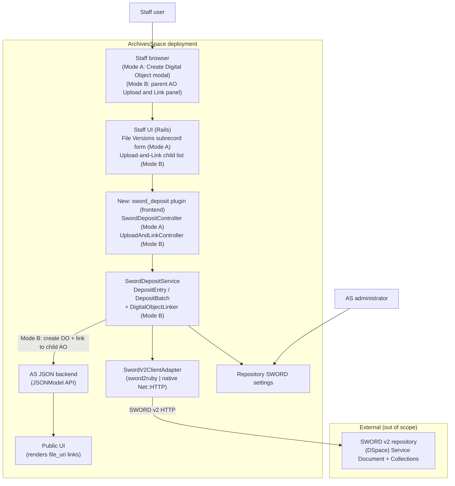

# A3-4: ArchivesSpace SWORD Deposits — High-Level Feature Design

## Technical specification (architecture-first draft)

**Scenarios:** [A3](https://github.com/lyrasisorghome/InteroperabilityProject/issues/45) and [A4](https://github.com/lyrasisorghome/InteroperabilityProject/issues/52)

**Status:** Draft v0.4 — high-level feature design; closes the *where-in-the-codebase* and *where-does-it-initiate* gaps in [`A3-4-as-sword-deposit.md`](A3-4-as-sword-deposit.md) (notably Gap G-03). Defines **two deposit modes** sharing one SWORD primitive: **Mode A** — single deposit from a child Archival Object (in-form population; verified against the ArchivesSpace sandbox, 2026-07-19); **Mode B** — a parent-level **"Upload and Link"** panel that deposits one local file per immediate child Archival Object and creates+links a Digital Object for each (server-side).

**Systems:** ArchivesSpace staff UI (SUI, Rails) and JSON backend API; ArchivesSpace PUI (display only); DSpace SWORD v2 endpoint (7.x/9.x contract); extensible to other SWORD-compliant repositories and SWORD v3.

**Normative references:**

- [SWORD v2 Profile](https://swordapp.github.io/SWORDv2-Profile/SWORDProfile.html)
- [SWORD v2 specification](https://swordapp.github.io/SWORDv2/SWORDv2.html)
- [swordapp/sword2ruby](https://github.com/swordapp/sword2ruby) (candidate client; see maintenance note)
- [ArchivesSpace API](https://archivesspace.github.io/archivesspace/api/)
- [ArchivesSpace plugin development](https://archivesspace.github.io/tech-docs/customization/plugins.html)
- Parent requirements: [`A3-4-as-sword-deposit.md`](A3-4-as-sword-deposit.md)
- Companion designs: [`V1-dev-high-vivo-sword-deposit.md`](V1-dev-high-vivo-sword-deposit.md), [`A1-2-dev-high-bidirectional-linking-as-ds.md`](A1-2-dev-high-bidirectional-linking-as-ds.md)
- Metadata mapping: [`as-dc-mapping.html`](../references/as-dc-mapping.html)

---

## Purpose and scope

Define **how ArchivesSpace would implement** a workflow in which a staff user deposits **one local file** for a **child Archival Object** to a configured SWORD v2 repository, then records a **File Version** whose `file_uri` is the **public item URL** returned by the deposit. Both modes below share the same SWORD deposit primitive (`DepositEntry`) and the same 1:1:1 granularity — one file → one repository item → one File Version.

### Two deposit modes

| Mode | Entry point | Scope | AS write path |
|------|-------------|-------|---------------|
| **A — Single deposit** | A **child Archival Object** → Instances → Add Digital Object → **Create** modal | One file for one child AO, repeated manually down the tree | **In-form population**, persisted on the modal's "Create and Link" (A-11) |
| **B — Batch "Upload and Link"** | A new panel on the **parent Archival Object** listing its immediate children, one file input each | One file per child AO, all in a single action | **Server-side create + link** (the plugin creates a Digital Object and links it to each child AO) |

Mode A is the primary, lowest-risk flow; Mode B is a client-requested efficiency feature for populating many children quickly. They are complementary — Mode B is `DepositBatch` = N × the Mode A deposit primitive, differing only in how results are written back (see [Mode B write path](#mode-b-write-path-server-side-create--link)).

### Mode A — single deposit (child Archival Object)

The staff user clicks a child Archival Object in the resource tree, then opens **Instances → Add Digital Object → Create**, which renders the native **"Create Digital Object"** modal containing the standard **File Versions** subrecord form. The deposit control lives in that File Versions form. Because the same subrecord form is reused on the standalone Digital Object / Digital Object Component edit screens, those are supported entry points too, at no extra cost.

**Observed workflow (from user studies):**

1. Staff user browses to an Archival Object; existing child Archival Objects appear in the resource tree (upper panel).
2. If a needed child Archival Object does not exist, the staff user creates one per binary they intend to deposit (**Archival Objects always exist before a deposit is attempted**), then returns to the parent.
3. Staff user clicks a **child Archival Object** in the tree.
4. Staff user does **Instances → Add Digital Object → Create → "Upload File Version"** → the plugin deposits the single file via SWORD and populates the File Version's `file_uri`.
5. Staff user clicks **"Create and Link"**.
6. Staff user clicks the **next child Archival Object** in the tree and repeats.

Mode A optimizes for **one binary per child Archival Object, quickly repeated across children** — not for attaching many binaries to a single Digital Object. Tree navigation between children is native ArchivesSpace behavior; Mode A adds no special multi-object mode.

### Mode B — batch "Upload and Link" (parent Archival Object)

To populate many children in one pass, the plugin adds an **"Upload and Link"** panel (proposed placement: a new section under **Instances** on the parent Archival Object). It lists the parent's **immediate child Archival Objects**, each with its own file input.

**Observed workflow (client ask):**

1. Staff user browses to the **parent** Archival Object; child Archival Objects appear in the resource tree (upper panel) **and** as rows in the new "Upload and Link" section.
2. For each child they want to populate, the staff user selects a **local file** in that child's file input. (Children left blank are skipped.)
3. Staff user clicks a single **"Upload and Link"** button for the whole group.
4. For every child with a chosen file, the plugin **deposits the file via SWORD**, then **creates a Digital Object with a single File Version** (`file_uri` = returned public item URL) and **links it to that child Archival Object** as a digital-object instance.
5. A per-child result summary reports success/failure; failures are **fail-forward** (successful children are created and linked; failed children are listed for retry — parent G-07).

Mode B still honors **1:1:1** (one file → one Digital Object with one File Version → one child AO) and **A-13** (children pre-exist). It does **not** attach multiple binaries to a single child, and it is **not** the deferred drag-and-drop wizard (see Out of scope).

This document is the bridge from the behavior spec ([`A3-4-as-sword-deposit.md`](A3-4-as-sword-deposit.md), which defines *what*: roles, config table, BS01–BS03, ES01–ES04, gaps G-01–G-10) to implementation planning (*which plugin, controllers, JSONModels, and client library would change*).

**In scope for v0.1–v0.4:**

1. ArchivesSpace deployment/plugin context and where HTTP requests land
2. **Mode A** — entry from the **child Archival Object → Instances → Add Digital Object → Create** modal (primary), plus the standalone **Digital Object** / **Digital Object Component** edit screens (same subrecord form)
3. An **"Upload File Version"** control aligned with the existing **"Add File Version"** button, in every context where the File Versions subrecord form is rendered
4. **Single-file browser upload** per deposit (v0.3 simplification; multi-select dropped)
5. **Mode B** — an **"Upload and Link"** panel on the **parent Archival Object** listing immediate children with one file input each, and a single action that deposits + creates + links a Digital Object per child (server-side)
6. The `DepositEntry` contract (one file → one item → one File Version); `DepositBatch` = N × `DepositEntry`, now realized by Mode B (fail-forward, G-07)
7. A version-abstracted SWORD client (v2 now; v3 adapter stub)
8. Two write-back paths: **in-form population** (Mode A) and **server-side create + link** (Mode B)
9. Configuration model at the repository level
10. Error handling mapped to parent ES01–ES04, including partial-batch failure for Mode B

**Out of scope for v0.1–v0.4 (deferred):**

- **Multi-file / multi-select** upload to a single Digital Object (de-prioritized per user studies: the real workflow is one binary per child Archival Object)
- The multi-page **deposit wizard** with **drag-and-drop** file→archival-object mapping described in parent BS02/BS03 (*explicitly deferred at client direction*). Mode B covers the common case (one file per immediate child via file inputs); the free-form drag-drop mapping across arbitrary tree depth remains deferred, but reuses the same `DepositBatch` + create-and-link machinery.
- **Non-immediate descendants**: Mode B lists only the parent's **direct** children (A-15); deep/recursive selection is deferred.
- Full descriptive-metadata mapping AS → DSpace (**open**, pending ArchivesSpace + DSpace team input; see G-05 / M-01)
- SWORD v3 implementation
- Re-deposit / update-in-place of previously deposited content (G-10)
- Changes to DSpace-side ingest workflow/approval configuration

**Naming constraint (program):** the feature integrates with **any SWORD-compliant repository** via standard endpoints. DSpace is the reference target but must not be assumed beyond the protocol.

---

## Why the parent spec stalls

[`A3-4-as-sword-deposit.md`](A3-4-as-sword-deposit.md) defines behavior but leaves implementation open, and its wizard scenarios (BS02/BS03) conflate several concerns:

| Parent gap | What is missing for developers |
|------------|--------------------------------|
| G-02 | Whether AS stores binaries. **Resolved here:** it does not — AS is a CMS, not a DAMS; binaries come from the **staff user's browser** at deposit time. |
| G-03 | Where the deposit initiates. **Resolved here:** primarily the **Archival Object → Instances → Add Digital Object → Create** modal, via an "Upload File Version" control in the **File Versions** subrecord section, aligned with "Add File Version". The same control appears wherever that subrecord form renders (standalone Digital Object / Component edit). |
| G-06 | Item/file granularity. **Resolved here:** **1:1:1** — one file → one DSpace item → one AS File Version. |
| G-04 / G-05 | Package format and metadata mapping. **Partially open:** v0.1 uses **binary deposit**; descriptive-metadata mapping is a **placeholder** (M-01). |
| G-08 | SWORD version abstraction. **Resolved here:** `SwordProtocolAdapter` interface, v2 impl + v3 stub. |
| Client library | Not named. **Resolved here:** `sword2ruby` *or* a thin native client behind the adapter. |

**Design stance:** implement the **atomic deposit primitive** (`DepositEntry`) that the "Upload File Version" button needs — one file → one repository item → one File Version. **Mode A** calls `DepositEntry` directly and writes back in-form. **Mode B** is `DepositBatch` = N × `DepositEntry`, one entry per immediate child, followed by a **create-and-link** step per child. This mirrors the `LinkEntry`/`LinkBatch` and `create_digital_object` patterns from [`A1-2-dev-high-bidirectional-linking-as-ds.md`](A1-2-dev-high-bidirectional-linking-as-ds.md) — the difference from A1-2 is that the `file_uri` comes from a SWORD **deposit** rather than a link to a pre-existing DSpace item.

---

## Assumptions

| ID | Assumption |
|----|------------|
| A-01 | Target **ArchivesSpace 3.x+** deployed as the standard multi-app stack (staff SUI + JSON backend + PUI + Solr). Feature ships as an **ArchivesSpace plugin**. |
| A-02 | **SWORD v2** is the only protocol implemented in v0.1. A `SwordProtocolAdapter` interface allows a future v3 adapter without rewriting orchestration. |
| A-03 | The target repository exposes a **Service Document URL** and ≥1 **Collection** accepting the configured deposit type (typically `application/pdf` / binary). |
| A-04 | **ArchivesSpace does not persist deposited binaries.** Files are streamed from the browser through the plugin to the SWORD endpoint and held only transiently. Only the returned **item URL** (and optional edit IRI) are written to AS. |
| A-05 | Deposit orchestration runs in the **staff frontend plugin**, which already holds an authenticated backend session, so binaries never transit the JSON backend API. |
| A-06 | **Granularity is 1:1:1**: one uploaded file → one repository item → one `file_version` on the target Digital Object / Component (whether pre-existing or being created inline from a child Archival Object). |
| A-07 | The `file_uri` written to AS is the repository's **public item URL** (e.g. `{dspaceBaseUrl}/handle/{handle}`), because PUI end users and staff both click it. |
| A-08 | **Authentication (v2)** is **HTTP Basic Auth** with a service credential configured per AS repository (parent G-01; per-user credentials deferred). |
| A-09 | Deposit is **synchronous from the user's perspective** in v0.1. Even if the endpoint returns SWORD **In-Progress**, AS still writes the File Version immediately; staff manage visibility via existing **Publish?** and **Make Representative** controls. |
| A-10 | **Descriptive metadata mapping AS → repository is not finalized.** v0.1 deposits binaries with a **minimal, configurable metadata stub** (at least a title/slug); full mapping is M-01 pending AS + DSpace teams. |
| A-11 | **The target Digital Object may not be persisted at deposit time.** In the primary Archival Object flow, the "Create Digital Object" modal holds an *unsaved* record (verified 2026-07-19: no ID/URI until "Create and Link"). Therefore the deposit **must not** depend on a saved AS record: it obtains the `file_uri` and **populates the in-memory File Version row**; AS persists everything on the record's normal Save / "Create and Link". This is the same client-side subrecord form used on the standalone Digital Object edit screen. |
| A-12 | **Metadata for the SWORD package is sourced from the deposit context, not a saved Digital Object**: the values being entered in the modal (Title, Identifier) and/or the **parent (child) Archival Object** (which *is* persisted and has a ref). See M-01. |
| A-13 | **One binary per child Archival Object; Archival Objects always pre-exist the deposit.** Staff create the child Archival Objects first, then deposit a single file for each. In Mode A they iterate across the tree manually; in Mode B they populate many children in one action. Each deposit is a single `DepositEntry`. |
| A-14 | **Mode B writes server-side.** Because Mode B spans **sibling** records (many child Archival Objects) rather than one open form, it cannot rely on the native "Create and Link" form save. The plugin creates each Digital Object and links it to its child Archival Object via the **JSONModel API** (`create_digital_object` + append a digital-object instance to the child AO; AS has no PATCH → GET→merge→POST). This is the same server-side path A-11 marks optional for Mode A. |
| A-15 | **Mode B lists only the parent's immediate (direct) child Archival Objects** and maps exactly **one file to one child** (1:1:1 preserved). Recursive/deep descendants and many-files-per-child are out of scope. |
| A-16 | **Children are enumerated via ArchivesSpace's existing tree/children API** (e.g. the resource/archival-object tree endpoints the SUI already uses); the plugin does not maintain its own hierarchy. |

---

## Actors and deployment context



| Actor | Role |
|-------|------|
| **AS Administrator** | Configures per-repository SWORD endpoint(s), credentials, default collection, protocol version, master enable (parent BS01). |
| **AS Staff User (Mode A)** | Selects a child Archival Object (primary) — or edits a Digital Object / Component — chooses **one** local file and triggers deposit; reviews the resulting File Version; sets Publish / Representative; saves via "Create and Link" / Save; moves to the next child and repeats. |
| **AS Staff User (Mode B)** | On the parent Archival Object, picks one local file per immediate child in the "Upload and Link" panel, clicks **"Upload and Link"** once, and reviews the per-child result summary. |
| **Repository/Collection manager** | Configures SWORD permissions and collections on the target repository (outside AS). |
| **PUI end user** | Clicks the `file_uri` link to the deposited item (no deposit UI). |
| **sword_deposit plugin** (new) | Validates uploads, deposits via SWORD, parses receipts; **Mode A** returns `file_uri` for in-form population; **Mode B** creates Digital Objects and links them to child Archival Objects; logs outcomes. |

### Typical URL shapes

Assume staff host `https://as.example.edu` (SUI):

| Surface | Example | Notes |
|---------|---------|-------|
| **Archival Object edit (Mode A primary)** | `/resources/16/edit#tree::archival_object_1646` | Instances → Add Digital Object → **Create** opens the "Create Digital Object" modal (no dedicated route; modal is inline) |
| **Parent Archival Object edit (Mode B)** | `/resources/16/edit#tree::archival_object_1646` | Hosts the injected **"Upload and Link"** panel listing immediate children |
| Digital Object edit (existing) | `/digital_objects/27/edit` | Same File Versions subrecord form |
| Digital Object Component edit (existing) | `/digital_objects/27/edit#tree::digital_object_component_1` | Same File Versions subrecord form |
| **Proposed upload endpoint (Mode A)** | `POST /plugins/sword_deposit/deposit` | Multipart; params: repo id, **one** file, optional parent Archival Object ref, in-form metadata (title/identifier) |
| **Proposed batch endpoint (Mode B)** | `POST /plugins/sword_deposit/deposit_and_link` | Multipart; params: repo id, parent AO ref, and per-child `{ child_ao_ref → file }` pairs; returns a per-child result report |
| Children listing (existing tree API, Mode B) | e.g. `GET /repositories/:id/resources/:id/tree/node` (or waypoint endpoints) | Enumerate the parent's immediate children (A-16) |
| **Proposed config** | `/plugins/sword_deposit/settings?repo_id=…` | Admin-only SWORD settings |
| Repository management (existing) | `/repositories` | Settings linked from here (parent §Configuration Location) |

---

## ArchivesSpace repositories/areas touched

| Area | Role in feature | Expected change level |
|------|-----------------|------------------------|
| **New plugin** `plugins/sword_deposit/` | Primary — controllers, service, SWORD adapter, config, JS, views, locales | **Major (new)** |
| Staff UI subrecord form for `file_version` | **Mode A:** add "Upload File Version" control beside "Add File Version"; render resulting File Versions | **Moderate (via plugin override/partial)** |
| Staff UI **Archival Object edit** (Instances area) | **Mode B:** inject the "Upload and Link" panel listing immediate children | **Moderate (via plugin partial/hook)** |
| `digital_object` JSONModel | **Mode A:** append `file_versions[]` (data only). **Mode B:** `create_digital_object` with one `file_version` (server-side) | **None (data only)** |
| `archival_object` JSONModel | **Mode B:** append a digital-object `instances[]` entry linking the new Digital Object to the child AO | **None (data only)** |
| Resource/AO **tree API** | **Mode B:** enumerate the parent's immediate children (A-16) | **None (read only)** |
| Repository configuration UI | Host SWORD Deposit Settings section | **Minor (plugin-provided)** |
| SWORD client dependency | `sword2ruby` gem *or* vendored native client | **Dependency** |
| PUI | Renders `file_versions[].file_uri` (existing behavior) | **None** |

**No core AS fork required:** everything is achievable through the plugin mechanism (frontend controllers/assets/views, optional backend model for config, `config.rb`).

---

## Existing components to reuse or extend

ArchivesSpace has **no SWORD code today**. Closest reusable machinery:

### File Versions subrecord (the anchor)

| Component | Reuse |
|-----------|-------|
| `file_version` subrecord form partial (staff UI) | The section rendered under **File Versions**; "Add File Version" is its subrecord-add control. The new control lives here, in every rendering context. |
| Subrecord add JS (`add_subrecord` / `subrecord.js` patterns) | Precedent for appending a File Version row client-side; the upload flow appends **populated** rows (with `file_uri`) instead of empty ones. |
| `is_representative` / "Make Representative" | Left to the staff user post-deposit (A-09). |
| `publish` checkbox | Default `true` on deposited File Versions; staff can toggle (A-09). |

**Sandbox-verified File Version fields (2026-07-19):** `Make Representative`, **File URI**, `Publish?`, `Use Statement`, `XLink Actuate Attribute`, `XLink Show Attribute`, `File Format Name`, `File Format Version`, `File Size (Bytes)`, `Checksum`, `Checksum Method`, `Caption`. The deposit populates at least **File URI** and `Publish?`; other fields remain staff-editable.

### Archival Object → Create Digital Object modal (primary entry)

| Component | Reuse |
|-----------|-------|
| Archival Object **Instances** subrecord (`Add Digital Object` → dropdown → `Create`) | Native control that opens the **"Create Digital Object"** modal; the deposit control appears inside that modal's File Versions form. |
| "Create Digital Object" modal (embedded, unsaved record) | **Verified:** the Digital Object is unsaved (no ID/URI) and is created + linked to the Archival Object only on **"Create and Link"**. The File Versions subrecord renders **inline** here, identical to the standalone form. |
| `add_form_and_link` / nested subrecord persistence | The whole nested record (Digital Object + File Versions + instance link) is persisted by AS on "Create and Link" — the plugin does **not** write it server-side. |

### Persistence path (Mode A)

| Component | Reuse |
|-----------|-------|
| Native subrecord form submit ("Create and Link" / Save) | **Default write path (A-11):** the deposited File Version row is populated in the form and persisted by AS's own save. Works whether the Digital Object pre-exists or is being created inline. No plugin-side JSONModel write required. |
| `JSONModel(:digital_object)` / `JSONModel(:digital_object_component)` (`find → append → save`) | **Optional path only** for a *pre-existing, already-saved* Digital Object if immediate auto-save is later chosen (D-03). Not usable in the unsaved AO-create modal. AS has no PATCH; this is the GET→merge→POST equivalent. |
| Frontend authenticated backend session | Plugin controller reuses the staff session's backend token — no separate auth. |

### Archival Object children + create/link (Mode B)

| Component | Reuse |
|-----------|-------|
| Resource / Archival Object **tree API** | List the parent's immediate children (title + ref) to render the "Upload and Link" rows (A-16). |
| `create_digital_object` (A1-2 precedent) | For each child with a file: `POST /repositories/:id/digital_objects` with a single `file_version` whose `file_uri` is the SWORD item URL. |
| Digital-object **instance** on `archival_object` | `GET` the child AO → append `instances[]` a digital-object instance referencing the new DO → `POST` (full JSONModel; GET→merge→POST). Mirrors A1-2 `create_digital_object` linking. |
| Frontend authenticated backend session | Same session/token reused for all reads and writes. |

### Configuration

| Component | Reuse |
|-----------|-------|
| Plugin `config.rb` / `AppConfig` | Global feature flags/limits. |
| Repository-scoped settings (plugin-managed store) | Per-repository endpoint records (parent Configuration Fields table). |

---

## Proposed new components

Plugin layout (ArchivesSpace conventions):

```
plugins/sword_deposit/
  config.rb                              # AppConfig defaults, feature flag
  frontend/
    controllers/
      sword_deposit_controller.rb        # Mode A: POST /plugins/sword_deposit/deposit (multipart)
      upload_and_link_controller.rb      # Mode B: POST /plugins/sword_deposit/deposit_and_link
      sword_settings_controller.rb       # repository SWORD settings CRUD + Test connection
    views/
      sword_deposit/_upload_button.html.erb        # Mode A: "Upload File Version" control
      sword_deposit/_upload_and_link_panel.html.erb # Mode B: child list + file inputs + button
      sword_settings/index.html.erb
    assets/
      sword_deposit.js                   # Mode A: single-file input, populate File Version
      sword_upload_and_link.js           # Mode B: per-child inputs, submit, per-child results
    locales/en.yml                       # button labels, errors, tooltips
    plugin_init.rb                        # inject Mode A button + Mode B panel
  backend/
    model/
      sword_endpoint_config.rb           # per-repo endpoint persistence (or repo preference)
    controllers/
      sword_config_controller.rb         # optional backend API for config (if not frontend-only)
  lib/
    sword_deposit_service.rb             # DepositEntry / DepositBatch orchestration
    digital_object_linker.rb             # Mode B: create_digital_object + link instance to child AO
    archival_object_children.rb          # Mode B: enumerate parent's immediate children (tree API)
    metadata/
      as_record_metadata.rb              # pull title/label from DO/DOC (+ archival object)
      dc_mapper.rb                        # AS -> Dublin Core (PLACEHOLDER, see M-01)
      deposit_package.rb                  # binary (+ optional minimal metadata) wrapper
    sword/
      sword_protocol_adapter.rb          # interface: service_document, deposit, status
      sword_v2_client_adapter.rb         # wraps sword2ruby OR native Net::HTTP
      sword_v3_client_adapter.rb         # stub -> NotImplemented
      sword_adapter_factory.rb           # select by configured version
      deposit_result.rb                  # item_url, edit_iri, in_progress, status
    sword_deposit_audit_log.rb           # timestamp, user, repo, collection, result
```

### Class responsibilities (sketch)

**`SwordDepositController#deposit`** — staff HTTP entry (multipart):

```ruby
# POST /plugins/sword_deposit/deposit  (multipart)
# params: repo_id, collection_href, file,   # ONE file (A-13)
#         metadata: { title:, identifier: },  # in-form values (DO may be unsaved, A-11)
#         parent_ao_ref                        # optional: persisted child Archival Object for DC (A-12)
def deposit
  cfg    = SwordEndpointConfig.for_repository(params[:repo_id])   # enabled? (ES01)
  ctx    = DepositContext.new(metadata: params[:metadata],
                              parent_ao_ref: params[:parent_ao_ref])
  result = SwordDepositService.new(cfg, current_backend_session)
             .deposit_entry(params[:file], ctx,
                            collection_href: params[:collection_href])
  render json: result   # { filename, status, file_uri, error } -> JS fills one row
end
```

**`SwordDepositService`** — the contract everything hangs off. Note it returns the
`file_uri` and does **not** write to AS (A-11): persistence is the native form save.

```ruby
# DepositEntry: one file -> one item -> one file_version row (1:1:1)
def deposit_entry(file, ctx, collection_href:)
  package = DepositPackage.binary(file, metadata: AsRecordMetadata.from(ctx)) # M-01 minimal
  res     = adapter.deposit(collection_href || cfg.default_collection, package, cfg) # SWORD POST
  audit_log.record(ctx, cfg, collection_href, res)
  DepositResult.ok(file.original_filename, res.item_url)   # public handle URL (A-07)
ensure
  package&.dispose                                          # drop transient bytes (A-04)
end

# DepositBatch: retained ONLY for the deferred wizard (batch across archival objects).
# The shipping "Upload File Version" control deposits one file per child Archival Object,
# so it calls deposit_entry directly. N x DepositEntry, fail-forward (parent G-07).
def deposit_batch(files, ctx, collection_href:)
  DepositReport.new(files.map { |f|
    begin;  deposit_entry(f, ctx, collection_href: collection_href)
    rescue => e; DepositResult.fail(f.original_filename, e); end
  })
end
```

**`AsRecordMetadata.from(ctx)`** — builds the minimal SWORD package metadata (M-01) from the
**in-form values** (Title, Identifier) and/or the **persisted parent Archival Object**
(`ctx.parent_ao_ref`, fetched via JSONModel). It never requires a saved Digital Object,
so it works inside the unsaved "Create Digital Object" modal.

**`SwordV2ClientAdapter`** — thin, library-agnostic:

```ruby
class SwordV2ClientAdapter          # implements SwordProtocolAdapter
  def service_document(cfg); end    # GET Service-Document IRI (Basic auth)
  def deposit(collection_href, package, cfg)
    # POST binary to Collection IRI with headers:
    #   Authorization: Basic ..., Content-Type, Content-Disposition (filename),
    #   optional Slug, In-Progress. Parse DepositReceipt -> DepositResult.
  end
  def status(edit_iri, cfg); end    # optional in v0.1 (In-Progress polling)
end
```

### File Version population (client-side, default path)

On a successful deposit the browser receives `{ filename, file_uri }` and
**injects a populated File Version row** into the current subrecord form — the same DOM the
native "Add File Version" button drives — then AS persists it on Save / "Create and Link"
(A-11). No plugin-side JSONModel write is needed, so this works identically in the unsaved
child Archival Object → Create Digital Object modal and on a saved Digital Object edit screen.

```javascript
// sword_deposit.js (sketch): after POST /plugins/sword_deposit/deposit (one file)
function onDepositResult(r) {
  if (r.status !== "ok") { showRowError(r.filename, r.error); return; } // ES02/03/04
  var $row = addFileVersionRow();          // reuse AS subrecord add
  $row.find("[name$='[file_uri]']").val(r.file_uri);   // public handle URL (A-07)
  $row.find("[name$='[publish]']").prop("checked", true); // A-09; staff can toggle
  // is_representative left unchecked -> staff uses "Make Representative"
}
// persistence happens on the native "Create and Link" / Save submit
```

**Optional immediate-save path (pre-existing Digital Object only, see D-03):** if a future
iteration wants deposits to persist without waiting for Save on an *already-saved* record:

```ruby
rec = JSONModel(target_type).find(id_from(target_ref))   # only when DO already exists
rec.file_versions << {
  "jsonmodel_type"          => "file_version",
  "file_uri"                => item_public_url,   # A-07
  "publish"                 => true,              # A-09; staff can toggle
  "is_representative"       => false,             # staff uses "Make Representative"
  "xlink_actuate_attribute" => "onRequest",
  "xlink_show_attribute"    => "new"
}
rec.save                                          # full JSONModel POST (no PATCH)
```

### Mode B write path (server-side create + link)

Mode B spans **sibling** child Archival Objects, so there is no single open form to populate; the plugin writes to AS itself (A-14). For each child that has a chosen file it runs one `DepositEntry` (SWORD deposit → `file_uri`), then creates a Digital Object and links it to that child. Failures are **fail-forward** and reported per child (G-07).

**`UploadAndLinkController#deposit_and_link`** — Mode B HTTP entry (multipart):

```ruby
# POST /plugins/sword_deposit/deposit_and_link  (multipart)
# params: repo_id, parent_ao_ref, collection_href,
#         children: [ { child_ao_ref:, file: }, ... ]   # one file per child (A-15)
def deposit_and_link
  cfg    = SwordEndpointConfig.for_repository(params[:repo_id])   # enabled? (ES01)
  report = SwordDepositService.new(cfg, current_backend_session)
             .deposit_and_link_batch(params[:children],
                                     collection_href: params[:collection_href])
  render json: report   # per-child { child_ao_ref, status, digital_object_uri, file_uri, error }
end
```

**`SwordDepositService#deposit_and_link_batch`** — `DepositBatch` + create/link:

```ruby
def deposit_and_link_batch(children, collection_href:)
  DepositReport.new(children.map { |c|
    begin
      ctx = DepositContext.new(parent_ao_ref: c[:child_ao_ref])          # metadata from the child AO (A-12)
      res = deposit_entry(c[:file], ctx, collection_href: collection_href) # SWORD deposit (shared primitive)
      link = DigitalObjectLinker.new(session).create_and_link(
               child_ao_ref: c[:child_ao_ref], file_uri: res.file_uri)     # create DO + instance link
      DepositResult.linked(c[:child_ao_ref], link.digital_object_uri, res.file_uri)
    rescue => e
      DepositResult.fail(c[:child_ao_ref], e)   # fail-forward; other children continue (G-07)
    end
  })
end
```

**`DigitalObjectLinker#create_and_link`** — the AS write (A-14; mirrors A1-2 `create_digital_object`):

```ruby
def create_and_link(child_ao_ref:, file_uri:)
  child = JSONModel(:archival_object).find(id_from(child_ao_ref))
  do_obj = JSONModel(:digital_object).new._always_valid!
  do_obj.title = child.display_string                 # minimal title (M-01); refine later
  do_obj.digital_object_id = generate_identifier(child)
  do_obj.file_versions = [{
    "jsonmodel_type" => "file_version", "file_uri" => file_uri,          # A-07
    "publish" => true, "is_representative" => false,                     # A-09
    "xlink_actuate_attribute" => "onRequest", "xlink_show_attribute" => "new"
  }]
  created = do_obj.save                                 # POST /repositories/:id/digital_objects
  child.instances << {                                  # GET->merge->POST (no PATCH)
    "jsonmodel_type" => "instance", "instance_type" => "digital_object",
    "digital_object" => { "ref" => created.uri }
  }
  child.save
  OpenStruct.new(digital_object_uri: created.uri)
end
```

> **Partial state (ES02/ES05):** if the SWORD deposit succeeds but the AS create/link fails, a repository item exists with no AS link. The failure is reported for that child and the **Edit-IRI is logged** for cleanup (same caveat as A1-2 "DSpace PATCH fails after AS success"). Default policy is fail-forward, not rollback (see D-12).

---

## Configuration model

Two tiers, matching the parent Configuration Fields table and AS conventions.

### Tier 1 — System (plugin `config.rb` / `AppConfig`)

| Key | Example | Purpose |
|-----|---------|---------|
| `AppConfig[:sword_deposit_enabled]` | `true` | Master switch; hides control, rejects endpoint when false (ES01) |
| `AppConfig[:sword_deposit_max_upload_bytes]` | `104857600` | Per-file upload cap |
| `AppConfig[:sword_deposit_allowed_mime_types]` | `["application/pdf"]` | Upload validation (parent notes "mostly PDFs") |
| `AppConfig[:sword_deposit_client]` | `native` | `native` (Net::HTTP) or `sword2ruby` |
| `AppConfig[:sword_deposit_default_protocol]` | `v2` | Adapter default |

### Tier 2 — AS Administrator (per-repository SWORD settings)

Reached via **Repository management → SWORD Deposit Settings** (parent §Configuration Location):

| Field | Type | Required | Description |
|-------|------|----------|-------------|
| `display_name` | string | No | Label when multiple endpoints exist |
| `enabled` | boolean | Yes | Per-repository master switch (drives control visibility, ES01) |
| `service_document_url` | URL | Yes | SWORD v2 Service Document URL |
| `protocol_version` | enum | Yes | `v2` (default); `v3` disabled until implemented |
| `auth_type` | enum | Yes | `basic` (v0.1); schema allows future OAuth/API key (G-01) |
| `username` | string | Yes | Service credential |
| `password` | secret | Yes | Encrypted at rest — never logged (G-01, ES03) |
| `default_collection_href` | URL | No | Pre-selected collection from Service Document |
| `default_package_format` | enum | Yes | `binary` (v0.1); `zip`/`mets` future (G-04) |

**Save / test actions** (parent BS01): **Test connection** GETs the Service Document, validates auth, and populates the collection list; failures surface to the admin.

---

## Reference UI touchpoint

### Mode A — "Upload File Version" (child Archival Object)

The control lives **in the File Versions subrecord section**, aligned with **Add File Version** (per the observation that "Add File Version" simply appends an empty File Version row). Because that subrecord form is shared, a single injection covers all Mode A entry points.

**Flow:** click a child Archival Object in the tree → Instances → **Add Digital Object** → dropdown → **Create** → the "Create Digital Object" modal opens → scroll to **File Versions** → **"Upload File Version"** → select **one** file → the row is populated with the returned URI → **"Create and Link"** persists the Digital Object, its File Version, and the instance link to the Archival Object → click the **next** child Archival Object and repeat.

| Element | Behavior |
|---------|----------|
| Entry contexts | The "Create Digital Object" modal (from a child Archival Object), the standalone Digital Object edit screen, and the Digital Object Component edit screen — anywhere the File Versions subrecord renders. |
| **"Upload File Version"** button | Rendered next to "Add File Version" when the repository has SWORD enabled (ES01 hides/disables otherwise, with tooltip). |
| Hidden file input | `<input type="file" accept=".pdf">` — **single file** (A-13; no `multiple`). |
| Collection select | Shown only if >1 collection or no default; else uses `default_collection_href`; "None" allowed (parent BS02). |
| Progress + result | Upload progress; on success, **populate the File Version row** (with `file_uri`, `publish` checked) exactly as if the user had added it manually; on failure, inline error (ES02/ES03/ES04). |
| Save semantics | The deposited File Version is populated into the in-memory subrecord form and persisted on the record's normal **Save** / **"Create and Link"** (A-11). No auto-save is required; see D-03. |

### Mode B — "Upload and Link" panel (parent Archival Object)

A plugin-injected panel on the parent Archival Object (proposed placement: a new section under **Instances**). It renders one row per **immediate child** Archival Object (A-15), enumerated via the tree API (A-16).

**Flow:** open the parent Archival Object → the **"Upload and Link"** panel lists immediate children → pick a local file in each child's input (leave others blank) → click the single **"Upload and Link"** button → the plugin deposits + creates + links per child → a per-child result summary appears with links to each new Digital Object / repository item.

| Element | Behavior |
|---------|----------|
| Panel visibility | Shown on Archival Objects that have children when SWORD is enabled for the repository (ES01 otherwise hidden/disabled with tooltip). |
| Child rows | One row per immediate child: child title/label + a single `<input type="file" accept=".pdf">` (one file per child, A-15). Children with no file selected are skipped. |
| Collection select | One selector for the batch (per-child override deferred); default from config (D-06). |
| **"Upload and Link"** button | Submits all chosen `{ child → file }` pairs to `POST /plugins/sword_deposit/deposit_and_link`. |
| Progress + result | Per-child status (pending → deposited → linked, or error). On success, the row shows a link to the new Digital Object and the repository item; on failure, an inline, retryable error (ES02/ES03/ES04). |
| Persistence | **Server-side** — the plugin creates each Digital Object and links it to the child AO (A-14). No parent-form save is required; results are already persisted when the summary appears. |

**i18n:** add keys under `frontend/locales/en.yml` following AS locale conventions.

---

## Metadata and packaging

> This is the least-settled area and is intentionally a **placeholder** pending ArchivesSpace + DSpace team input.

### v0.1 approach

- **Deposit type:** `binary` — a single file `POST` to the Collection IRI (`Content-Type` from the file, `Content-Disposition` carrying the filename). This is the lowest-friction path and matches "mostly PDFs."
- **Minimal metadata stub (M-01):** DSpace typically requires at least a title. v0.1 sends a **minimal title** derived from the Digital Object/Component **title/label** (or filename fallback) via SWORD `Slug` and/or a small metadata entry. Anything beyond that is deferred.
- **Full DC mapping:** [`as-dc-mapping.html`](../references/as-dc-mapping.html) is the *starting* mapping (AS Digital Object → Dublin Core), but it was authored for **export**, not SWORD deposit, and predates this workflow. Confirm field-by-field with stakeholders before implementing (G-05).

### Packaging modes behind the adapter (future-proofing)

| Mode | When | Notes |
|------|------|-------|
| **`binary`** (v0.1) | Collection accepts the file MIME directly | Simplest; minimal metadata |
| `zip` / `mets` (future) | Collection requires packaged deposit + descriptive metadata | Requires resolved DC mapping (G-04/G-05) |

---

## SWORD v2 protocol surface (implementation mapping)

| Operation | SWORD v2 | Adapter method |
|-----------|----------|----------------|
| Service Document | `GET` Service-Document IRI (Basic auth) | `service_document` |
| List collections | Parse workspaces from Service Document | (from `service_document`) |
| Deposit | `POST` file to Collection IRI | `deposit` → `DepositResult` |
| In-progress / complete | `In-Progress` header; Status/Edit-IRI in receipt | `status` (optional v0.1) |
| Auth | HTTP Basic | credential from config |

Headers: **Authorization**, **Content-Type**, **Content-Length**, **Content-Disposition**, optional **Slug**, **In-Progress**, **Packaging**.

**Which IRIs to keep:** the receipt yields several IRIs. Store the **public item URL** as `file_uri` (A-07); optionally retain the **Edit-IRI** in the audit log to enable future re-deposit/update (G-10).

### Client library note (`sword2ruby`)

[`sword2ruby`](https://github.com/swordapp/sword2ruby) is a genuine SWORD v2 Ruby client but appears **effectively unmaintained** (SWORD-project origin, ~2012-era, `atom-tools`-based, minimal repo activity). Recommendation: treat it as a **reference implementation** behind `SwordProtocolAdapter`, and default `AppConfig[:sword_deposit_client]` to a **thin native `Net::HTTP` client** for v0.1 (a v2 binary deposit is a small, well-specified HTTP interaction). This isolates the dependency decision to one class and keeps upgrade/replacement cheap.

### SWORD v3 forward compatibility

| Concern | v0.1 approach |
|---------|---------------|
| Adapter selection | `SwordAdapterFactory.for(cfg.protocol_version)` |
| v3 implementation | `SwordV3ClientAdapter` raises `NotImplementedError` |
| Auth | Config schema reserves OAuth/bearer fields; unused in v0.1 |

---

## Data flow: Mode A (single deposit, in-form population)

```mermaid
sequenceDiagram
  participant S as Staff
  participant UI as Create Digital Object modal (File Versions)
  participant C as SwordDepositController
  participant Svc as SwordDepositService
  participant A as SwordV2ClientAdapter
  participant DS as SWORD endpoint
  participant B as AS JSON backend

  S->>UI: Click child Archival Object → Instances → Add Digital Object → Create; Upload File Version, select one file
  UI->>C: POST /plugins/sword_deposit/deposit (file, metadata, parent_ao_ref)
  C->>Svc: deposit_entry(file, ctx)
  Svc->>A: deposit(collection, binary + minimal metadata)
  A->>DS: SWORD POST (Basic auth)
  DS-->>A: 201 DepositReceipt (+ item URL, edit IRI)
  Svc-->>C: DepositResult(ok, file_uri = public handle URL)
  C-->>UI: result { filename, file_uri }
  UI-->>UI: populate File Version row (file_uri, Publish checked)
  S->>UI: Click "Create and Link"
  UI->>B: POST digital_object (+ file_version) + link instance to Archival Object
  B-->>UI: Created + Linked (PUI shows file_uri)
  Note over S,B: Staff clicks next child Archival Object and repeats
```

> Mode A performs **no AS write** during the deposit; it returns the `file_uri` for in-form population (A-11). AS persistence — creating the Digital Object, its File Version, and the instance link back to the child Archival Object — happens on the native **"Create and Link"** submit. On a standalone Digital Object edit screen the flow is identical except the final submit is **Save** on the existing record. The staff user then selects the next child in the tree and repeats (A-13).

## Data flow: Mode B (batch "Upload and Link")

```mermaid
sequenceDiagram
  participant S as Staff
  participant UI as Upload and Link panel (parent AO)
  participant C as UploadAndLinkController
  participant Svc as SwordDepositService
  participant A as SwordV2ClientAdapter
  participant DS as SWORD endpoint
  participant B as AS JSON backend

  S->>UI: Open parent AO; pick one file per child; click "Upload and Link"
  UI->>C: POST /plugins/sword_deposit/deposit_and_link (children[{child_ao_ref, file}])
  loop each child with a file (fail-forward, G-07)
    C->>Svc: deposit_entry(file, ctx=child_ao) then create_and_link
    Svc->>A: deposit(collection, binary + minimal metadata)
    A->>DS: SWORD POST (Basic auth)
    DS-->>A: 201 DepositReceipt (+ item URL, edit IRI)
    Svc->>B: POST digital_object (file_version.file_uri = item URL)
    Svc->>B: GET child AO → append digital-object instance → POST
    B-->>Svc: Digital Object created + linked
  end
  C-->>UI: per-child report { child_ao_ref, status, digital_object_uri, file_uri, error }
  UI-->>S: summary; success rows link to DO + repository item; failed rows offer retry
```

> Mode B **writes to AS server-side** (A-14): for each child with a file it deposits, then creates a Digital Object and links it to that child. There is no parent-form save step — results are persisted as the summary renders. Failures are isolated per child (fail-forward); a deposit that succeeds while the AS write fails leaves a repository item whose Edit-IRI is logged for cleanup (D-12).

---

## Error handling (maps to parent ES01–ES04)

| ID | Condition | User-visible behavior | Log / notes |
|----|-----------|----------------------|-------------|
| ES01 | SWORD not configured/enabled for repository | "Upload File Version" hidden or disabled with tooltip "SWORD deposit is not configured…" | — |
| ES02 | Endpoint HTTP 4xx/5xx or SWORD Error Document | Plain-language error per file; **no File Version** created for that file | Full SWORD body + timestamp + user in audit log; retry/cancel offered |
| ES03 | Auth failure (401/403) | "Authentication failed. Your SWORD credentials may be expired or incorrect. Contact your administrator." | No deposit attempted; **never log password** |
| ES04 | Missing required metadata (once mapping exists) | Block the file; prompt to fill/acknowledge required fields | Which fields are required depends on M-01 |
| — | **Partial batch failure** (parent G-07, Mode B) | **Fail-forward:** children that deposited + created + linked show success; failed children keep their file input for retry, others are unaffected | Consistent with A1-2 `LinkBatch` semantics; per-child result in the report |
| ES05 | **Deposit succeeded but AS create/link failed** (Mode B) | Report the child as failed with a clear message; offer retry | **Repository item is orphaned**; log the Edit-IRI for cleanup. Default is fail-forward, not rollback (D-12) |

---

## Open decisions (for client / stakeholder feedback)

| ID | Question | Options | Default recommendation |
|----|----------|---------|------------------------|
| M-01 | **Descriptive metadata mapping AS → repository** | binary-only vs minimal title vs full DC; and *which* AS record supplies it | **Minimal title stub now** from in-form Title/Identifier and/or the parent **Archival Object** (A-12); full mapping with AS+DSpace teams |
| D-01 | Client library | `sword2ruby` vs native `Net::HTTP` | **Native client**, `sword2ruby` as reference |
| D-02 | Config store | Repository preference vs plugin backend model vs JSON file | **Plugin-managed per-repository record** |
| D-03 | When File Versions persist | On record Save/"Create and Link" vs immediate auto-save on deposit | **Persist on Save / "Create and Link"** — *required* for the primary AO flow, where the Digital Object is unsaved at deposit time (A-11); auto-save is only viable for a pre-existing Digital Object |
| D-04 | Credential storage | Encrypted field vs external secret | **Encrypted at rest**; document production hardening (G-01) |
| D-05 | Orchestration tier | Frontend plugin vs backend job | **Frontend plugin** (session reuse; binaries avoid JSON backend) |
| D-06 | Collection selection UX | Always show vs default+hide | **Default when configured; show when ambiguous** |
| D-07 | In-progress deposits | Hold vs write immediately | **Write File Version immediately** (A-09) |
| D-08 | Re-deposit/update | New item vs SWORD replace | **New item (deposit-only)** in v0.1 (G-10) |
| D-09 | **Mode B panel placement** | New section under **Instances** on the AO vs a separate panel/tab | **Section under Instances** on the parent AO (matches the client's "under Instances" ask); confirm with UX |
| D-10 | **Mode B write path** | Server-side create + link vs client form population | **Server-side create + link** (A-14) — required because Mode B spans sibling records with no single open form |
| D-11 | **Mode B child scope** | Immediate children only vs recursive/deep | **Immediate (direct) children only** in v0.4 (A-15); deep selection deferred to the wizard |
| D-12 | **Mode B transactionality** | Fail-forward per child vs all-or-nothing vs rollback of orphaned items | **Fail-forward per child** (G-07); log Edit-IRI of orphaned items (ES05); auto-rollback deferred |

---

## Suggested epics

| Epic | Deliverable | Area |
|------|-------------|------|
| **0 — Spike** | Native v2 binary deposit against a test DSpace SWORD endpoint; parse receipt → item URL | `lib/sword` |
| **1 — Config** | Per-repository SWORD settings + Test connection + enable flag | frontend/backend config |
| **2 — Upload UI (Mode A)** | "Upload File Version" control (single file), progress, in-form row population; injected into the File Versions subrecord in the child AO "Create Digital Object" modal **and** the DO/DOC edit screens | frontend assets/views |
| **3 — Deposit + in-form population (Mode A)** | `DepositEntry` (single file), metadata from context (form + parent AO), return `file_uri`; persistence via native Save / "Create and Link" | `lib` |
| **4 — Batch Upload-and-Link (Mode B)** | "Upload and Link" panel listing immediate children (tree API); `deposit_and_link_batch` + `DigitalObjectLinker` (create DO + instance link per child); per-child report; fail-forward | frontend + `lib` |
| **5 — Hardening** | ES01–ES05, partial-batch fail-forward, orphaned-item logging, audit log, credential encryption | plugin-wide |
| **6 — Metadata (M-01)** | Resolve AS→DC mapping; packaged deposit if required | `lib/metadata` |
| **7 — Wizard (deferred)** | Deep/drag-drop file→archival-object mapping over the same `DepositBatch` + create-and-link machinery | frontend |
| **8 — SWORD v3 (future)** | `SwordV3ClientAdapter`, OAuth | `lib/sword` |

---

## Related documents

| Document | Relationship |
|----------|--------------|
| [`A3-4-as-sword-deposit.md`](A3-4-as-sword-deposit.md) | Requirements baseline (BS01–BS03, ES01–ES04, G-01–G-10) |
| [`V1-dev-high-vivo-sword-deposit.md`](V1-dev-high-vivo-sword-deposit.md) | Sibling SWORD deposit design (VIVO/Java); adapter + config patterns reused |
| [`A1-2-dev-high-bidirectional-linking-as-ds.md`](A1-2-dev-high-bidirectional-linking-as-ds.md) | AS write path (no PATCH; find→merge→save); `Entry`/`Batch` precedent |
| [`as-dc-mapping.html`](../references/as-dc-mapping.html) | Candidate AS → Dublin Core mapping (export-era; needs review for deposit) |
| [swordapp/sword2ruby](https://github.com/swordapp/sword2ruby) | Candidate Ruby SWORD v2 client (maintenance caveat) |

---

## Document history

| Version | Date | Notes |
|---------|------|-------|
| 0.1-draft | 2026-07-17 | Initial high-level design: AS plugin map, "Upload File Version" multi-select control, `DepositEntry`/`DepositBatch` (1:1:1), public-handle `file_uri`, v2 adapter (native vs `sword2ruby`), immediate File Version write with Publish/Representative deferred to staff, metadata mapping as M-01 placeholder. Wizard deferred. |
| 0.2-draft | 2026-07-19 | Made the **Archival Object** the primary entry point (Instances → Add Digital Object → Create → File Versions), verified against the ArchivesSpace sandbox. Reframed write-back as **in-form File Version population** persisted on "Create and Link" / Save (A-11), since the modal's Digital Object is unsaved at deposit time; server-side JSONModel write demoted to an optional path for pre-existing records. Deposit no longer requires a saved target; metadata now sourced from in-form values and/or the parent Archival Object (A-12). Updated purpose, scope, actors, URL shapes, reuse map, UI touchpoints, data flow, decisions (D-03, M-01), and epics. |
| 0.3-draft | 2026-07-19 | Simplified to match user studies: **one binary per child Archival Object**, repeated across the tree. **Dropped multi-select**; single-file upload only (`DepositEntry`; `DepositBatch` retained solely for the deferred wizard). Button label singular ("Upload File Version"). Added the observed step-by-step workflow and A-13 (AOs always pre-exist; per-child iteration is native tree navigation). Updated purpose/scope, in/out-of-scope, design stance, actors, controller/service and JS sketches, UI touchpoints, and data-flow diagram. |
| 0.4-draft | 2026-07-19 | Added **Mode B — "Upload and Link"**: a parent-Archival-Object panel listing immediate children with one file input each, and a single action that deposits + creates + links a Digital Object per child. Framed the design as **two modes** sharing the `DepositEntry` primitive: Mode A (in-form population, unchanged) and Mode B (**server-side create + link**, realizing `DepositBatch`). Added A-14/A-15/A-16 (server-side write, immediate children, tree-API enumeration), `UploadAndLinkController` / `deposit_and_link_batch` / `DigitalObjectLinker` / `ArchivalObjectChildren` components, Mode B UI section, a second data-flow diagram, ES05 (orphaned item), and D-09–D-12. Distinguished Mode B from the still-deferred deep/drag-drop wizard. |
