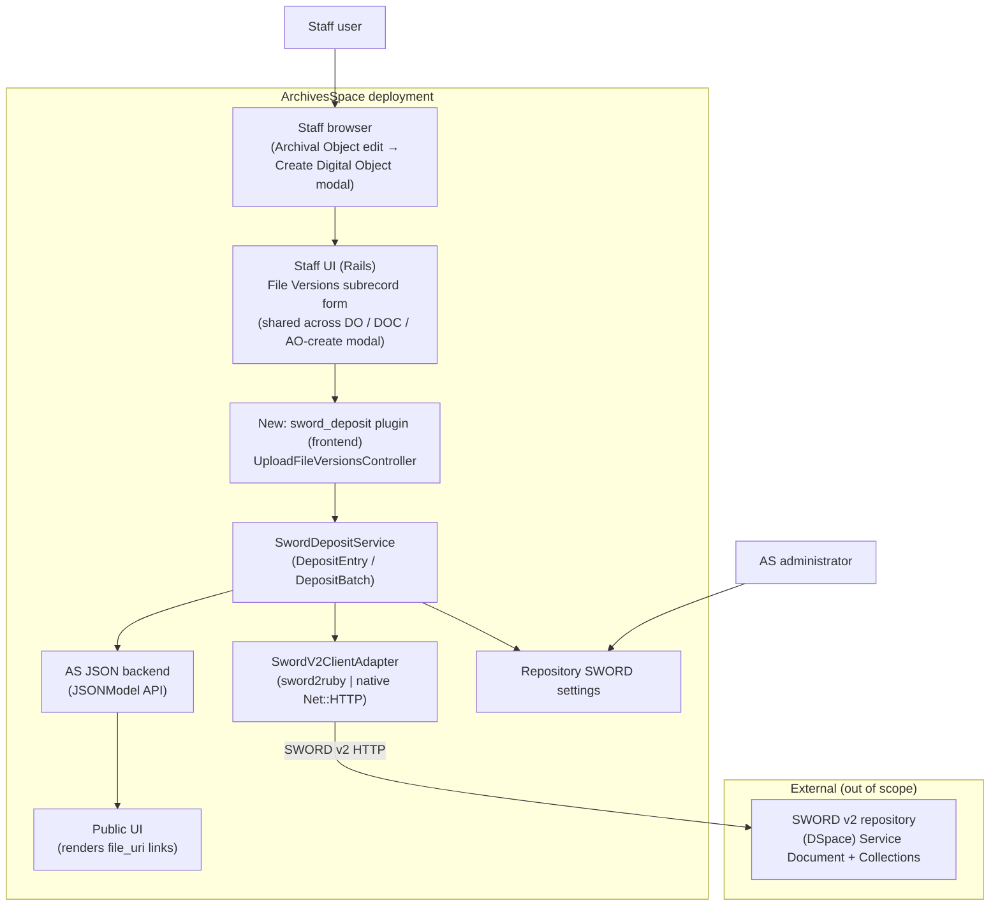

# A3-4: ArchivesSpace SWORD Deposits — High-Level Feature Design

## Technical specification (architecture-first draft)

**Scenarios:** [A3](https://github.com/lyrasisorghome/InteroperabilityProject/issues/45) and [A4](https://github.com/lyrasisorghome/InteroperabilityProject/issues/52)

**Status:** Draft v0.2 — high-level feature design; closes the *where-in-the-codebase* and *where-does-it-initiate* gaps in [`A3-4-as-sword-deposit.md`](A3-4-as-sword-deposit.md) (notably Gap G-03). v0.2 makes the **Archival Object** the primary entry point and reframes File Version write-back as in-form population (verified against the ArchivesSpace sandbox, 2026-07-19).

**Systems:** ArchivesSpace staff UI (SUI, Rails) and JSON backend API; ArchivesSpace PUI (display only); DSpace SWORD v2 endpoint (7.x/9.x contract); extensible to other SWORD-compliant repositories and SWORD v3.

**Normative references:**

- [SWORD v2 Profile](https://swordapp.github.io/SWORDv2-Profile/SWORDProfile.html)
- [SWORD v2 specification](https://swordapp.github.io/SWORDv2/SWORDv2.html)
- [swordapp/sword2ruby](https://github.com/swordapp/sword2ruby) (candidate client; see maintenance note)
- [ArchivesSpace API](https://archivesspace.github.io/archivesspace/api/)
- [ArchivesSpace plugin development](https://archivesspace.github.io/tech-docs/customization/plugins.html)
- Parent requirements: [`A3-4-as-sword-deposit.md`](A3-4-as-sword-deposit.md)
- Companion designs: [`V1-dev-high-vivo-sword-deposit.md`](V1-dev-high-vivo-sword-deposit.md), [`A1-2-dev-high-bidirectional-linking-as-ds.md`](A1-2-dev-high-bidirectional-linking-as-ds.md)
- Metadata mapping: [`as-dc-mapping.html`](../references/as-dc-mapping.html)

---

## Purpose and scope

Define **how ArchivesSpace would implement** a workflow in which a staff user selects **one or more local files** and deposits each to a configured SWORD v2 repository. For each deposited file, ArchivesSpace populates a **File Version** whose `file_uri` is the **public item URL** returned by the deposit.

The **primary entry point is the Archival Object** (per stakeholder feedback): a staff user editing an Archival Object opens **Instances → Add Digital Object → Create**, which renders the native **"Create Digital Object"** modal containing the standard **File Versions** subrecord form. The deposit control lives in that File Versions form. Because the same subrecord form is reused on the standalone Digital Object / Digital Object Component edit screens, those are supported entry points too, at no extra cost.

This document is the bridge from the behavior spec ([`A3-4-as-sword-deposit.md`](A3-4-as-sword-deposit.md), which defines *what*: roles, config table, BS01–BS03, ES01–ES04, gaps G-01–G-10) to implementation planning (*which plugin, controllers, JSONModels, and client library would change*).

**In scope for v0.1/v0.2:**

1. ArchivesSpace deployment/plugin context and where HTTP requests land
2. Entry from the **Archival Object → Instances → Add Digital Object → Create** modal (primary), plus the standalone **Digital Object** / **Digital Object Component** edit screens (same subrecord form)
3. An **"Upload File Version(s)"** control aligned with the existing **"Add File Version"** button, in every context where the File Versions subrecord form is rendered
4. **Multi-select browser upload**; each file deposited independently
5. `DepositEntry` (one file) and `DepositBatch` (N files) contracts
6. A version-abstracted SWORD client (v2 now; v3 adapter stub)
7. **In-form File Version population** (rows are filled with the returned `file_uri` and persisted on the record's normal Save / "Create and Link")
8. Configuration model at the repository level
9. Error handling mapped to parent ES01–ES04

**Out of scope for v0.1/v0.2 (deferred):**

- The multi-page **deposit wizard** and drag-and-drop file→archival-object mapping described in parent BS02/BS03 (*explicitly deferred at client direction*; `DepositBatch` is designed so the wizard can be layered on later)
- **Bulk / multi-Archival-Object** creation of Digital Objects in one pass (the batch drag-drop mapping). *Single* Digital Object creation from one Archival Object via the native "Create Digital Object" modal **is in scope** (it is the primary entry point); only the bulk mapping across many AOs is deferred.
- Full descriptive-metadata mapping AS → DSpace (**open**, pending ArchivesSpace + DSpace team input; see G-05 / M-01)
- SWORD v3 implementation
- Re-deposit / update-in-place of previously deposited content (G-10)
- Changes to DSpace-side ingest workflow/approval configuration

**Naming constraint (program):** the feature integrates with **any SWORD-compliant repository** via standard endpoints. DSpace is the reference target but must not be assumed beyond the protocol.

---

## Why the parent spec stalls

[`A3-4-as-sword-deposit.md`](A3-4-as-sword-deposit.md) defines behavior but leaves implementation open, and its wizard scenarios (BS02/BS03) conflate several concerns:

| Parent gap | What is missing for developers |
|------------|--------------------------------|
| G-02 | Whether AS stores binaries. **Resolved here:** it does not — AS is a CMS, not a DAMS; binaries come from the **staff user's browser** at deposit time. |
| G-03 | Where the deposit initiates. **Resolved here:** primarily the **Archival Object → Instances → Add Digital Object → Create** modal, via an "Upload File Version(s)" control in the **File Versions** subrecord section, aligned with "Add File Version". The same control appears wherever that subrecord form renders (standalone Digital Object / Component edit). |
| G-06 | Item/file granularity. **Resolved here:** **1:1:1** — one file → one DSpace item → one AS File Version. |
| G-04 / G-05 | Package format and metadata mapping. **Partially open:** v0.1 uses **binary deposit**; descriptive-metadata mapping is a **placeholder** (M-01). |
| G-08 | SWORD version abstraction. **Resolved here:** `SwordProtocolAdapter` interface, v2 impl + v3 stub. |
| Client library | Not named. **Resolved here:** `sword2ruby` *or* a thin native client behind the adapter. |

**Design stance:** implement the **atomic deposit primitive** (`DepositEntry`) that the "Upload File Version(s)" button needs, and express bulk upload as `DepositBatch` = N × `DepositEntry`. This mirrors the `LinkEntry`/`LinkBatch` pattern from [`A1-2-dev-high-bidirectional-linking-as-ds.md`](A1-2-dev-high-bidirectional-linking-as-ds.md) and keeps the deferred wizard a pure orchestration layer over the same primitive.

---

## Assumptions

| ID | Assumption |
|----|------------|
| A-01 | Target **ArchivesSpace 3.x+** deployed as the standard multi-app stack (staff SUI + JSON backend + PUI + Solr). Feature ships as an **ArchivesSpace plugin**. |
| A-02 | **SWORD v2** is the only protocol implemented in v0.1. A `SwordProtocolAdapter` interface allows a future v3 adapter without rewriting orchestration. |
| A-03 | The target repository exposes a **Service Document URL** and ≥1 **Collection** accepting the configured deposit type (typically `application/pdf` / binary). |
| A-04 | **ArchivesSpace does not persist deposited binaries.** Files are streamed from the browser through the plugin to the SWORD endpoint and held only transiently. Only the returned **item URL** (and optional edit IRI) are written to AS. |
| A-05 | Deposit orchestration runs in the **staff frontend plugin**, which already holds an authenticated backend session, so binaries never transit the JSON backend API. |
| A-06 | **Granularity is 1:1:1**: each selected file → one repository item → one `file_version` on the target Digital Object / Component (whether pre-existing or being created inline from an Archival Object). |
| A-07 | The `file_uri` written to AS is the repository's **public item URL** (e.g. `{dspaceBaseUrl}/handle/{handle}`), because PUI end users and staff both click it. |
| A-08 | **Authentication (v2)** is **HTTP Basic Auth** with a service credential configured per AS repository (parent G-01; per-user credentials deferred). |
| A-09 | Deposit is **synchronous from the user's perspective** in v0.1. Even if the endpoint returns SWORD **In-Progress**, AS still writes the File Version immediately; staff manage visibility via existing **Publish?** and **Make Representative** controls. |
| A-10 | **Descriptive metadata mapping AS → repository is not finalized.** v0.1 deposits binaries with a **minimal, configurable metadata stub** (at least a title/slug); full mapping is M-01 pending AS + DSpace teams. |
| A-11 | **The target Digital Object may not be persisted at deposit time.** In the primary Archival Object flow, the "Create Digital Object" modal holds an *unsaved* record (verified 2026-07-19: no ID/URI until "Create and Link"). Therefore the deposit **must not** depend on a saved AS record: it obtains the `file_uri` and **populates the in-memory File Version row**; AS persists everything on the record's normal Save / "Create and Link". This is the same client-side subrecord form used on the standalone Digital Object edit screen. |
| A-12 | **Metadata for the SWORD package is sourced from the deposit context, not a saved Digital Object**: the values being entered in the modal (Title, Identifier) and/or the **parent Archival Object** (which *is* persisted and has a ref). See M-01. |

---

## Actors and deployment context



| Actor | Role |
|-------|------|
| **AS Administrator** | Configures per-repository SWORD endpoint(s), credentials, default collection, protocol version, master enable (parent BS01). |
| **AS Staff User** | Editing an Archival Object (primary) or a Digital Object / Component, selects one or more local files and triggers deposit; reviews the resulting File Versions; sets Publish / Representative; saves via "Create and Link" / Save. |
| **Repository/Collection manager** | Configures SWORD permissions and collections on the target repository (outside AS). |
| **PUI end user** | Clicks the `file_uri` link to the deposited item (no deposit UI). |
| **sword_deposit plugin** (new) | Validates uploads, deposits via SWORD, parses receipts, writes File Versions, logs outcomes. |

### Typical URL shapes

Assume staff host `https://as.example.edu` (SUI):

| Surface | Example | Notes |
|---------|---------|-------|
| **Archival Object edit (primary)** | `/resources/16/edit#tree::archival_object_1646` | Instances → Add Digital Object → **Create** opens the "Create Digital Object" modal (no dedicated route; modal is inline) |
| Digital Object edit (existing) | `/digital_objects/27/edit` | Same File Versions subrecord form |
| Digital Object Component edit (existing) | `/digital_objects/27/edit#tree::digital_object_component_1` | Same File Versions subrecord form |
| **Proposed upload endpoint** | `POST /plugins/sword_deposit/deposit` | Multipart; params: repo id, files[], optional parent Archival Object ref, in-form metadata (title/identifier) |
| **Proposed config** | `/plugins/sword_deposit/settings?repo_id=…` | Admin-only SWORD settings |
| Repository management (existing) | `/repositories` | Settings linked from here (parent §Configuration Location) |

---

## ArchivesSpace repositories/areas touched

| Area | Role in feature | Expected change level |
|------|-----------------|------------------------|
| **New plugin** `plugins/sword_deposit/` | Primary — controllers, service, SWORD adapter, config, JS, views, locales | **Major (new)** |
| Staff UI subrecord form for `file_version` | Add "Upload File Version(s)" control beside "Add File Version"; render resulting File Versions | **Moderate (via plugin override/partial)** |
| `digital_object` / `digital_object_component` JSONModels | Append `file_versions[]` after deposit (no schema change) | **None (data only)** |
| Repository configuration UI | Host SWORD Deposit Settings section | **Minor (plugin-provided)** |
| SWORD client dependency | `sword2ruby` gem *or* vendored native client | **Dependency** |
| PUI | Renders `file_versions[].file_uri` (existing behavior) | **None** |

**No core AS fork required:** everything is achievable through the plugin mechanism (frontend controllers/assets/views, optional backend model for config, `config.rb`).

---

## Existing components to reuse or extend

ArchivesSpace has **no SWORD code today**. Closest reusable machinery:

### File Versions subrecord (the anchor)

| Component | Reuse |
|-----------|-------|
| `file_version` subrecord form partial (staff UI) | The section rendered under **File Versions**; "Add File Version" is its subrecord-add control. The new control lives here, in every rendering context. |
| Subrecord add JS (`add_subrecord` / `subrecord.js` patterns) | Precedent for appending a File Version row client-side; the upload flow appends **populated** rows (with `file_uri`) instead of empty ones. |
| `is_representative` / "Make Representative" | Left to the staff user post-deposit (A-09). |
| `publish` checkbox | Default `true` on deposited File Versions; staff can toggle (A-09). |

**Sandbox-verified File Version fields (2026-07-19):** `Make Representative`, **File URI**, `Publish?`, `Use Statement`, `XLink Actuate Attribute`, `XLink Show Attribute`, `File Format Name`, `File Format Version`, `File Size (Bytes)`, `Checksum`, `Checksum Method`, `Caption`. The deposit populates at least **File URI** and `Publish?`; other fields remain staff-editable.

### Archival Object → Create Digital Object modal (primary entry)

| Component | Reuse |
|-----------|-------|
| Archival Object **Instances** subrecord (`Add Digital Object` → dropdown → `Create`) | Native control that opens the **"Create Digital Object"** modal; the deposit control appears inside that modal's File Versions form. |
| "Create Digital Object" modal (embedded, unsaved record) | **Verified:** the Digital Object is unsaved (no ID/URI) and is created + linked to the Archival Object only on **"Create and Link"**. The File Versions subrecord renders **inline** here, identical to the standalone form. |
| `add_form_and_link` / nested subrecord persistence | The whole nested record (Digital Object + File Versions + instance link) is persisted by AS on "Create and Link" — the plugin does **not** write it server-side. |

### Persistence path

| Component | Reuse |
|-----------|-------|
| Native subrecord form submit ("Create and Link" / Save) | **Default write path (A-11):** deposited File Version rows are populated in the form and persisted by AS's own save. Works whether the Digital Object pre-exists or is being created inline. No plugin-side JSONModel write required. |
| `JSONModel(:digital_object)` / `JSONModel(:digital_object_component)` (`find → append → save`) | **Optional path only** for a *pre-existing, already-saved* Digital Object if immediate auto-save is later chosen (D-03). Not usable in the unsaved AO-create modal. AS has no PATCH; this is the GET→merge→POST equivalent. |
| Frontend authenticated backend session | Plugin controller reuses the staff session's backend token — no separate auth. |

### Configuration

| Component | Reuse |
|-----------|-------|
| Plugin `config.rb` / `AppConfig` | Global feature flags/limits. |
| Repository-scoped settings (plugin-managed store) | Per-repository endpoint records (parent Configuration Fields table). |

---

## Proposed new components

Plugin layout (ArchivesSpace conventions):

```
plugins/sword_deposit/
  config.rb                              # AppConfig defaults, feature flag
  frontend/
    controllers/
      sword_deposit_controller.rb        # POST /plugins/sword_deposit/deposit (multipart)
      sword_settings_controller.rb       # repository SWORD settings CRUD + Test connection
    views/
      sword_deposit/_upload_button.html.erb   # "Upload File Version(s)" control
      sword_settings/index.html.erb
    assets/
      sword_deposit.js                   # multi-select input, progress, append File Versions
    locales/en.yml                       # button labels, errors, tooltips
    plugin_init.rb                        # inject button partial into file_version form
  backend/
    model/
      sword_endpoint_config.rb           # per-repo endpoint persistence (or repo preference)
    controllers/
      sword_config_controller.rb         # optional backend API for config (if not frontend-only)
  lib/
    sword_deposit_service.rb             # DepositEntry / DepositBatch orchestration
    metadata/
      as_record_metadata.rb              # pull title/label from DO/DOC (+ archival object)
      dc_mapper.rb                        # AS -> Dublin Core (PLACEHOLDER, see M-01)
      deposit_package.rb                  # binary (+ optional minimal metadata) wrapper
    sword/
      sword_protocol_adapter.rb          # interface: service_document, deposit, status
      sword_v2_client_adapter.rb         # wraps sword2ruby OR native Net::HTTP
      sword_v3_client_adapter.rb         # stub -> NotImplemented
      sword_adapter_factory.rb           # select by configured version
      deposit_result.rb                  # item_url, edit_iri, in_progress, status
    sword_deposit_audit_log.rb           # timestamp, user, repo, collection, result
```

### Class responsibilities (sketch)

**`SwordDepositController#deposit`** — staff HTTP entry (multipart):

```ruby
# POST /plugins/sword_deposit/deposit  (multipart)
# params: repo_id, collection_href, files[],
#         metadata: { title:, identifier: },  # in-form values (DO may be unsaved, A-11)
#         parent_ao_ref                        # optional: persisted Archival Object for DC (A-12)
def deposit
  cfg    = SwordEndpointConfig.for_repository(params[:repo_id])   # enabled? (ES01)
  ctx    = DepositContext.new(metadata: params[:metadata],
                              parent_ao_ref: params[:parent_ao_ref])
  report = SwordDepositService.new(cfg, current_backend_session)
             .deposit_batch(Array(params[:files]), ctx,
                            collection_href: params[:collection_href])
  render json: report   # per-file { filename, status, file_uri, error } -> JS fills rows
end
```

**`SwordDepositService`** — the contract everything hangs off. Note it returns the
`file_uri` and does **not** write to AS (A-11): persistence is the native form save.

```ruby
# DepositEntry: one file -> one item -> one file_version row (1:1:1)
def deposit_entry(file, ctx, collection_href:)
  package = DepositPackage.binary(file, metadata: AsRecordMetadata.from(ctx)) # M-01 minimal
  res     = adapter.deposit(collection_href || cfg.default_collection, package, cfg) # SWORD POST
  audit_log.record(ctx, cfg, collection_href, res)
  DepositResult.ok(file.original_filename, res.item_url)   # public handle URL (A-07)
ensure
  package&.dispose                                          # drop transient bytes (A-04)
end

# DepositBatch: N x DepositEntry, independent success/failure (parent G-07 -> fail-forward)
def deposit_batch(files, ctx, collection_href:)
  DepositReport.new(files.map { |f|
    begin;  deposit_entry(f, ctx, collection_href: collection_href)
    rescue => e; DepositResult.fail(f.original_filename, e); end
  })
end
```

**`AsRecordMetadata.from(ctx)`** — builds the minimal SWORD package metadata (M-01) from the
**in-form values** (Title, Identifier) and/or the **persisted parent Archival Object**
(`ctx.parent_ao_ref`, fetched via JSONModel). It never requires a saved Digital Object,
so it works inside the unsaved "Create Digital Object" modal.

**`SwordV2ClientAdapter`** — thin, library-agnostic:

```ruby
class SwordV2ClientAdapter          # implements SwordProtocolAdapter
  def service_document(cfg); end    # GET Service-Document IRI (Basic auth)
  def deposit(collection_href, package, cfg)
    # POST binary to Collection IRI with headers:
    #   Authorization: Basic ..., Content-Type, Content-Disposition (filename),
    #   optional Slug, In-Progress. Parse DepositReceipt -> DepositResult.
  end
  def status(edit_iri, cfg); end    # optional in v0.1 (In-Progress polling)
end
```

### File Version population (client-side, default path)

On a successful deposit the browser receives `{ filename, file_uri }` per file and
**injects a populated File Version row** into the current subrecord form — the same DOM the
native "Add File Version" button drives — then AS persists it on Save / "Create and Link"
(A-11). No plugin-side JSONModel write is needed, so this works identically in the unsaved
Archival Object → Create Digital Object modal and on a saved Digital Object edit screen.

```javascript
// sword_deposit.js (sketch): after POST /plugins/sword_deposit/deposit
report.forEach(function (r) {
  if (r.status !== "ok") { showRowError(r.filename, r.error); return; } // ES02/03/04
  var $row = addFileVersionRow();          // reuse AS subrecord add
  $row.find("[name$='[file_uri]']").val(r.file_uri);   // public handle URL (A-07)
  $row.find("[name$='[publish]']").prop("checked", true); // A-09; staff can toggle
  // is_representative left unchecked -> staff uses "Make Representative"
});
// persistence happens on the native "Create and Link" / Save submit
```

**Optional immediate-save path (pre-existing Digital Object only, see D-03):** if a future
iteration wants deposits to persist without waiting for Save on an *already-saved* record:

```ruby
rec = JSONModel(target_type).find(id_from(target_ref))   # only when DO already exists
rec.file_versions << {
  "jsonmodel_type"          => "file_version",
  "file_uri"                => item_public_url,   # A-07
  "publish"                 => true,              # A-09; staff can toggle
  "is_representative"       => false,             # staff uses "Make Representative"
  "xlink_actuate_attribute" => "onRequest",
  "xlink_show_attribute"    => "new"
}
rec.save                                          # full JSONModel POST (no PATCH)
```

---

## Configuration model

Two tiers, matching the parent Configuration Fields table and AS conventions.

### Tier 1 — System (plugin `config.rb` / `AppConfig`)

| Key | Example | Purpose |
|-----|---------|---------|
| `AppConfig[:sword_deposit_enabled]` | `true` | Master switch; hides control, rejects endpoint when false (ES01) |
| `AppConfig[:sword_deposit_max_upload_bytes]` | `104857600` | Per-file upload cap |
| `AppConfig[:sword_deposit_allowed_mime_types]` | `["application/pdf"]` | Upload validation (parent notes "mostly PDFs") |
| `AppConfig[:sword_deposit_client]` | `native` | `native` (Net::HTTP) or `sword2ruby` |
| `AppConfig[:sword_deposit_default_protocol]` | `v2` | Adapter default |

### Tier 2 — AS Administrator (per-repository SWORD settings)

Reached via **Repository management → SWORD Deposit Settings** (parent §Configuration Location):

| Field | Type | Required | Description |
|-------|------|----------|-------------|
| `display_name` | string | No | Label when multiple endpoints exist |
| `enabled` | boolean | Yes | Per-repository master switch (drives control visibility, ES01) |
| `service_document_url` | URL | Yes | SWORD v2 Service Document URL |
| `protocol_version` | enum | Yes | `v2` (default); `v3` disabled until implemented |
| `auth_type` | enum | Yes | `basic` (v0.1); schema allows future OAuth/API key (G-01) |
| `username` | string | Yes | Service credential |
| `password` | secret | Yes | Encrypted at rest — never logged (G-01, ES03) |
| `default_collection_href` | URL | No | Pre-selected collection from Service Document |
| `default_package_format` | enum | Yes | `binary` (v0.1); `zip`/`mets` future (G-04) |

**Save / test actions** (parent BS01): **Test connection** GETs the Service Document, validates auth, and populates the collection list; failures surface to the admin.

---

## Reference UI touchpoint

The control lives **in the File Versions subrecord section**, aligned with **Add File Version** (per the observation that "Add File Version" simply appends an empty File Version row). Because that subrecord form is shared, a single injection covers all entry points.

**Primary flow (Archival Object):** Instances → **Add Digital Object** → dropdown → **Create** → the "Create Digital Object" modal opens → scroll to **File Versions** → **"Upload File Version(s)"** → select files → rows are populated with returned URIs → **"Create and Link"** persists the Digital Object, its File Versions, and the instance link to the Archival Object.

| Element | Behavior |
|---------|----------|
| Entry contexts | The "Create Digital Object" modal (from an Archival Object), the standalone Digital Object edit screen, and the Digital Object Component edit screen — anywhere the File Versions subrecord renders. |
| **"Upload File Version(s)"** button | Rendered next to "Add File Version" when the repository has SWORD enabled (ES01 hides/disables otherwise, with tooltip). |
| Hidden file input | `<input type="file" multiple accept=".pdf">` — **multi-select** (A-06). |
| Collection select | Shown only if >1 collection or no default; else uses `default_collection_href`; "None" allowed (parent BS02). |
| Progress + result | Per-file progress; on success, **populate a File Version row** (with `file_uri`, `publish` checked) exactly as if the user had added it manually; on failure, inline error (ES02/ES03/ES04). |
| Save semantics | Deposited File Versions are populated into the in-memory subrecord form and persisted on the record's normal **Save** / **"Create and Link"** (A-11). No auto-save is required; see D-03. |

**i18n:** add keys under `frontend/locales/en.yml` following AS locale conventions.

---

## Metadata and packaging

> This is the least-settled area and is intentionally a **placeholder** pending ArchivesSpace + DSpace team input.

### v0.1 approach

- **Deposit type:** `binary` — a single file `POST` to the Collection IRI (`Content-Type` from the file, `Content-Disposition` carrying the filename). This is the lowest-friction path and matches "mostly PDFs."
- **Minimal metadata stub (M-01):** DSpace typically requires at least a title. v0.1 sends a **minimal title** derived from the Digital Object/Component **title/label** (or filename fallback) via SWORD `Slug` and/or a small metadata entry. Anything beyond that is deferred.
- **Full DC mapping:** [`as-dc-mapping.html`](../references/as-dc-mapping.html) is the *starting* mapping (AS Digital Object → Dublin Core), but it was authored for **export**, not SWORD deposit, and predates this workflow. Confirm field-by-field with stakeholders before implementing (G-05).

### Packaging modes behind the adapter (future-proofing)

| Mode | When | Notes |
|------|------|-------|
| **`binary`** (v0.1) | Collection accepts the file MIME directly | Simplest; minimal metadata |
| `zip` / `mets` (future) | Collection requires packaged deposit + descriptive metadata | Requires resolved DC mapping (G-04/G-05) |

---

## SWORD v2 protocol surface (implementation mapping)

| Operation | SWORD v2 | Adapter method |
|-----------|----------|----------------|
| Service Document | `GET` Service-Document IRI (Basic auth) | `service_document` |
| List collections | Parse workspaces from Service Document | (from `service_document`) |
| Deposit | `POST` file to Collection IRI | `deposit` → `DepositResult` |
| In-progress / complete | `In-Progress` header; Status/Edit-IRI in receipt | `status` (optional v0.1) |
| Auth | HTTP Basic | credential from config |

Headers: **Authorization**, **Content-Type**, **Content-Length**, **Content-Disposition**, optional **Slug**, **In-Progress**, **Packaging**.

**Which IRIs to keep:** the receipt yields several IRIs. Store the **public item URL** as `file_uri` (A-07); optionally retain the **Edit-IRI** in the audit log to enable future re-deposit/update (G-10).

### Client library note (`sword2ruby`)

[`sword2ruby`](https://github.com/swordapp/sword2ruby) is a genuine SWORD v2 Ruby client but appears **effectively unmaintained** (SWORD-project origin, ~2012-era, `atom-tools`-based, minimal repo activity). Recommendation: treat it as a **reference implementation** behind `SwordProtocolAdapter`, and default `AppConfig[:sword_deposit_client]` to a **thin native `Net::HTTP` client** for v0.1 (a v2 binary deposit is a small, well-specified HTTP interaction). This isolates the dependency decision to one class and keeps upgrade/replacement cheap.

### SWORD v3 forward compatibility

| Concern | v0.1 approach |
|---------|---------------|
| Adapter selection | `SwordAdapterFactory.for(cfg.protocol_version)` |
| v3 implementation | `SwordV3ClientAdapter` raises `NotImplementedError` |
| Auth | Config schema reserves OAuth/bearer fields; unused in v0.1 |

---

## Data flow: happy path (single file within a batch)

```mermaid
sequenceDiagram
  participant S as Staff
  participant UI as Create Digital Object modal (File Versions)
  participant C as SwordDepositController
  participant Svc as SwordDepositService
  participant A as SwordV2ClientAdapter
  participant DS as SWORD endpoint
  participant B as AS JSON backend

  S->>UI: AO Instances → Add Digital Object → Create; Upload File Version(s), select files
  UI->>C: POST /plugins/sword_deposit/deposit (files[], metadata, parent_ao_ref)
  loop each file (DepositBatch → DepositEntry)
    C->>Svc: deposit_entry(file, ctx)
    Svc->>A: deposit(collection, binary + minimal metadata)
    A->>DS: SWORD POST (Basic auth)
    DS-->>A: 201 DepositReceipt (+ item URL, edit IRI)
    Svc-->>C: DepositResult(ok, file_uri = public handle URL)
  end
  C-->>UI: per-file report { filename, file_uri }
  UI-->>UI: populate File Version rows (file_uri, Publish checked)
  S->>UI: Click "Create and Link"
  UI->>B: POST digital_object (+ file_versions) + link instance to Archival Object
  B-->>UI: Created + Linked (PUI shows file_uri)
```

> The deposit itself performs **no AS write**; it returns each `file_uri` for in-form population (A-11). AS persistence — creating the Digital Object, its File Versions, and the instance link back to the Archival Object — happens on the native **"Create and Link"** submit. On a standalone Digital Object edit screen the flow is identical except the final submit is **Save** on the existing record.

---

## Error handling (maps to parent ES01–ES04)

| ID | Condition | User-visible behavior | Log / notes |
|----|-----------|----------------------|-------------|
| ES01 | SWORD not configured/enabled for repository | "Upload File Version(s)" hidden or disabled with tooltip "SWORD deposit is not configured…" | — |
| ES02 | Endpoint HTTP 4xx/5xx or SWORD Error Document | Plain-language error per file; **no File Version** created for that file | Full SWORD body + timestamp + user in audit log; retry/cancel offered |
| ES03 | Auth failure (401/403) | "Authentication failed. Your SWORD credentials may be expired or incorrect. Contact your administrator." | No deposit attempted; **never log password** |
| ES04 | Missing required metadata (once mapping exists) | Block the file; prompt to fill/acknowledge required fields | Which fields are required depends on M-01 |
| — | **Partial batch failure** (parent G-07) | **Fail-forward:** successful files become File Versions; failed files are listed for retry | Consistent with A1-2 `LinkBatch` semantics |

---

## Open decisions (for client / stakeholder feedback)

| ID | Question | Options | Default recommendation |
|----|----------|---------|------------------------|
| M-01 | **Descriptive metadata mapping AS → repository** | binary-only vs minimal title vs full DC; and *which* AS record supplies it | **Minimal title stub now** from in-form Title/Identifier and/or the parent **Archival Object** (A-12); full mapping with AS+DSpace teams |
| D-01 | Client library | `sword2ruby` vs native `Net::HTTP` | **Native client**, `sword2ruby` as reference |
| D-02 | Config store | Repository preference vs plugin backend model vs JSON file | **Plugin-managed per-repository record** |
| D-03 | When File Versions persist | On record Save/"Create and Link" vs immediate auto-save on deposit | **Persist on Save / "Create and Link"** — *required* for the primary AO flow, where the Digital Object is unsaved at deposit time (A-11); auto-save is only viable for a pre-existing Digital Object |
| D-04 | Credential storage | Encrypted field vs external secret | **Encrypted at rest**; document production hardening (G-01) |
| D-05 | Orchestration tier | Frontend plugin vs backend job | **Frontend plugin** (session reuse; binaries avoid JSON backend) |
| D-06 | Collection selection UX | Always show vs default+hide | **Default when configured; show when ambiguous** |
| D-07 | In-progress deposits | Hold vs write immediately | **Write File Version immediately** (A-09) |
| D-08 | Re-deposit/update | New item vs SWORD replace | **New item (deposit-only)** in v0.1 (G-10) |

---

## Suggested epics

| Epic | Deliverable | Area |
|------|-------------|------|
| **0 — Spike** | Native v2 binary deposit against a test DSpace SWORD endpoint; parse receipt → item URL | `lib/sword` |
| **1 — Config** | Per-repository SWORD settings + Test connection + enable flag | frontend/backend config |
| **2 — Upload UI** | "Upload File Version(s)" control, multi-select, progress, in-form row population; injected into the File Versions subrecord in the AO "Create Digital Object" modal **and** the DO/DOC edit screens | frontend assets/views |
| **3 — Deposit + in-form population** | `DepositEntry`/`DepositBatch`, metadata from context (form + parent AO), return `file_uri`; persistence via native Save / "Create and Link" | `lib` |
| **4 — Hardening** | ES01–ES04, partial-batch fail-forward, audit log, credential encryption | plugin-wide |
| **5 — Metadata (M-01)** | Resolve AS→DC mapping; packaged deposit if required | `lib/metadata` |
| **6 — Wizard (deferred)** | Batch file→archival-object mapping over `DepositBatch` | frontend |
| **7 — SWORD v3 (future)** | `SwordV3ClientAdapter`, OAuth | `lib/sword` |

---

## Related documents

| Document | Relationship |
|----------|--------------|
| [`A3-4-as-sword-deposit.md`](A3-4-as-sword-deposit.md) | Requirements baseline (BS01–BS03, ES01–ES04, G-01–G-10) |
| [`V1-dev-high-vivo-sword-deposit.md`](V1-dev-high-vivo-sword-deposit.md) | Sibling SWORD deposit design (VIVO/Java); adapter + config patterns reused |
| [`A1-2-dev-high-bidirectional-linking-as-ds.md`](A1-2-dev-high-bidirectional-linking-as-ds.md) | AS write path (no PATCH; find→merge→save); `Entry`/`Batch` precedent |
| [`as-dc-mapping.html`](../references/as-dc-mapping.html) | Candidate AS → Dublin Core mapping (export-era; needs review for deposit) |
| [swordapp/sword2ruby](https://github.com/swordapp/sword2ruby) | Candidate Ruby SWORD v2 client (maintenance caveat) |

---

## Document history

| Version | Date | Notes |
|---------|------|-------|
| 0.1-draft | 2026-07-17 | Initial high-level design: AS plugin map, "Upload File Version(s)" multi-select control, `DepositEntry`/`DepositBatch` (1:1:1), public-handle `file_uri`, v2 adapter (native vs `sword2ruby`), immediate File Version write with Publish/Representative deferred to staff, metadata mapping as M-01 placeholder. Wizard deferred. |
| 0.2-draft | 2026-07-19 | Made the **Archival Object** the primary entry point (Instances → Add Digital Object → Create → File Versions), verified against the ArchivesSpace sandbox. Reframed write-back as **in-form File Version population** persisted on "Create and Link" / Save (A-11), since the modal's Digital Object is unsaved at deposit time; server-side JSONModel write demoted to an optional path for pre-existing records. Deposit no longer requires a saved target; metadata now sourced from in-form values and/or the parent Archival Object (A-12). Updated purpose, scope, actors, URL shapes, reuse map, UI touchpoints, data flow, decisions (D-03, M-01), and epics. |
