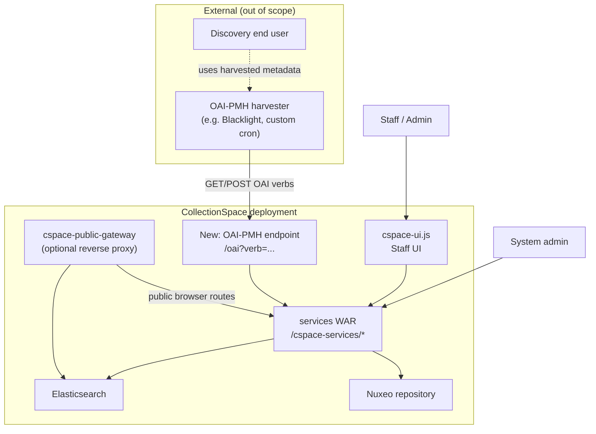
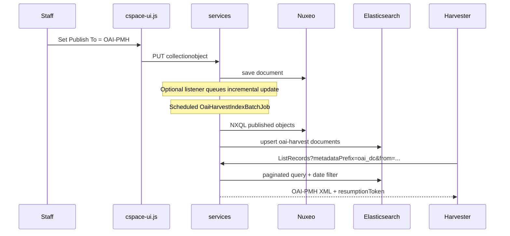

# C1: OAI-PMH Provider for CollectionSpace - High-Level Feature Design

## Technical specification (architecture-first draft)

**Scenario:** [C1: Enabling discovery of a CollectionSpace object in an OAI-PMH enabled discovery repository](https://github.com/lyrasisorghome/InteroperabilityProject/issues/46)

**Status:** Draft v0.1:  high-level feature design; closes *where-in-the-codebase* gaps in [`C1-cs-oai-pmh.md`](C1-cs-oai-pmh.md)

**Systems:** CollectionSpace 8.x (Java services layer, Nuxeo, Elasticsearch), OAI-PMH 2.0 harvesters (external)

**Normative references:**

- [OAI-PMH 2.0](https://www.openarchives.org/OAI/openarchivesprotocol.html)
- [OAI-PMH Guidelines for Repository Implementers](https://www.openarchives.org/OAI/2.0/guidelines-repository.htm)
- [CollectionSpace for Developers](https://collectionspace.atlassian.net/wiki/spaces/cstd/pages/3570171905/CollectionSpace+for+Developers)
- [ArchivesSpace OAI-PMH architecture](https://docs.archivesspace.org/architecture/oai-pmh/) (behavioral reference; same LYRASIS ecosystem)
- [Dublin Core mapping (internal draft)](https://collectionspace.atlassian.net/wiki/spaces/CPD/pages/4081451009/Open+for+Internal+Comment+Dublin+Core+Mapping)
- Meeting notes: [`proposal/cs-meeting-notes.md`](../proposal/cs-meeting-notes.md)

---

## Purpose and scope

Define **how CollectionSpace would implement** native OAI-PMH 2.0 *provider* (repository) functionality so external discovery systems can harvest published collection-object metadata.

The parent spec [`C1-cs-oai-pmh.md`](C1-cs-oai-pmh.md) captures **requirements and behavior scenarios** but not **which Java modules, classes, configuration stores, or UI surfaces** would change. This document is the bridge to implementation planning.

This v0.1 draft covers:

1. **Deployment context** - where a running CollectionSpace instance lives and how HTTP traffic reaches it
2. **Existing components** to extend or reuse
3. **New components** (proposed packages, class names, responsibilities)
4. **Configuration and persistence** - tenant (.e.g, an institution or museum within an instance) bindings, optional harvest index, permissions
5. **Staff UI** touchpoints
6. **High-level request/data flows** with pseudocode sketches
7. **Open decisions** inherited from the parent spec and program-team meetings

Out of scope for v0.1 (defer to a lower-level design pass or client feedback):

- Full XML schema examples for every verb/error response
- Line-by-line Dublin Core mapping for every CollectionSpace profile
- Harvester-side configuration (discovery system UI)
- OAI **sets** hierarchy (Phase I returns `noSetHierarchy`; see meeting notes)
- Procedure/authority record harvesting
- Proof-of-concept GitHub repository (separate deliverable mentioned in meetings)

---

## Why the parent spec stalls

[`C1-cs-oai-pmh.md`](C1-cs-oai-pmh.md) defines **what** (verbs, roles, configuration table, DC mapping for Anthro) but leaves **how** open.

**Recommendation:** Treat **CollectionSpace services** as the primary implementation locus, mirror proven patterns from `PublicItemResource`, `ExportResource`, and `IndexResource`, and use **ArchivesSpace's OAI module** as a behavioral template, not a Java dependency.

---

## Assumptions

| ID | Assumption |
|----|------------|
| A-01 | Target CollectionSpace **8.x** on Tomcat; REST services WorkAuthority Resource (WAR) exposes `/cspace-services/...` per tenant. |
| A-02 | **Nuxeo** remains the system of record for collection objects and media metadata. |
| A-03 | **Elasticsearch** is already deployed (public browser / advanced search); may host a dedicated harvest index. |
| A-04 | Phase I record eligibility uses existing **Publish To** vocabulary (`publishto`), extended with an OAI-PMH value (per meeting notes). |
| A-05 | OAI **sets** are out of scope for Phase I; `ListSets` returns `noSetHierarchy`. |
| A-06 | Harvesters are **external**; CollectionSpace exposes an anonymous HTTP endpoint when the feature is enabled. |
| A-07 | A **scheduled refresh** (batch job + optional listener) prepares harvestable records; OAI verbs should not run heavy NXQL against live Nuxeo on every request (per meeting notes). |
| A-08 | Dublin Core mapping is **fixed in code** per profile for Phase I (per meeting notes); extensibility is a Phase II concern. |

---

## Actors and deployment context



| Actor | Role |
|-------|------|
| **CollectionSpace System Administrator** | Enables feature at instance/tenant level via config files or tenant admin APIs not exposed in Staff UI. |
| **OAI-PMH Administrator** (new permission) | Enables/disables endpoint, edits repository name, admin email, harvest page size, etc. via Staff UI. |
| **Staff user** | Marks records harvestable via **Publish To**; may run bulk publish jobs. |
| **Harvester** | Calls OAI verbs on a schedule; handles resumption tokens and incremental `from`/`until`. |
| **OAI provider module** (new) | Serves XML responses from harvest index + config; enforces enabled/disabled state. |

### Typical URL shapes

Assume tenant `museum` and host `https://cs.example.edu`:

| Surface | Example URL | Notes |
|---------|-------------|-------|
| Services REST (authenticated) | `https://cs.example.edu/museum/cspace-services/collectionobjects/...` | Existing pattern |
| Public item (anonymous) | `https://cs.example.edu/museum/cspace-services/publicitems/{csid}/{tenantId}/content` | `PublicItemResource` precedent |
| **Proposed OAI base** | `https://cs.example.edu/museum/cspace-services/oai` | Registered in services WAR; anonymous when enabled |
| Gateway (if used) | `https://cs.example.edu/gateway/museum/cspace-services/oai` | Optional; add route in `cspace-public-gateway` |

---

## CollectionSpace repositories touched

| Repository | Role in OAI feature | Expected change level |
|------------|---------------------|------------------------|
| [collectionspace/services](https://github.com/collectionspace/services) | **Primary** - JAX-RS endpoint, mappers, batch jobs, listeners, tenant bindings | **Major** - new `oai` module |
| [collectionspace/application](https://github.com/collectionspace/application) | Tenant templates, default properties, Tomcat packaging | **Minor** - defaults in `*-tenant.xml`, profile deltas |
| [collectionspace/cspace-ui.js](https://github.com/collectionspace/cspace-ui.js) | Staff UI - settings page, Publish To, bulk job invoke | **Moderate** - new admin plugin + vocabulary display |
| [collectionspace/cspace-public-gateway](https://github.com/collectionspace/cspace-public-gateway) | Anonymous proxy to services/ES | **Optional minor** - route `/oai` if harvesters must use gateway hostname |
| Nuxeo platform extensions (under `services/`) | Document types, listeners | **Possible** - harvest record doctype or reuse ES-only index |

**Not required for Phase I:** changes to `cspace-public-browser.js` (consumes ES for human search, not OAI).

---

## Existing components to reuse

CollectionSpace has **no OAI-PMH code today**. These patterns are the closest analogues:

### HTTP / JAX-RS registration

| Component | Location | Reuse for OAI |
|-----------|----------|---------------|
| `CollectionSpaceJaxRsApplication` | `services/JaxRsServiceProvider/.../CollectionSpaceJaxRsApplication.java` | Register new `OaiResource` singleton |
| `SecurityInterceptor` | `services/common/.../security/SecurityInterceptor.java` | Whitelist anonymous access on `/oai` when enabled (same pattern as `PublicItemResource.allowAnonymousAccess()`) |
| `*Resource` + `*Client` pair | Each service module | Follow `ExportClient.SERVICE_PATH` convention |

### Public / published content

| Component | Location | Reuse for OAI |
|-----------|----------|---------------|
| `PublicItemResource` | `services/common/.../publicitem/PublicItemResource.java` | Precedent for **anonymous** read endpoint backed by Nuxeo |
| `PublicItemDocumentModelHandler` | `services/publicitem/.../nuxeo/` | URL generation for public media links in DC `relation`/`identifier` |
| Publish To vocabulary | `cspace-ui.js` → `publishTo` / `publishToList` on media (and possibly collection object) | **Record-level opt-in** gate for harvest set |

### Query, export, and bulk update

| Component | Location | Reuse for OAI |
|-----------|----------|---------------|
| `ExportResource` | `services/export/.../ExportResource.java` | NXQL/query iteration over Nuxeo documents |
| `AbstractDocumentsByQueryIterator` | `services/export/.../` | Walk matching collection objects for harvest index build |
| `BatchResource` + `AbstractBatchJob` | `services/batch/.../` | Bulk enable Publish To; scheduled harvest index refresh |
| `ReindexFullTextBatchJob` (example) | `services/batch/.../nuxeo/` | Template for `OaiHarvestIndexBatchJob` |

### Search index

| Component | Location | Reuse for OAI |
|-----------|----------|---------------|
| `IndexResource` | `services/index/.../IndexResource.java` | `POST /index/{indexid}` reindex hook |
| `IndexDocumentModelHandler` | `services/index/.../` | Per-tenant NXQL for what gets indexed |
| Tenant index bindings | `services/common/.../tenants/tenant-bindings-proto-unified.xml` | Declare new index id (e.g. `oai-harvest`) |

### Authorization

| Component | Location | Reuse for OAI |
|-----------|----------|---------------|
| `CSpaceAction`, `AuthZ`, `RoleResource`, `PermissionResource` | `services/authorization*` | New permission e.g. `OAI-PMH Admin` with `ADMIN` on OAI config resource |
| Service authz suffix pattern | `{Module}Client.SERVICE_AUTHZ_SUFFIX` | e.g. `/*/oai/` for config mutations |

### Configuration

| Component | Location | Reuse for OAI |
|-----------|----------|---------------|
| `tenant-bindings-proto-unified.xml` + profile deltas | `services/common/.../tenants/` | Service binding for OAI module, batch jobs, listeners |
| `{profile}-tenant.xml` | `application/tomcat-main/src/main/resources/` | Instance-level defaults |
| `TenantBindingConfigReaderImpl` | `services/config/.../` | Runtime read of OAI settings |

---

## Proposed new components

### New Maven module: `services/oai/`

Mirror structure of `export` and `publicitem`:

```
services/oai/
  client/
    org/collectionspace/services/client/OaiClient.java
  jaxb/
    oai_config.xsd                    # admin config payload (optional REST CRUD)
    oai_harvest_record.xsd            # internal harvest document shape
  service/
    org/collectionspace/services/oai/
      OaiResource.java                # @Path("/oai") - verb dispatcher
      OaiRequestParser.java           # GET/POST param normalization
      OaiResponseWriter.java          # XML serialization, gzip
      OaiConfigService.java           # read merged tenant + admin config
      OaiHarvestRecordRepository.java # query harvest store (ES or Nuxeo)
      verb/
        IdentifyHandler.java
        ListMetadataFormatsHandler.java
        ListSetsHandler.java          # returns noSetHierarchy (Phase I)
        ListIdentifiersHandler.java
        ListRecordsHandler.java
        GetRecordHandler.java
      OaiResumptionTokenService.java  # token issue/validate/TTL
      mapper/
        OaiMetadataMapper.java        # interface
        OaiDcMapper.java              # oai_dc for collectionobject (per profile)
        ProfileMapperRegistry.java    # anthro, fcart, registration, etc.
      nuxeo/
        OaiHarvestDocumentModelHandler.java   # if harvest docs live in Nuxeo
      batch/
        OaiHarvestIndexBatchJob.java          # rebuild harvest index
        OaiPublishBatchJob.java               # bulk set Publish To from query
    resources/
      OaiHarvestIndexBatchJob.xml
      OaiPublishBatchJob.xml
```

### Class responsibilities (sketch)

**`OaiResource`** - single entry point; OAI uses query params, not RESTful subpaths:

```java
@Path(OaiClient.SERVICE_PATH)  // "/oai"
public class OaiResource extends AbstractResource {
    public boolean allowAnonymousAccess() { return configService.isEndpointEnabled(); }

    @GET @POST
    @Produces("application/xml")
    public Response handleOaiRequest(@Context UriInfo uri, MultivaluedMap formParams) {
        if (!configService.isEndpointEnabled()) return disabledResponse(); // see G-11
        OaiVerb verb = parser.parseVerb(uri, formParams);
        return verbRouter.dispatch(verb, parser.buildContext(uri, formParams));
    }
}
```

**`OaiHarvestIndexBatchJob`** - ETL from Nuxeo → harvest store:

```java
// Pseudocode: select published collection objects, map to harvest records
NXQL = """
  SELECT * FROM CollectionObject
  WHERE ecm:isProxy = 0
    AND collectionobjects:publishTo/* IN ('OAI-PMH')
  ORDER BY ecm:modified
""";
for (DocumentModel doc : nuxeoQuery(NXQL)) {
    HarvestRecord rec = mapper.toHarvestRecord(doc);
    rec.setOaiIdentifier(pidFactory.for(doc));
    rec.setDatestamp(doc.getModifiedDate()); // UTC seconds
    rec.setDeleted(false);
    harvestRepository.upsert(rec);
}
tombstonePass(); // mark soft-deletes, unpublish, hard-deletes per policy
```

**`ListRecordsHandler`** - read from harvest store, not live Nuxeo:

```java
Page<HarvestRecord> page = repository.findPublished(
    metadataPrefix, from, until, set, resumptionToken, maxRecords);
if (page.isEmpty()) return error("noRecordsMatch");
OaiXml records = page.items().stream()
    .map(r -> xml.record(r.identifier(), r.datestamp(), mapper.toMetadata(r)))
    .collect(OaiXml.listRecords());
if (page.hasMore()) records.setResumptionToken(tokenService.issue(page));
return Response.ok(records).build();
```

### Files to modify (existing)

| File | Change |
|------|--------|
| `services/pom.xml` | Add `<module>oai</module>` |
| `CollectionSpaceJaxRsApplication.java` | `singletons.add(new OaiResource());` or `addResourceToMapAndSingletons` |
| `tenant-bindings-proto-unified.xml` | OAI service binding, batch jobs, optional listener, index definition |
| `publishto` vocabulary source | Add term `OAI-PMH` (exact label TBD with product) |
| Profile `*-tenant-bindings.delta.xml` | Register profile-specific `OaiDcMapper` |

---

## Configuration model

Two tiers align with the parent spec's roles:

### Tier 1 - System administrator (instance / tenant template)

Stored in **tenant bindings XML** and/or `{profile}-tenant.xml` in the **application** repo. Not editable in Staff UI.

| Key | Example | Purpose |
|-----|---------|---------|
| `oai.featureAvailable` | `true` | Master switch - without this, OAI code paths are inactive |
| `oai.baseUrl` | `https://cs.example.edu/museum/cspace-services/oai` | Canonical `baseURL` in Identify (may be computed from request if unset) |
| `oai.protocolVersion` | `2.0` | Identify response |
| `oai.deletedRecord` | `persistent` | Identify response; tombstone headers in List* |
| `oai.granularity` | `YYYY-MM-DDThh:mm:ssZ` | Identify response |
| `oai.maxRecordsPerRequest` | `100` | Resumption token threshold |
| `oai.resumptionTokenTtlSeconds` | `3600` | Token cache TTL |
| `oai.compressionSupported` | `true` | gzip response encoding |
| `oai.harvestIndexId` | `oai-harvest` | ES index name or Nuxeo doc type namespace |
| `oai.harvestRefreshCron` | *(external)* | Document that ops scheduler invokes batch job - CS has no built-in cron |
| `oai.metadataFormats` | `oai_dc` | ListMetadataFormats source of truth |
| `oai.setSupportEnabled` | `false` | Phase I |

**Storage mechanism:** extend tenant service binding for a new `OaiClient.SERVICE_NAME` in `tenant-bindings-proto-unified.xml`, properties read at runtime via existing `ServiceMain.getTenantBindingConfigReader()`.

### Tier 2 - OAI-PMH Administrator (Staff UI)

Stored in **Nuxeo configuration document** or **dedicated config record** exposed via authenticated REST (pattern used by other admin settings). Editable in Staff UI when user holds new permission.

| Key | Purpose |
|-----|---------|
| `oai.enabled` | Administrator toggle - endpoint returns 503/disabled when false |
| `oai.repositoryName` | Identify |
| `oai.repositoryDescription` | Identify `<description>` |
| `oai.adminEmail` | Identify (required) |
| `oai.earliestDatestamp` | Identify - computed from harvest index min datestamp unless overridden |
| `oai.includeMediaLinks` | Whether DC includes thumbnail/public URLs (`Supported Media` in parent spec) |
| `oai.publicBaseUrl` | Base for `relation` link to public browser record |

**REST shape (illustrative):**

```
GET  /cspace-services/oai/config        → 200 + OAI config JSON/XML (auth required)
PUT  /cspace-services/oai/config        → update admin-tier settings
POST /cspace-services/oai/config/test     → optional Identify dry-run for admins
```

### Record-level eligibility

| Field | Where | Rule |
|-------|-------|------|
| `publishTo` / `publishToList` | Collection object and/or media record | Must include OAI-PMH term for record to enter harvest index |
| `ecm:modified` / record audit | Nuxeo | Becomes OAI **datestamp** (UTC, seconds) |

Bulk update: **`OaiPublishBatchJob`** invoked from Staff UI with an advanced-search query URI (same invoke pattern as export/report batch jobs per meeting notes).

---

## Staff UI touchpoints (`cspace-ui.js`)

| Location | Change |
|----------|--------|
| **Administration → OAI-PMH Settings** (new) | New invocable plugin under admin/tools; mirrors ArchivesSpace "Manage OAI-PMH Settings" |
| **Publish To** field | Ensure `OAI-PMH` appears in `publishto` vocabulary picker on relevant record types |
| **Bulk data update** | Expose `OaiPublishBatchJob` from Tools or batch job menu with search query input |
| **Record editor cue** | Help text or indicator when Publish To includes OAI-PMH (parent spec BS03) |

Proposed plugin path: `src/plugins/invocables/oaiSettings/` (or under existing admin plugin structure).

Permission gate: hide settings unless user has new **OAI-PMH Administrator** permission (parent spec).

---

## Data flow: harvest index (recommended)

Meeting notes and performance requirements point to **decoupling harvest reads from live Nuxeo queries**:



### Harvest record document (logical)

Internal shape stored in ES (or Nuxeo sidecar documents):

```json
{
  "csid": "abc-123",
  "oaiIdentifier": "oai:cs.example.edu:museum/abc-123",
  "datestamp": "2026-06-01T14:30:00Z",
  "deleted": false,
  "metadataPrefix": "oai_dc",
  "profile": "anthropology",
  "metadataXml": "<oai_dc:dc>...</oai_dc:dc>"
}
```

Pre-computing `metadataXml` at index time avoids mapping cost on every harvest request; remapping requires reindex job after code/config changes.

**Alternative (simpler, higher load):** query Nuxeo directly on each ListRecords - acceptable only for small repositories; not recommended as default.

---

## OAI protocol surface (Phase I)

Inherited from parent spec; implementation mapping:

| Verb | Phase I behavior | Handler |
|------|------------------|---------|
| `Identify` | Repository metadata from config | `IdentifyHandler` |
| `ListMetadataFormats` | At minimum `oai_dc` | `ListMetadataFormatsHandler` |
| `ListSets` | Error `noSetHierarchy` | `ListSetsHandler` |
| `ListIdentifiers` | Headers from harvest index | `ListIdentifiersHandler` |
| `ListRecords` | Headers + metadata | `ListRecordsHandler` |
| `GetRecord` | Single record by OAI identifier | `GetRecordHandler` |

| Requirement | Implementation note |
|-------------|---------------------|
| GET and POST | Both hit `OaiResource.handleOaiRequest` |
| Persistent identifiers | Build from tenant + CSID: `oai:{host}:{tenant}/{csid}` (parent spec G - confirm with product) |
| Deleted records | `deletedRecord=persistent`; tombstone entries in harvest index when object soft-deleted or Publish To cleared |
| Resumption tokens | `OaiResumptionTokenService` - in-memory or Nuxeo/Redis cache; `badResumptionToken` if expired |
| Compression | `OaiResponseWriter` wraps XML with gzip when `Accept-Encoding` allows |

---

## Delete and unpublish semantics

CollectionSpace has multiple removal paths (meeting notes). Phase I must document behavior:

| Event | Proposed OAI behavior |
|-------|----------------------|
| Publish To cleared | Harvest index row updated; next List* shows `status="deleted"` tombstone |
| Soft delete | Tombstone with last known identifier |
| Hard delete | Tombstone retained in harvest index with `deleted=true` (persistent policy); identifier may be CSID-based |
| Incremental harvest | Harvester diffs ListIdentifiers; deleted headers signal removal in discovery layer |

Reference: ArchivesSpace `OAIDeletion` / tombstone pass in [AS OAI repository](https://github.com/archivesspace/archivesspace/blob/master/backend/app/lib/oai/aspace_oai_repository.rb).

---

## Dublin Core mapping (Phase I)

| Source | Direction |
|--------|-----------|
| [Internal DC mapping draft (Confluence)](https://collectionspace.atlassian.net/wiki/spaces/CPD/pages/4081451009/Open+for+Internal+Comment+Dublin+Core+Mapping) | **Authoritative** for field choices |
| [`C1-cs-oai-pmh.md` Anthro table](C1-cs-oai-pmh.md#default-dublin-core-field-mapping---anthro-profile) | Example for one profile |
| Meeting notes | **Not user-configurable** in Phase I; no arbitrary XSLT upload |

Implementation: one `OaiDcMapper` subclass or profile section per CollectionSpace profile; registered in `ProfileMapperRegistry` at startup from tenant profile id.

Media links: include public thumbnail URL in `dc:relation` when `oai.includeMediaLinks` is true (parent spec G-03).

---

## Reference: ArchivesSpace OAI (behavioral, not code reuse)

| AS component | CS analogue |
|--------------|-------------|
| `ArchivesSpaceOAIRepository` | `OaiResource` + verb handlers |
| `ArchivesSpaceOAIRecord` | `HarvestRecord` |
| `ArchivesSpaceResumptionToken` | `OaiResumptionTokenService` |
| `OAIDeletion` / tombstone pass | End of `OaiHarvestIndexBatchJob` |
| `oai/mappers/oai_dc.rb` | `OaiDcMapper.java` |
| System → Manage OAI-PMH Settings | Administration → OAI-PMH Settings |
| Separate OAI port (8082) | Shared services WAR path `/oai` (simpler ops) |

---

## Open decisions (for client / product feedback)

| ID | Question | Options | Default recommendation |
|----|----------|---------|------------------------|
| D-01 | Harvest store backend | Elasticsearch index vs Nuxeo harvest documents | **Elasticsearch** - aligns with public browser infra |
| D-02 | Endpoint hostname | Services direct vs public gateway | **Services direct** unless institution requires single gateway URL |
| D-03 | Endpoint authentication | Open vs IP allowlist vs token | **Open when enabled** (OAI convention); document risk |
| D-04 | User-configurable DC mapping | Fixed code vs admin UI vs XSLT | **Fixed per profile** (Phase I) per meeting notes |
| D-05 | Publish To scope | Media only vs collection object vs both | Confirm which record types carry `publishTo` today for public browser |
| D-06 | Missing required DC fields | Block publish / exclude / empty elements | Recommend **warn in UI, exclude from harvest** until complete |
| D-07 | Disabled endpoint HTTP code | 503 vs 404 vs OAI error document | Recommend **503** with plain text or minimal OAI error (G-11) |
| D-08 | Metadata formats beyond `oai_dc` | Phase I vs II | **Phase II** unless C2 timeline requires MODS/LIDO |
| D-09 | Listener vs batch-only refresh | Real-time index update vs scheduled only | **Both**: listener for low latency; batch for full rebuild |
| D-10 | New permission name / role mapping | Greenfield vs extend Exports role | **New permission** per parent spec |

---

## Suggested delivery phases

| Phase | Deliverable | Repos |
|-------|-------------|-------|
| **0 - Spike** | Identify + ListMetadataFormats on static config; anonymous routing | `services` |
| **1 - Core harvest** | Harvest index job, ListRecords/ListIdentifiers/GetRecord, `oai_dc` for one profile | `services`, `application` |
| **2 - Admin UI** | Settings page, permission, enable/disable toggle | `cspace-ui.js`, `services` |
| **3 - Staff workflow** | Publish To term, bulk publish job, delete/tombstone pass | `services`, `cspace-ui.js` |
| **4 - Hardening** | Compression, resumption token edge cases, logging, additional profiles | `services` |
| **II - Sets & formats** | ListSets, optional metadata prefixes | `services` |

---

## Related documents

| Document | Relationship |
|----------|--------------|
| [`C1-cs-oai-pmh.md`](C1-cs-oai-pmh.md) | Requirements baseline - roles, verbs, config table, gaps G-01–G-12 |
| [`proposal/cs-meeting-notes.md`](../proposal/cs-meeting-notes.md) | Program-team constraints (Publish To, no sets, fixed mapping, batch index) |
| [`A2-dspace-bulk-linking.md`](A2-dspace-bulk-linking.md) | Example of consultant "dev spec" depth for comparison; C1 lower-level pass would add similar pseudocode per verb |

---

## Document history

| Version | Date | Notes |
|---------|------|-------|
| 0.1-draft | 2026-06-10 | Initial high-level feature design |
