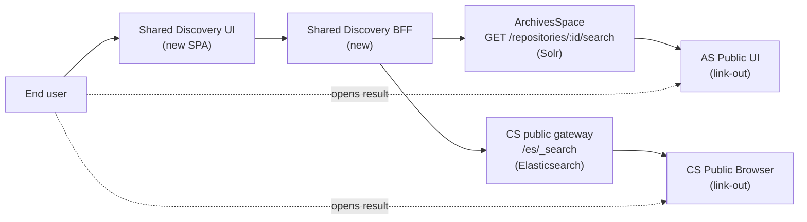
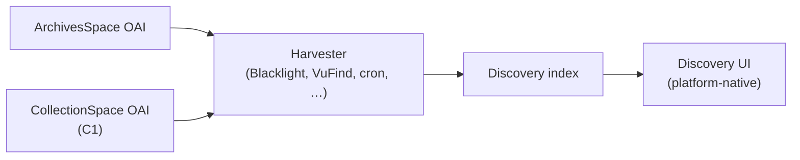
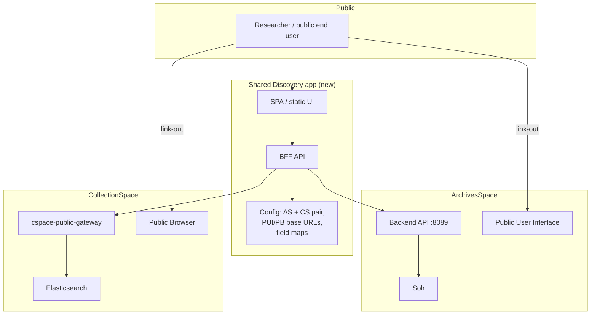
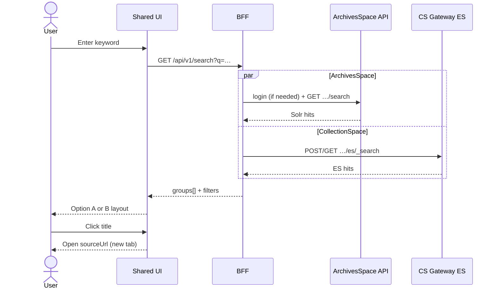

# C3: Shared Discovery for CollectionSpace and ArchivesSpace — High-Level Feature Design

## Technical specification (architecture-first draft)

**Scenario:** [C3: Shared discovery / unified search across CollectionSpace and ArchivesSpace](https://github.com/lyrasisorghome/InteroperabilityProject/issues/51)

**Status:** Draft v0.1 — high-level feature design; closes *how-do-we-actually-search* gaps in [`C3-cs-as-shared-discovery.md`](C3-cs-as-shared-discovery.md)

**Systems:** New shared-discovery application (BFF + public UI); ArchivesSpace backend Search API (Solr); CollectionSpace public gateway → Elasticsearch; optional later path via OAI-PMH harvest into an institutional discovery platform

**Normative references:**

- [OAI-PMH 2.0](https://www.openarchives.org/OAI/openarchivesprotocol.html) (harvest protocol — Path B only)
- [ArchivesSpace Search requests](https://docs.archivesspace.org/api/#search-requests)
- [ArchivesSpace API — search routes](https://archivesspace.github.io/archivesspace/api/)
- [CollectionSpace Common Services REST API](https://collectionspace.atlassian.net/wiki/spaces/cstd/pages/3577544705/Common+Services+REST+API)
- [cspace-public-gateway](https://github.com/collectionspace/cspace-public-gateway)
- [cspace-public-browser.js configuration](https://github.com/collectionspace/cspace-public-browser.js/blob/main/docs/configuration/README.md)
- Parent requirements: [`C3-cs-as-shared-discovery.md`](C3-cs-as-shared-discovery.md)
- Related provider design: [`C1-dev-high-cs-oai-pmh.md`](C1-dev-high-cs-oai-pmh.md)

---

## Purpose and scope

Define **how an institution with one ArchivesSpace instance and one CollectionSpace tenant can offer a single public search** that returns records from both systems, clearly distinguishes source and type, and links out to the originating public UIs.

The parent spec [`C3-cs-as-shared-discovery.md`](C3-cs-as-shared-discovery.md) captures **search/display behavior** but assumes a **discovery layer that already harvests via OAI-PMH**, then puts that harvesting infrastructure **out of scope**. This document chooses a buildable architecture that does not require inventing (or waiting on) Blacklight/VuFind/Primo.

This v0.1 draft covers:

1. **Why the parent stalls** and what OAI-PMH can and cannot do for search
2. **Two architecture paths** — recommended federated live search vs optional harvest/index
3. **New shared-discovery app** components (BFF + UI) and configuration for a **single AS↔CS pair**
4. **Record-type scope**, result card schema, link-out rules
5. **Display Option A and B** (grouped per source vs unified list)
6. **Coarse faceting / pagination** strategies that survive two heterogeneous backends
7. **High-level request flows** and open decisions

Out of scope for v0.1:

- Cross-institution multi-repo federation
- Duplicate detection / merge of “same” records across AS and CS (parent ES03 removed)
- Intermediate detail pages in the unified UI (parent BS04 removed — **link-out only**)
- Advanced search form (parent G-01) beyond keyword + coarse filters
- Rich shared subject vocabulary alignment
- Changes to ArchivesSpace or CollectionSpace data models
- Implementing OAI-PMH on CollectionSpace (that is [C1](C1-dev-high-cs-oai-pmh.md); **not a dependency** of recommended Path A)
- Building or configuring Blacklight / VuFind / Primo (Path B consumer only)

---

## Why the parent spec stalls

[`C3-cs-as-shared-discovery.md`](C3-cs-as-shared-discovery.md) defines **what users should see** (keyword box, facets, source labels, thumbnails, link-out) but leaves **where search runs** contradictory:

| Parent statement | Tension |
|------------------|---------|
| “A discovery layer is already in place that can harvest… using OAI-PMH” | Assumes an institutional discovery platform that this project does not deliver |
| “OAI-PMH harvesting infrastructure” is **out of scope** | Removes the only backend the rest of the spec depends on |
| “Keyword search searches all of the Dublin Core fields available in the OAI-PMH harvest” | Implies a local index of harvested DC — not a live IR search API |
| Development areas are “discovery layer configuration… not AS/CS” | True only if Path B’s platform already exists |
| Error scenario ES01 is harvest failure / stale cache | Irrelevant if search is live-federated |

**Critical protocol fact:** OAI-PMH is a **harvesting** protocol (`Identify`, `ListRecords`, `GetRecord`, resumption tokens). It is **not** a search API. You cannot send a user keyword to an OAI endpoint and get ranked results. Search requires either:

- each IR’s **native search backend** (Solr / Elasticsearch), or
- a **separate index** populated by harvesting (or other ingest).

**Recommendation:** Implement **Path A — federated live search** in a small new application. Document **Path B — harvest/index** as the longer-term institutional pattern when a real discovery platform exists. Do **not** block C3 on C1.

---

## Architecture paths

### Path A (recommended): Federated live search



On each search request the BFF:

1. Issues **parallel** queries to AS and CS (subject to source filter).
2. Maps each hit into a shared **result card** schema.
3. Returns **grouped** result sets (one group per source) plus coarse filter metadata.
4. Never stores a full metadata mirror; optional short-lived response cache only.

**Pros:** No harvest lag; reuses published search indexes; no dependency on C1; smallest honest v1.  
**Cons:** Relevance scores are **not comparable** across systems; facet vocabularies differ; one source down ⇒ partial results (not “stale harvest”).

### Path B (optional / later): Harvest → institutional discovery index



This is what the parent spec describes. It remains valid for institutions that **already** run (or will run) a discovery platform. C1 then becomes a real dependency for CS participation. This draft does **not** design Path B beyond noting where parent gaps (G-04 source detection, G-08 harvest staleness, D-01–D-05) belong.

| Concern | Path A | Path B |
|---------|--------|--------|
| Search mechanism | Live IR APIs | Local index over harvested DC (+ extras) |
| C1 required? | **No** | **Yes** (for CS) |
| Freshness | Near real-time with IR indexes | Harvest schedule; ES01 stale-data UX |
| New software in this project | **Yes** — shared discovery app | Mostly config of existing platform |
| Cross-system relevance ranking | Not claimed | Possible inside one index |
| Deduping AS↔CS | Out of scope (both) | Out of scope (both) |

---

## Assumptions


| ID | Assumption |
|----|------------|
| A-01 | **Path A** is the implementation target for this deliverable unless product explicitly selects Path B. |
| A-02 | Scope is **one configured pair**: one ArchivesSpace instance (one or more repositories, configurable) + one CollectionSpace tenant. |
| A-03 | Deliverable is a **new** shared-discovery application (public UI + BFF), not a plugin inside AS PUI or CS Public Browser. |
| A-04 | **Click-through only:** result titles / “View full record” open the AS PUI or CS Public Browser in a **new tab**. No intermediate detail page in the shared UI. |
| A-05 | AS record types in v1: **`archival_object`** and **`digital_object`**. Resources, agents, accessions, etc. deferred. |
| A-06 | CS record types in v1: **collection objects** already exposed to the public browser / gateway (same publish gate as C1: Publish To `all` / `cspacepub`). |
| A-07 | CS queries go through the **public gateway → Elasticsearch** path (anonymous), not authenticated Common Services staff search. |
| A-08 | AS queries use the **backend Search API** (`/repositories/:id/search` or `/search`). Prefer a **read-only API user + session token** held only in the BFF; investigate anonymous/public search if a given deploy allows it. Backend port **8089 must not be exposed to browsers** — only to the BFF (allowlist). |
| A-09 | Results are presented **grouped by source** (see Display options). No global merged relevance ranking in v1. |
| A-10 | Facets in v1 are **coarse**: source system; optional “has media/thumbnail”; optional simple date bounds if both adapters can supply them cheaply. |
| A-11 | “Is it digitized / can I view the item?” is a **nice-to-have** signal on the card when detectable — not a v1 blocker. |
| A-12 | Duplicate / related-record merging across AS and CS is **out of scope**. |
| A-13 | **C1 is not required** for Path A. OAI remains the path for *external* harvesters and for Path B. |

---

## Actors and deployment context




| Actor | Role |
|-------|------|
| **End user** | Keywords search; filters by source / coarse facets; opens source records |
| **Shared Discovery Administrator** | Configures the AS↔CS pair, base URLs, repository IDs, display labels, timeouts |
| **ArchivesSpace Administrator** | Ensures PUI URLs resolve; provides read-only API credentials (or confirms anonymous search policy) |
| **CollectionSpace Administrator** | Ensures public gateway + ES indexing for published collection objects; provides public browser base URL |

---

## New components (Path A)

### Repositories / packages (proposed)


| Component | Responsibility |
|-----------|----------------|
| `shared-discovery-ui` | Public SPA: search box, Option A/B layouts, coarse filters, pagination per group, link-out |
| `shared-discovery-bff` | Authenticated-to-IR adapter layer; parallel search; normalize to result cards; never expose AS session tokens to the browser |
| `as-search-adapter` | Maps unified query → AS Solr search params; maps hits → card schema; builds PUI URLs |
| `cs-search-adapter` | Maps unified query → gateway ES query; maps hits → card schema; builds Public Browser URLs |
| Config store | Environment / file / simple admin JSON for the single pair (URLs, credentials, labels, page size) |

Technology choice (React/Vue/Svelte, Node/Java/Go) is **not** locked in v0.1; the contracts below are.

### BFF HTTP surface (logical)


| Method | Path | Purpose |
|--------|------|---------|
| `GET` | `/api/v1/health` | Liveness; optional upstream ping summary |
| `GET` | `/api/v1/search` | Federated search (see request/response) |
| `GET` | `/api/v1/config/public` | Non-secret UI config (labels, enabled sources, default page size) |

No public write APIs. No proxy of raw AS/CS admin endpoints to the browser.

---

## Search backends

### ArchivesSpace

- Search is **Solr** behind routes documented under [Search requests](https://docs.archivesspace.org/api/#search-requests).
- Typical call (auth via `X-ArchivesSpace-Session` after `/users/:user/login`):

```http
GET /repositories/{repo_id}/search?q={lucene}&type[]=archival_object&type[]=digital_object&page=1&page_size=20
```

- Hits are **Solr documents**, not full JSONModels. Useful fields commonly include `title`, `primary_type` / `types`, `uri`, `identifier`, dates, and a string `json` blob for deeper mapping when needed.
- **Auth model for v1:** BFF holds a read-only username/password (or long-lived session refresh). Browser never sees the session header. Confirm with each deploy whether firewall policy allows only the BFF IP to reach `:8089`.
- **Publish/public visibility:** Prefer filters that match what the **PUI** would show (unpublished suppression). Exact filter_query flags are an open decision (D-03) — do not return staff-only hits in a public UI.

### CollectionSpace

- Public Browser talks to **Elasticsearch through `cspace-public-gateway`** (e.g. `https://{host}/gateway/{tenant}/es/...`), not directly to Nuxeo.
- The gateway already restricts to publicly published records (Publish To shortIds such as `all`, `cspacepub` — same set C1 reuses).
- BFF issues ES `_search` (or the same query shape the public browser uses) limited to **CollectionObject** (and media fields needed for thumbnails).
- **Auth model:** anonymous via gateway, same as the public browser.

### What we deliberately do *not* query for Path A

- OAI-PMH endpoints (no `q=` search)
- CS staff Common Services search (auth + over-broad visibility)
- Direct browser calls to AS `:8089`

---

## Intermediate result card schema

Normalize **after** search, at the BFF — not Dublin Core from OAI. Align display labels with the parent Intermediate Metadata Schema where practical.


| Field | Type | Required | Notes |
|-------|------|----------|-------|
| `id` | string | yes | Stable within source: AS `uri` or CS CSID / ES `_id` |
| `source` | `"archivesspace"` \| `"collectionspace"` | yes | Drives labels / filters |
| `recordType` | string | yes | e.g. `archival_object`, `digital_object`, `CollectionObject` |
| `title` | string | yes | Display + link text |
| `identifier` | string | no | AS component id / CS objectNumber |
| `dateDisplay` | string | no | Pre-formatted; do not pretend full calendar normalization in v1 |
| `description` | string | no | Truncate ~250 chars in UI |
| `subjects` | string[] | no | Nice-to-have; coarse filter later |
| `thumbnailUrl` | string \| null | no | Nice-to-have (parent G-11) |
| `hasMedia` | boolean | no | Nice-to-have digitized signal |
| `sourceUrl` | string | yes | Absolute link-out to AS PUI or CS Public Browser |
| `foundIn` | string \| null | no | AS hierarchy breadcrumb text; CS usually null (parent G-10) |

**Display field matching:** When rendering a card, use this schema’s keys so the UI does not show both `Title` and `title` as separate rows. Source-specific labels (e.g. “Scope and Contents” vs “Brief Description”) may still differ by `source` in Option A templates; Option B uses the unified labels above.

---

## Display implementation options

Both remain in scope for the UI; config selects the default.

### Option A — Grouped / side-by-side (matches pagination assumption A-09)

- Two result groups: **Archival records** (AS) and **Museum objects** (CS).
- Each group has its **own** total count, page controls, and empty state.
- Source filter can hide a group entirely.
- Natural fit for federated search: no fake global ranking.

### Option B — Unified list

- Single vertical list of cards, each stamped with source + record type.
- **v1 ranking rule:** do **not** interleave by foreign relevance scores. Prefer deterministic ordering, e.g. round-robin merge of the two current pages, or “AS block then CS block” within the viewport, with clear group headers still available.
- Source facet filters the list to one source (degrades to Option A with one group).

**Recommendation:** Ship **Option A as default**; implement Option B as an alternate layout flag once cards exist. Both share the same BFF response (`groups[]`).

---

## BFF search contract (sketch)

### Request

```http
GET /api/v1/search?q=pottery&sources=archivesspace,collectionspace&pageAs=1&pageCs=1&pageSize=20&hasMedia=any
```


| Param | Notes |
|-------|-------|
| `q` | Keyword; BFF maps to Lucene `q` (AS) and ES `query_string` / `multi_match` (CS) |
| `sources` | Subset of configured sources |
| `pageAs` / `pageCs` | Independent pagination (Option A). Option B UI may advance both or the active source |
| `pageSize` | Per source |
| `hasMedia` | `any` \| `true` — best-effort; ignored if adapter cannot filter |
| `dateFrom` / `dateTo` | Optional coarse strings; adapter no-ops if unsupported |

### Response (grouped)

```json
{
  "query": "pottery",
  "groups": [
    {
      "source": "archivesspace",
      "label": "Archival Records",
      "total": 42,
      "page": 1,
      "pageSize": 20,
      "status": "ok",
      "results": [ { "id": "/repositories/2/archival_objects/99", "title": "…", "sourceUrl": "https://…" } ]
    },
    {
      "source": "collectionspace",
      "label": "Museum Objects",
      "total": 17,
      "page": 1,
      "pageSize": 20,
      "status": "ok",
      "results": [ { "id": "…", "title": "…", "sourceUrl": "https://…" } ]
    }
  ],
  "filters": {
    "sources": [
      { "value": "archivesspace", "count": 42 },
      { "value": "collectionspace", "count": 17 }
    ]
  }
}
```

If one upstream fails: that group returns `"status": "error"` (or `"degraded"`) with `results: []` and an opaque message; the other group still renders. This replaces parent ES01’s harvest-staleness story for Path A.

---

## Behavior mapping (parent → Path A)


| Parent scenario | Path A behavior |
|-----------------|-----------------|
| BS01 keyword search both systems | Parallel adapter queries; grouped cards with source labels |
| BS02 filter by source | `sources=` param; hide or empty the other group |
| BS03 navigate to source | `sourceUrl` → AS PUI / CS PB, new tab |
| BS04 detail in unified UI | **Still removed** — link-out only |
| BS05 subject facet | Deferred; subjects on card only if cheap |
| ES01 harvest down | **N/A** → per-group upstream error / timeout |
| ES02 metadata inconsistency | Card schema + per-source formatters; no false precision on dates |
| ES03 duplicates | Show both; labeled; no merge |

---

## Configuration requirements (Path A)


| Item | Description |
|------|-------------|
| `as.baseApiUrl` | ArchivesSpace backend base (BFF-only network path) |
| `as.username` / `as.password` | Read-only API user (or equiv.) |
| `as.repositoryIds` | One or more repo IDs to search |
| `as.puiBaseUrl` | For link-out: `AppConfig[:public_proxy_url]` equivalent |
| `as.types` | Default `archival_object,digital_object` |
| `cs.gatewayUrl` | e.g. `https://cs.example.edu/gateway/museum` |
| `cs.publicBrowserBaseUrl` | Link-out base for object pages |
| `cs.esIndex` / query template | Match public browser expectations for the tenant/profile |
| `ui.defaultLayout` | `grouped` (A) or `unified` (B) |
| `ui.labels` | “Archival Records” / “Museum Objects” (parent G-05) |
| Timeouts / page size defaults | Fail a group fast rather than block the whole response |

Path B keeps the parent’s “source system field / OAI identifier / harvest normalization” table; not restated here.

---

## High-level sequence (Path A)



---

## Relationship to C1 and OAI-PMH

| Need | Use |
|------|-----|
| Shared public search for one AS + one CS (this scenario) | **Path A** — live search; **C1 not required** |
| Feed Blacklight / VuFind / Primo / union catalogs | **OAI-PMH** — AS existing provider + **C1** for CS |
| Parent spec’s harvest/facet/index configuration language | Applies to **Path B** only |

C1 and C3 are complementary: C1 publishes CS to the **harvesting** world; C3 Path A gives researchers a **thin unified UI** without waiting on that ecosystem.

---

## Open decisions


| ID | Decision | Options | Lean |
|----|----------|---------|------|
| D-01 | Default UI layout | A grouped / B unified | **A**, with B as flag |
| D-02 | AS auth | Read-only session in BFF vs deploy-specific anonymous | **Session in BFF** |
| D-03 | AS public-only filter | Match PUI suppression filters vs trust API user ACLs | Confirm per deploy; prefer explicit publish filters |
| D-04 | CS ES query template | Copy public-browser query DSL vs simplified `multi_match` | Start from public-browser patterns for field parity |
| D-05 | Thumbnail / hasMedia | Defer / best-effort from DO file URIs (AS) and media snapshot (CS) | Best-effort; never block search |
| D-06 | `foundIn` breadcrumbs | Omit / fetch extra AS resolves | Omit in v1 if it costs N+1 calls |
| D-07 | App stack | TBD with implementers | Prefer boring, deployable static UI + small BFF |
| D-08 | Caching | None / short TTL GET cache | Optional short TTL only |
| D-09 | Path B commitment | Document only vs schedule platform work | **Document only** unless institution already runs a discovery platform |

### Inherited parent gaps (status under Path A)


| Parent | Status under Path A |
|--------|---------------------|
| G-01 Advanced search | Deferred |
| G-02 Intermediate schema | Replaced by **result card schema** above; DC/OAI mapping relevant to Path B / C1 |
| G-03 Detail page vs redirect | **Resolved: link-out only** |
| G-04 OAI source detection | Path B only |
| G-05 Labels | Still needs stakeholder review |
| G-06 AS type scope | **Resolved for v1: AO + DO** |
| G-07 Related records | Deferred |
| G-08 Harvest failure UX | Replaced by per-group upstream error |
| G-10 Hierarchy | Nice-to-have / likely omit v1 |
| G-11 Thumbnail | Nice-to-have |

---

## Development areas (Path A)


| \# | Work item | Notes |
|---|-----------|-------|
| D-A01 | Scaffold shared-discovery UI + BFF | Public read-only |
| D-A02 | AS search adapter (AO + DO) | Session handling, PUI link builder, publish filters |
| D-A03 | CS gateway ES adapter (CO) | Mirror public-browser eligibility |
| D-A04 | Result card mapper + truncation | Unified keys; per-source label overlays for Option A |
| D-A05 | Option A grouped UI + independent pagination | Default |
| D-A06 | Option B unified layout flag | Same `groups[]` payload |
| D-A07 | Coarse source filter + optional hasMedia | |
| D-A08 | Partial-failure UX | One source down |
| D-A09 | Deploy docs | Network allowlist for AS API; gateway URL; secrets |
| D-B01+ | Path B harvest platform work | Only if product selects Path B; depends on C1 for CS |

---

## Risks and non-goals (explicit)


| Risk / non-goal | Mitigation |
|-----------------|------------|
| Pretending OAI-PMH is search | Path A never calls OAI for `q=` |
| Fake global relevance | Grouped results; no cross-index sort |
| Exposing AS API credentials | BFF-only secrets; no browser proxy of `:8089` |
| Waiting on C1 | Path A independent |
| Overbuilding a “discovery platform” | Thin app; Path B left to real platforms |
| Deduping across AS/CS | Out of scope — show both with labels |

---

## Suggested next review questions for Redstart / product

1. Confirm **Path A** as the funded deliverable (vs configuring an existing Blacklight/etc.).
2. Confirm v1 types: **AS AO+DO**, **CS collection objects only**.
3. Approve **link-out only** (no unified detail page).
4. Provide a reference deploy (hostnames for AS API, PUI, CS gateway, public browser) for adapter spikes.
5. Choose default layout **grouped (A)** vs **unified (B)**.
