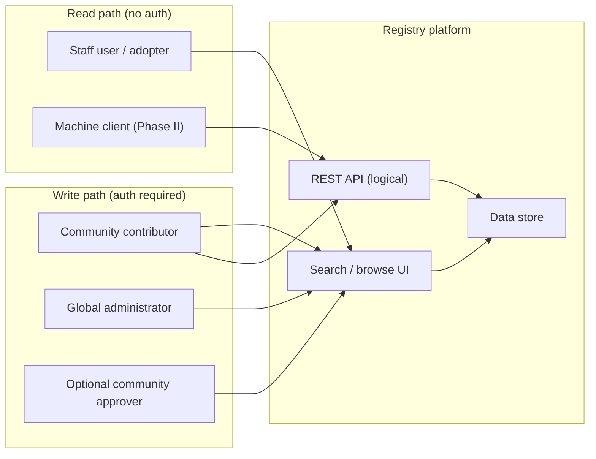
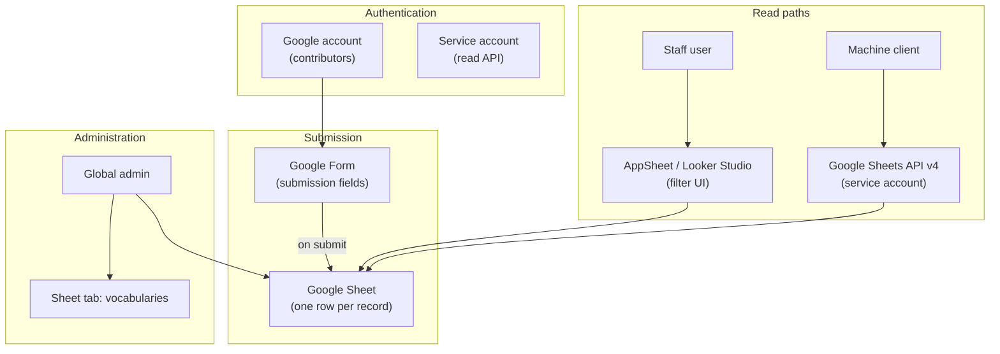
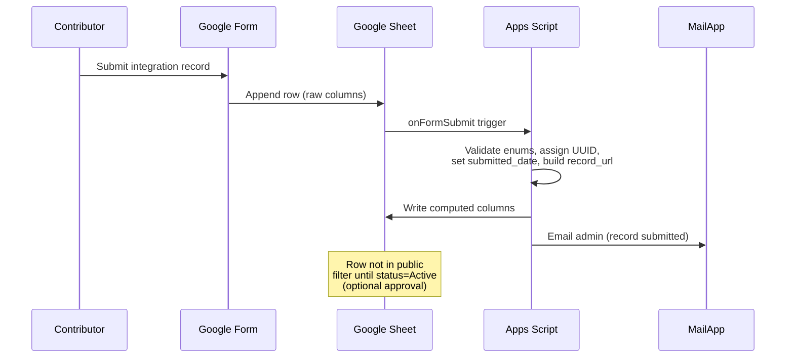
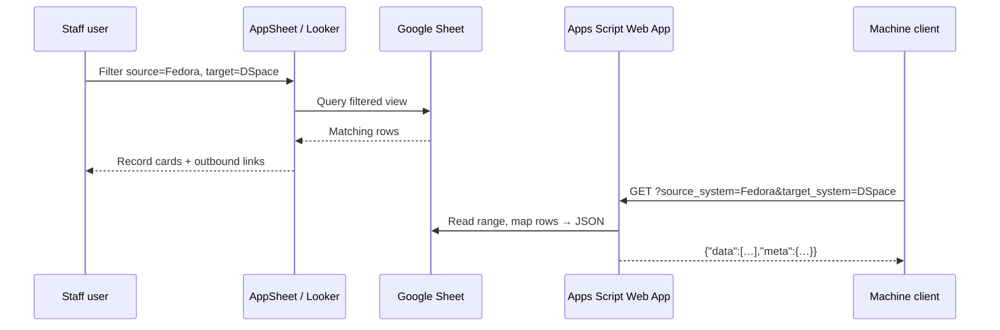
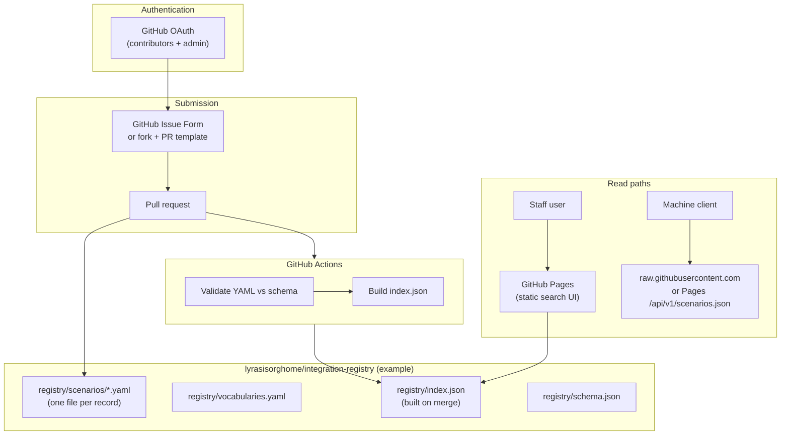
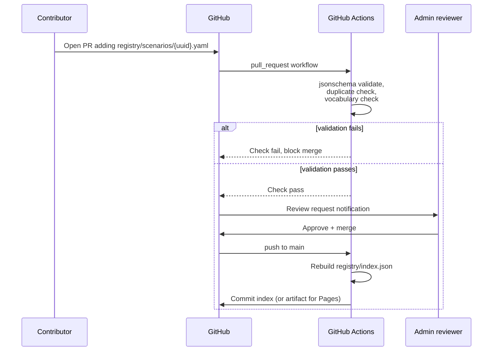
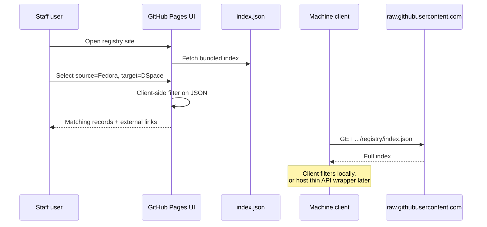
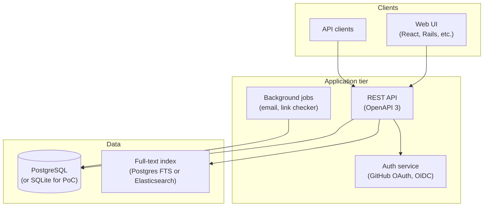
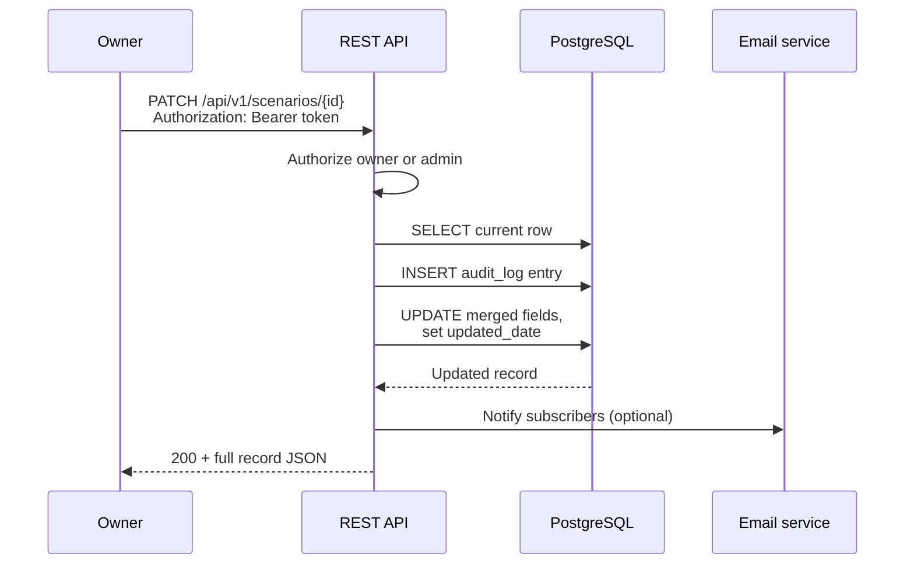

# F1: Integration Scenario Registry — Platform & API Technical Specification

## Technical specification (architecture-first draft)

**Scenario:** [F1 — Lyrasis Interoperability Database](https://github.com/lyrasisorghome/InteroperabilityProject/issues/58)

**Status:** Draft v0.1 — closes implementation gaps in [`F1-integration-scenario-registry.md`](F1-integration-scenario-registry.md)

**Systems:** Registry data store, submission workflow, read UI, REST API (logical contract)

**References:**

- Requirements baseline: [`F1-integration-scenario-registry.md`](F1-integration-scenario-registry.md) (data model, roles, Phase II endpoint table)
- Behavior scenarios: [GitHub issue #58](https://github.com/lyrasisorghome/InteroperabilityProject/issues/58)
- [Google Sheets API v4](https://developers.google.com/sheets/api)
- [Google Forms → Sheets](https://support.google.com/docs/answer/6281888)
- [GitHub REST API — Pull requests](https://docs.github.com/en/rest/pulls)
- [GitHub Issue Forms](https://docs.github.com/en/communities/using-templates-to-encourage-useful-issues-and-pull-requests/syntax-for-issue-forms)

---

## Purpose and scope

Define **how to implement** the Integration Scenario Registry described in the Redstart draft spec: a searchable matrix of real-world integrations (source system → target system) with links to code, docs, and related LYRASIS specs.

This document is **self-contained for platform decisions** but **inherits field definitions** from the parent spec. It adds:

1. A **canonical JSON record** (the logical API payload regardless of backend)
2. Three **viable Phase I platform paths** with architecture diagrams
3. A **REST API contract** (Phase II on paper; useful now to lock the interface down, AKA: normative)
4. **Sequence diagrams** for deposit, search, and update with example JSON
5. A **decision matrix** and a recommended default for June 2026 delivery

Out of scope for v0.1:

- Building or hosting a specific implementation
- Export-to-integration-guide crawler (BS01 stretch goal in issue #58)
- AI prompt document generation (BS02 in issue #58)
- Link health monitoring cron (noted as future enhancement)

---

## Why the parent spec stalls

[`F1-integration-scenario-registry.md`](F1-integration-scenario-registry.md) defines **what** (fields, roles, endpoint names) but leaves **where** open:

| Parent spec section | State |
|---------------------|-------|
| Integration Architecture table | Six rows; five are blank |
| Behavior scenarios (Deposit, Search, …) | Headings only |
| Error scenarios | Gap G-03 |
| Phase II API | Endpoint table exists; no request/response bodies |
| G-10 Diagrams | Explicitly listed as missing |

**Recommendation:** Define the **JSON record + REST contract first**, then map each operation to a concrete platform. The API is the spine; Google Sheets, GitHub, and a custom app are interchangeable backends that **implement the same shapes**.

---

## Actors



| Actor | Role |
|-------|------|
| **Staff user** | Filters by source/target system; opens a record; follows outbound links (BS01). |
| **Community contributor** | Deposits or updates a record after account approval. |
| **Global administrator** | Approves accounts, manages vocabularies, flags records, configures optional review. |
| **Machine client** | Queries `GET /api/v1/scenarios` with filters (Phase II). |
| **Registry platform** | Persists records, enforces schema, serves UI and API. |

---

## Canonical data contract

All platform options below MUST be able to produce and consume this JSON shape. Field names align with the parent spec; additions are noted.

### IntegrationScenarioRecord (JSON)

```json
{
  "id": "550e8400-e29b-41d4-a716-446655440000",
  "title": "ArchivesSpace digital object linking to DSpace via REST API",
  "source_system": ["ArchivesSpace"],
  "target_system": ["DSpace"],
  "integration_type": "Linking",
  "protocol": ["REST API"],
  "status": "Active",
  "description": "Bidirectional URI linking between AS digital objects and DSpace items using REST APIs on both sides.",
  "submitted_by": "Example University Library",
  "submitted_date": "2026-05-15T14:30:00Z",
  "prerequisites": "ArchivesSpace 3.4+, DSpace 7.x with REST enabled, service accounts on both systems.",
  "configuration_notes": "Configure `dc.identifier.uri` on DSpace; append `file_versions.file_uri` on AS.",
  "code_repository_url": "https://github.com/example/as-dspace-linker",
  "documentation_url": "https://wiki.example.edu/integrations/as-dspace",
  "related_spec_url": "https://github.com/lyrasisorghome/InteroperabilityProject/blob/main/specs/A2-dspace-bulk-linking.md",
  "related_scenario_ids": [],
  "min_system_version": ["ArchivesSpace 3.4", "DSpace 7.3"],
  "def_system_version": ["ArchivesSpace 3.5", "DSpace 9.0"],
  "last_verified_date": "2026-04-01",
  "contact_email": "integrations@example.edu",
  "license": "CC-BY-4.0",
  "tags": ["finding aid", "digitization", "bidirectional"],
  "updated_date": "2026-05-20T09:00:00Z",
  "record_url": "https://registry.example.org/scenarios/550e8400-e29b-41d4-a716-446655440000",
  "flagged": false
}
```

### Controlled vocabularies

| Field | Allowed values (initial) |
|-------|--------------------------|
| `source_system`, `target_system` | `ArchivesSpace`, `DSpace`, `CollectionSpace`, `VIVO`, `Fedora`, `Other` (+ extensible) |
| `integration_type` | `Linking`, `Deposit`, `Metadata Harvesting (OAI-PMH)`, `Search/Discovery`, `Bidirectional Sync`, `Other` |
| `protocol` | `SWORD v2`, `SWORD v3`, `OAI-PMH v2`, `REST API`, `SPARQL`, `Custom/Bespoke`, `Other` |
| `status` | `Active`, `Experimental`, `Deprecated`, `Retired`, `Recalled` |

Multi-select fields are JSON arrays. Admin-maintained vocabularies are exposed at `GET /api/v1/vocabularies`.

### Duplicate detection (resolves parent G-01)

On `POST /api/v1/scenarios`, the registry SHOULD evaluate:

| Rule | Match | Action |
|------|-------|--------|
| **Hard advisory** | Same `submitted_by` + same sorted `source_system` + same sorted `target_system` + same `integration_type` | Return `409` with `duplicate_of` UUID **or** `201` with `warnings[]` (configurable by admin) |
| **Soft advisory** | Levenshtein similarity on `title` ≥ 0.85 vs existing Active/Experimental records | Return `201` with `warnings[]`; do not block |

Default for Phase I: **warn, do not block** (community registry, not cataloging authority).

---

## REST API Contract (required behavior)

Implementations MAY defer HTTP exposure to Phase II, but Phase I storage and UI MUST be mappable to these operations. This table extends the parent spec with request/response detail.

| Method | Endpoint | Auth | Description |
|--------|----------|------|-------------|
| GET | `/api/v1/scenarios` | No | List/search records (query params below) |
| POST | `/api/v1/scenarios` | Yes | Create record; server assigns `id`, `submitted_date`, `record_url` |
| GET | `/api/v1/scenarios/{id}` | No | Single record |
| PATCH | `/api/v1/scenarios/{id}` | Yes (owner or admin) | JSON Merge Patch partial update |
| GET | `/api/v1/vocabularies` | No | Controlled lists |
| GET | `/api/v1/schema` | No | JSON Schema for records |

**Search query parameters** (`GET /api/v1/scenarios`):

| Param | Example | Semantics |
|-------|---------|-----------|
| `source_system` | `ArchivesSpace` | Record's `source_system` contains value |
| `target_system` | `DSpace` | Record's `target_system` contains value |
| `integration_type` | `Linking` | Exact match |
| `protocol` | `REST API` | Record's `protocol` contains value |
| `status` | `Active` | Exact match; default public UI excludes `Retired`, `Recalled` |
| `keyword` | `finding aid` | Full-text on `title`, `description`, `tags` |
| `tags` | `digitization` | Any tag match |
| `updated_since` | `2026-01-01T00:00:00Z` | `updated_date` ≥ value |
| `page`, `per_page` | `1`, `20` | Pagination; default `per_page=20`, max `100` |

### Example: search response

```http
GET /api/v1/scenarios?source_system=Fedora&target_system=DSpace&status=Active&page=1&per_page=2
```

```json
{
  "data": [
    {
      "id": "7c9e6679-7425-40de-944b-e07fc1f90ae7",
      "title": "Fedora object metadata sync to DSpace via OAI-PMH",
      "source_system": ["Fedora"],
      "target_system": ["DSpace"],
      "integration_type": "Metadata Harvesting (OAI-PMH)",
      "protocol": ["OAI-PMH v2"],
      "status": "Active",
      "description": "…",
      "record_url": "https://registry.example.org/scenarios/7c9e6679-7425-40de-944b-e07fc1f90ae7",
      "updated_date": "2026-03-10T11:00:00Z"
    }
  ],
  "meta": {
    "page": 1,
    "per_page": 2,
    "total": 14,
    "total_pages": 7
  },
  "links": {
    "self": "/api/v1/scenarios?source_system=Fedora&target_system=DSpace&page=1",
    "next": "/api/v1/scenarios?source_system=Fedora&target_system=DSpace&page=2"
  }
}
```

### Example: create request

```http
POST /api/v1/scenarios
Authorization: Bearer {token}
Content-Type: application/json
```

```json
{
  "title": "ArchivesSpace to Archive-It crawl configuration",
  "source_system": ["ArchivesSpace"],
  "target_system": ["Other"],
  "integration_type": "Linking",
  "protocol": ["Custom/Bespoke"],
  "status": "Experimental",
  "description": "Export finding aid URLs from AS for Archive-It seed list.",
  "submitted_by": "State Archives",
  "documentation_url": "https://example.org/docs/as-archive-it",
  "tags": ["web archiving", "Archive-It"]
}
```

**Example success response** (`201 Created`):

```json
{
  "id": "a1b2c3d4-e5f6-7890-abcd-ef1234567890",
  "title": "ArchivesSpace to Archive-It crawl configuration",
  "source_system": ["ArchivesSpace"],
  "target_system": ["Other"],
  "integration_type": "Linking",
  "protocol": ["Custom/Bespoke"],
  "status": "Experimental",
  "description": "Export finding aid URLs from AS for Archive-It seed list.",
  "submitted_by": "State Archives",
  "submitted_date": "2026-06-06T16:00:00Z",
  "documentation_url": "https://example.org/docs/as-archive-it",
  "tags": ["web archiving", "Archive-It"],
  "updated_date": "2026-06-06T16:00:00Z",
  "record_url": "https://registry.example.org/scenarios/a1b2c3d4-e5f6-7890-abcd-ef1234567890",
  "flagged": false,
  "warnings": []
}
```

### Example: validation error (`422`)

```json
{
  "error": "validation_failed",
  "message": "One or more required fields are missing or invalid.",
  "details": [
    { "field": "source_system", "code": "required", "message": "Must include at least one system." },
    { "field": "integration_type", "code": "invalid_enum", "message": "Must be one of: Linking, Deposit, …" }
  ]
}
```

### Example: unauthorized edit (`403`)

```json
{
  "error": "forbidden",
  "message": "Authenticated user is not the record owner or an administrator."
}
```

**Rate limiting (resolves parent G-02 sketch):** Public read: 120 requests/minute per IP; authenticated write: 30/minute. Respond `429` with `Retry-After` header.

---

## Platform option A — Google Forms + Sheets (+ optional AppSheet)

**Best for:** Fastest Phase I delivery, non-developer admin, minimal hosting cost.

**Weak fit for:** GitHub SSO requirement, rich version history, machine API without extra glue.

### Architecture



### How requirements map

| Requirement | Google implementation |
|-------------|----------------------|
| Deposit | Form → Sheet row; optional Form restrict to `@domain` or manual contributor list |
| Search UI | AppSheet app or Looker Studio dashboard with source/target filters |
| Controlled vocabularies | Separate Sheet tab; data validation on main tab columns |
| Admin approval of users | Manual: share Form/Sheet edit access after review (no native SSO) |
| GitHub SSO | **Not native** — use Google accounts or external IdP via Google Workspace |
| Version history | Sheet **Version history** (file-level); per-row audit via Apps Script log tab |
| Email notifications | Apps Script on Form submit → MailApp |
| Public read API | Sheets API + service account; publish read-only JSON via Apps Script Web App |
| UUID `id` | Apps Script on submit: generate UUID column |
| No delete | Hide row or set `status=Retired`; filter views exclude retired |

### Deposit sequence



### Search sequence (AppSheet / API adapter)



**Sheets column → JSON mapping:** One column per scalar field; pipe-delimited strings for multi-select (`ArchivesSpace|DSpace` → array). Apps Script Web App implements the logical API shape above.

### Tradeoffs

| Pros | Cons |
|------|------|
| Live in days; familiar to archivists | GitHub SSO not satisfied without compromise |
| Built-in form validation | Weak per-field audit trail vs Git |
| Sheets API enables read automation | Write API needs Apps Script; not REST-native |
| Free tier sufficient for 10–15 seed records | "Matrix" UX needs AppSheet/Looker investment |

---

## Platform option B — GitHub-native registry (recommended default)

**Best for:** GitHub SSO alignment, PR-based review, version control, LYRASIS already on GitHub, zero custom server for Phase I.

**Weak fit for:** Non-technical contributors who will not use GitHub; WYSIWYG markdown editing expectations.

### Architecture



### Submission via pull request

This is a common pattern:

1. Contributor forks repo (or uses GitHub web editor with branch).
2. Adds `registry/scenarios/{uuid}.yaml` using PR template checklist.
3. GitHub Action validates against `registry/schema.json` (JSON Schema).
4. Admin (or optional community approver) reviews PR; merge = publish.
5. Action rebuilds `registry/index.json` for search UI and API consumers.

Optional: **GitHub Issue Form** opens an issue with structured fields; a bot or maintainer converts approved issues to YAML via PR (lower barrier for first-time contributors).

### Example record file

`registry/scenarios/550e8400-e29b-41d4-a716-446655440000.yaml`:

```yaml
id: 550e8400-e29b-41d4-a716-446655440000
title: ArchivesSpace digital object linking to DSpace via REST API
source_system:
  - ArchivesSpace
target_system:
  - DSpace
integration_type: Linking
protocol:
  - REST API
status: Active
description: |
  Bidirectional URI linking between AS digital objects and DSpace items.
submitted_by: Example University Library
submitted_date: "2026-05-15T14:30:00Z"
code_repository_url: https://github.com/example/as-dspace-linker
related_spec_url: https://github.com/lyrasisorghome/InteroperabilityProject/blob/main/specs/A2-dspace-bulk-linking.md
tags:
  - finding aid
  - digitization
updated_date: "2026-05-20T09:00:00Z"
flagged: false
```

`git log` on each file = **version history** (resolves parent G-05). `status: Retired` removes from default index build (no delete).

### Deposit sequence



### Search sequence



Phase II upgrade path: add Cloudflare Worker or Lambda that serves `GET /api/v1/scenarios` with server-side filter over the same JSON index — **no schema change**.

### Static UI sketch

Minimal Phase I UI (Jekyll/Eleventy/React Single-Page Application (SPA) on Pages):

- Dropdowns: source system, target system, integration type, protocol, status
- Free-text keyword box
- Results table: title, systems, status, links
- Record detail page: render YAML fields + markdown `description`

Embed link from Fedora Confluence / project site (per BS01 navigation — exact URL is a content decision, not technical).

### Tradeoffs

| Pros | Cons |
|------|------|
| Native GitHub SSO + PR review | Contributors must tolerate GitHub (or issue form + maintainer proxy) |
| Full version history, public audit | No built-in email; use GitHub notifications |
| Same org as InteroperabilityProject | Custom search UI is a small dev task |
| Seed records can reference specs in sibling repo | Immediate publish on merge (optional approver = merge gate) |
| Phase II API = index.json + thin wrapper | |

---

## Platform option C — Dedicated database + web application

**Best for:** Long-term product, non-GitHub contributors with rich UI, full REST API on day one.

**Weak fit for:** June 2026 deadline with no development budget identified.

### Architecture (hosting-agnostic)



### Reference stack (illustrative, not prescriptive)

| Layer | Example technologies |
|-------|---------------------|
| Frontend | React + TanStack Query, or Rails Hotwire |
| API | Node (Fastify), Python (FastAPI), or Ruby on Rails API mode |
| Database | PostgreSQL 15+ with JSONB for tags/metadata |
| Auth | GitHub OAuth via OAuth2 proxy; role table for admin/approver |
| Hosting | Fly.io, Render, AWS ECS, or Lyrasis-managed VM |
| Email | SendGrid, Amazon SES |

### Update sequence (PATCH)



### Tradeoffs

| Pros | Cons |
|------|------|
| Exact fit to parent spec (roles, email, API) | Highest cost and schedule risk |
| Server-side duplicate detection, full-text search (FTS), rate limits | Requires ops (monitoring, backups — parent G-03) |
| Best UX for matrix filtering | Overkill if seed dataset is 10–15 records |

---

## Decision matrix

| Criterion | A: Google | B: GitHub | C: Dedicated |
|-----------|-----------|-----------|--------------|
| Time to Phase I MVP | **Days–1 week** | **1–2 weeks** | 2–4+ months |
| GitHub SSO | Poor | **Excellent** | Good (OAuth) |
| Version history | Sheet history | **Git log** | Audit table |
| PR / review workflow | Manual | **Native** | Custom |
| Public read API | Apps Script adapter | **index.json** (+ wrapper later) | **Native REST** |
| Non-dev contributors | **Excellent** (Forms) | Moderate (Issue Form helps) | Excellent (custom UI) |
| Aligns with LYRASIS GitHub presence | Low | **High** | Medium |
| June 2026 feasibility | High | **High** | Low unless staffed |

### Recommended path

**Phase I (June 2026): Option B — GitHub-native registry** in `lyrasisorghome` org, with:

- YAML records + JSON Schema validation in CI
- GitHub Pages search UI (source × target matrix filters)
- Issue Form for contributors who prefer not to edit YAML directly
- 10–15 seed records populated via maintainer PRs referencing existing specs (A2, C1, V1, etc.)

**Phase II:** Publish `registry/index.json` at stable URL; add optional Cloudflare Worker implementing the logical REST paths; or migrate to Option C if volume and UX demand it.

**Option A** remains valid if Lyrasis insists on zero GitHub contribution friction and accepts Google accounts instead of GitHub SSO.

---

## Behavior scenario mapping

### BS01 — Discover Fedora integrations (issue #58)

| Step | Implementation (Option B) |
|------|----------------------------|
| Navigate from Confluence | Static link to GitHub Pages registry URL |
| Interactive filter by tools in use | UI dropdowns bound to `source_system`, `target_system` |
| Open entry | Detail page per record; outbound URLs validated at build time (optional CI check) |
| Export records | Phase I: download filtered JSON or CSV from UI; Phase II: `GET /api/v1/scenarios?...&format=csv` |

Fields in BS01 beyond parent spec (frequency, volume, error handling detail) map to **optional long-text sections** in `description` or `configuration_notes` until the community confirms a fixed schema extension.

### BS02 — AI prompts (issue #58)

Defer to v0.2. If pursued, add optional field:

```json
"ai_prompt_document_url": "https://…"
```

### Error scenarios (resolves parent G-03 headings)

| Scenario | HTTP / UX behavior |
|----------|-------------------|
| Deposit missing required fields | `422` + `details[]`; Form/PR template shows inline errors |
| Duplicate detection | `201` + `warnings[]` or configurable `409` |
| Search no results | `200` + `"data": []`, UI message: "No integrations match; try broader filters." |
| Unauthorized edit | `403` + error JSON |
| Record flagged | Public `GET` returns record with `"flagged": true` banner; or exclude from index (admin config) |

---

## Seed content plan (implementation phase)

Populate **10–15 records** as specified in issue #58:

| # | Source | Target | Type | Seed from |
|---|--------|--------|------|-----------|
| 1 | ArchivesSpace | DSpace | Linking | [`A2-dspace-bulk-linking.md`](A2-dspace-bulk-linking.md) |
| 2 | VIVO | DSpace | Deposit | [`V1-vivo-sword-deposit.md`](V1-vivo-sword-deposit.md) |
| 3 | CollectionSpace | — | OAI-PMH | [`C1-cs-oai-pmh.md`](C1-cs-oai-pmh.md) |
| 4 | ArchivesSpace | Archive-It | Linking | PoC external integration |
| 5–15 | Mix of five CSTs | Cross-CST pairs | Various | Community submissions + SME interviews |

Each seed record MUST include `related_spec_url` when a LYRASIS spec exists.

---

## Open questions (remaining)

| ID | Question | Default if no answer by implementation |
|----|----------|----------------------------------------|
| Q-01 | Public vs authenticated read | Public read (parent spec) |
| Q-02 | Per-record approval vs publish-on-merge | Publish-on-merge; approver may set `Recalled` |
| Q-03 | Contact email public display | Hidden by default; opt-in per record |
| Q-04 | Confluence entry URL for BS01 | Content decision; link from project README |
| Q-05 | Export / integration guide generator | Phase II+ |

---

## Gap resolution map

| Parent gap | Addressed in this doc |
|------------|----------------------|
| G-01 Duplicate detection | Canonical rules + 409/warnings |
| G-02 Rate limiting | 429 policy on logical API |
| G-03 Error scenarios | HTTP mapping table |
| G-05 Version history | Git log (B) or audit table (C) |
| G-10 Diagrams | Mermaid architecture + sequence diagrams |
| Integration Architecture blank rows | Three platform architectures |
| Phase II API bodies | JSON examples throughout |
| Behavior scenarios empty | BS01/BS02 mapping + error table |

---

## Implementation artifacts (Option B starter kit)

These files exist in this repo as a working prototype:

| Artifact | Path |
|----------|------|
| JSON Schema | [`registry/schema.json`](../registry/schema.json) |
| Controlled vocabularies | [`registry/vocabularies.yaml`](../registry/vocabularies.yaml) |
| Seed scenario records | [`registry/scenarios/`](../registry/scenarios/) |
| Public read index | [`registry/index.json`](../registry/index.json) (generated) |
| Validate script | [`scripts/validate_registry.py`](../scripts/validate_registry.py) |
| Index builder | [`scripts/build_registry_index.py`](../scripts/build_registry_index.py) |
| GitHub Actions CI | [`.github/workflows/registry-validate.yml`](../.github/workflows/registry-validate.yml) |
| Contributor docs | [`registry/README.md`](../registry/README.md) |
| Issue form (non-YAML submitters) | [`.github/ISSUE_TEMPLATE/registry-submission.yml`](../.github/ISSUE_TEMPLATE/registry-submission.yml) |
| PR template | [`.github/PULL_REQUEST_TEMPLATE/registry-record.md`](../.github/PULL_REQUEST_TEMPLATE/registry-record.md) |

### Local workflow

```powershell
pip install -r registry/requirements.txt
python scripts/validate_registry.py
python scripts/build_registry_index.py
git add registry/scenarios/ registry/index.json
```

### CI workflow (what Actions runs)

1. Trigger on PR/push when `registry/**` or validation scripts change.
2. `validate_registry.py` — JSON Schema, UUID filename match, duplicate advisories.
3. `build_registry_index.py --check` — fails if `index.json` was not rebuilt after YAML edits.

See [`registry/README.md`](../registry/README.md) for a contributor-oriented explanation.

## Next steps

1. **Stakeholder pick:** Confirm Option B (GitHub) vs A (Google) vs C (build app) — starter kit assumes B in-repo.
2. **GitHub Pages UI** (not yet in repo): static filter page reading `registry/index.json`.
3. **Backfill** remaining seed records (target 10–15 per issue #58).
4. **Fold** chosen platform specifics back into [`F1-integration-scenario-registry.md`](F1-integration-scenario-registry.md) Integration Architecture table (replace TBD rows).
5. **Optional v0.2:** OpenAPI 3 export from logical API section; link checker job.
