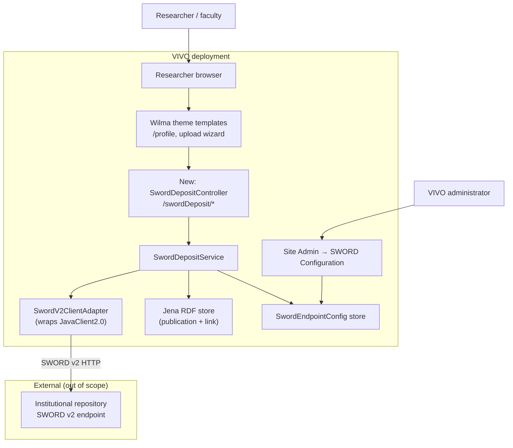
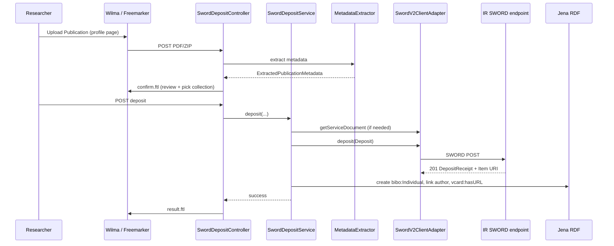

# V1: SWORD Deposit from VIVO — High-Level Feature Design

## Technical specification (architecture-first draft)

**Scenario:** [V1: SWORD-Based Deposit of Publications from VIVO to an Institutional Repository](https://github.com/lyrasisorghome/InteroperabilityProject/issues/54)

**Status:** Draft v0.1 — high-level feature design; closes *where-in-the-codebase* gaps in [`V1-vivo-sword-deposit.md`](V1-vivo-sword-deposit.md)

**Systems:** VIVO 1.15.x / Vitro (Java, Jena RDF, Freemarker), SWORD v2 client deposit to a configured institutional repository (IR) SWORD endpoint

**Normative references:**

- [SWORD v2 Profile](https://swordapp.github.io/SWORDv2-Profile/SWORDProfile.html)
- [SWORD v2 specification](https://swordapp.github.io/SWORDv2/SWORDv2.html)
- [JavaClient2.0 (SWORD v2 client)](https://github.com/swordapp/JavaClient2.0)
- [VIVO project](https://github.com/vivo-project/VIVO) and [Vitro core](https://github.com/vivo-project/Vitro)
- [VIVO technical documentation](https://wiki.lyrasis.org/display/VIVO/VIVO+Technical+Documentation)
- Parent requirements: [`V1-vivo-sword-deposit.md`](V1-vivo-sword-deposit.md)

---

## Purpose and scope

Define **how VIVO would implement** a workflow in which a signed-in researcher uploads a publication file (PDF, or ZIP containing a PDF plus metadata) from their profile, VIVO deposits the package to a configured IR via **SWORD v2**, and then creates or updates a **publication record on the profile** linked to the IR item URI returned by the deposit.

The parent spec [`V1-vivo-sword-deposit.md`](V1-vivo-sword-deposit.md) captures **requirements and behavior scenarios** but not **which Java modules, servlets, theme templates, configuration stores, or RDF properties** would change. This document is the bridge to implementation planning.

This v0.1 draft covers:

1. **Deployment context** — VIVO/Vitro WAR layout and where HTTP requests land
2. **Existing components** to extend or reuse (Create-and-Link, Site Admin registration, permissions, file upload limits)
3. **New components** (proposed packages, class names, responsibilities)
4. **Configuration and persistence** — admin UI, endpoint records, credentials, protocol version selection
5. **Reference UI touchpoints** — Wilma theme profile page and admin screens only (custom themes out of scope for this deliverable)
6. **Metadata extraction and SWORD packaging** — concrete v2 behavior where the parent spec abstract or undecided
7. **High-level request/data flows** with pseudocode sketches
8. **SWORD v3 forward compatibility** — adapter hook only; no v3 client in v0.1
9. **Open decisions** inherited from the parent spec

Out of scope for v0.1 (defer to a lower-level design pass or client feedback):

- Full Atom Entry / METS XML examples for every IR packaging variant
- Line-by-line BIBO ↔ IR metadata field mapping for every deployment ontology profile
- IR-side ingest workflow configuration (embargo, review queues, collection policies)
- Retrospective migration of existing IR items into VIVO
- Content-based PDF text extraction (OCR / heuristic parsing of non-XMP PDFs)
- SWORD v3 implementation (no production v3 servers identified yet)
- Changes to non-reference themes (`nemo`, `tenderfoot`, etc.)

**Naming constraint (program):** This spec describes integration with **any SWORD-compliant IR** via standard protocol endpoints. It does not name or assume a particular repository product unless required by the protocol itself.

---

## Why the parent spec stalls

[`V1-vivo-sword-deposit.md`](V1-vivo-sword-deposit.md) defines **what** (roles, configuration table, behavior scenarios BS01–BS04, gaps G-01–G-12) but leaves **how** open:

| Parent gap | What is missing for developers |
|------------|--------------------------------|
| BS02 inline questions | Authentication mechanism, response parsing, background processing, in-progress deposits |
| Metadata extraction | Accept types named, but no parser choice, ZIP layout, or mapping into VIVO RDF |
| G-06 / G-07 | Whether VIVO stores binaries; how extracted fields become `bibo:` / `vivo:` statements |
| G-10 | Plugin vs core — no module boundary proposed |
| G-11 | Permission values not defined |
| G-12 | XMP vs SAF vs full-text extraction — undecided |
| SWORD v2 vs v3 | Both listed in scope, but no selection strategy or adapter boundary |

**Recommendation:** Implement as a **VIVO `api` module feature** (same tier as the existing Create-and-Link publication workflow), use **[JavaClient2.0](https://github.com/swordapp/JavaClient2.0)** for SWORD v2, mirror the **`CreateAndLinkResourceController`** servlet + Freemarker wizard pattern, and register admin screens through **`BaseSiteAdminController.registerSiteConfigData`**. Limit **reference UI** changes to the **Wilma** theme templates under `webapp/themes/wilma/`.

---

## Assumptions

| ID | Assumption |
|----|------------|
| A-01 | Target **VIVO 1.15.x** (current `develop` branch family) deployed as a Tomcat WAR built from [vivo-project/VIVO](https://github.com/vivo-project/VIVO) with [vivo-project/Vitro](https://github.com/vivo-project/Vitro) as the platform dependency. |
| A-02 | **SWORD v2** is the only protocol implemented in the first release. Admins configure endpoints as v2; a **`SwordProtocolAdapter`** interface allows a future v3 adapter without rewriting orchestration. |
| A-03 | The IR exposes a **Service Document URL** and at least one **Collection** accepting the configured package type (typically `application/pdf` and/or `application/zip`). |
| A-04 | **VIVO does not persist uploaded publication binaries.** Files are held in memory or short-lived temp files for the duration of the deposit request (or async job), then deleted. Only **metadata and the IR item URI** are written to the RDF store. |
| A-05 | **Reference UI** means the **Wilma** theme (`webapp/src/main/webapp/themes/wilma/templates/`). Other themes inherit behavior only if they use shared Freemarker includes (not required in v0.1). |
| A-06 | **Authentication to the IR (v2)** uses **HTTP Basic Auth** with credentials configured by the VIVO administrator (shared service account model for PoC). Per-researcher IR credentials are deferred (parent G-03). |
| A-07 | Deposit is **synchronous from the user's perspective** for v0.1 (browser waits for success/failure). Long-running IR workflows may return SWORD **In-Progress**; VIVO surfaces that state and optionally polls the Status-IRI (see *In-progress deposits*). |
| A-08 | Publication records created by this feature use existing VIVO **BIBO** classes (`bibo:Article`, `bibo:Document`, etc.) and link to the profile via **`vivo:relatedBy` / authorship** patterns already used by Create-and-Link. |
| A-09 | **Write-back of the VIVO profile URI to the IR record** (parent G-08) is **out of scope** for v0.1 unless the IR supports it via a separate API beyond deposit. |

---

## Actors and deployment context



| Actor | Role |
|-------|------|
| **VIVO Administrator** | Registers one or more IR SWORD endpoints, credentials, default collection, protocol version (v2), and master enable flag via Site Admin. |
| **Researcher / faculty** | On their own profile (self-editing), uploads PDF/ZIP, reviews extracted metadata, selects target collection, submits deposit. |
| **Repository manager** | Configures SWORD permissions and collections on the IR (outside VIVO). |
| **Profile visitor** | Follows the publication's **web link** on the public profile to the IR item (no deposit UI). |
| **SWORD deposit module** (new) | Validates upload, extracts metadata, calls SWORD client, writes RDF, logs outcome. |

### Typical URL shapes

Assume host `https://vivo.example.edu` and profile `https://vivo.example.edu/display/cwid-ana4036`:

| Surface | Example URL | Notes |
|---------|-------------|-------|
| Individual profile (public) | `/display/{localName}` | Existing Vitro routing |
| Create-and-Link (precedent) | `/createAndLink/doi?profileUri=…` | Existing publication claim flow |
| **Proposed deposit entry** | `/swordDeposit/upload?profileUri=…` | GET → upload form; POST → process |
| **Proposed admin** | `/admin/sword` | CRUD for endpoint configuration |
| Site Admin hub | `/siteAdmin` | Existing; new link under Site Configuration |

---

## VIVO / Vitro repositories touched

| Repository | Role in SWORD feature | Expected change level |
|------------|----------------------|------------------------|
| [vivo-project/VIVO `api`](https://github.com/vivo-project/VIVO/tree/main/api) | **Primary** — deposit servlet, services, metadata extraction, SWORD adapter, RDF writes | **Major** — new `sword` package |
| [vivo-project/VIVO `webapp`](https://github.com/vivo-project/VIVO/tree/main/webapp) | Freemarker wizard templates; **Wilma** profile button | **Moderate** |
| [vivo-project/VIVO `home`](https://github.com/vivo-project/VIVO/tree/main/home) | Default `runtime.properties` keys; optional first-time RDF for permissions | **Minor** |
| [vivo-project/Vitro `api`](https://github.com/vivo-project/Vitro/tree/main/api) | Site Admin registration hook; optional new `SimplePermission` | **Minor** |
| [vivo-project/Vitro `webapp`](https://github.com/vivo-project/Vitro/tree/main/webapp) | Shared `siteAdmin-siteConfiguration.ftl` only if link is registered from Vitro side | **Optional minor** |
| [swordapp/JavaClient2.0](https://github.com/swordapp/JavaClient2.0) | SWORD v2 HTTP client library | **Dependency** (Maven) |

**Not required:** Vitro core changes beyond permission registration unless admin UI is implemented entirely in Vitro (recommended: VIVO `api` registers its own Site Admin link at startup, same pattern as other extensions).

---

## Existing components to reuse

VIVO has **no SWORD code today**. These are the closest analogues:

### Publication claim workflow (Create-and-Link)

| Component | Location | Reuse for SWORD deposit |
|-----------|----------|-------------------------|
| `CreateAndLinkResourceController` | `VIVO/api/.../CreateAndLinkResourceController.java` | **Template** for multi-step Freemarker wizard, profile URI parameter, RDF publication creation, authorship linking |
| `CreateAndLinkResourceProvider` | `VIVO/api/.../createandlink/` | Pattern for pluggable external systems (here: SWORD replaces Crossref/PubMed lookup) |
| Profile UI claim buttons | `webapp/themes/wilma/templates/individual--foaf-person.ftl` | Add **Upload Publication** alongside DOI/PMID claim forms |
| `createAndLink.providers` | `runtime.properties` | Precedent for feature toggles; add `swordDeposit.enabled` |

Create-and-Link already:

- Requires **`SimplePermission.EDIT_OWN_ACCOUNT`** for the claiming user
- Creates `bibo:` individuals and links them with **`vivo:relatedBy`** / author nodes
- Adds external URLs via **`vcard:hasURL`** when a resource URL is known

SWORD deposit extends this: the **IR item URI** from the deposit receipt becomes that external URL.

### Site Admin and permissions

| Component | Location | Reuse for SWORD deposit |
|-----------|----------|-------------------------|
| `BaseSiteAdminController.registerSiteConfigData` | `Vitro/api/.../BaseSiteAdminController.java` | Register **`manageSwordEndpoints`** → `/admin/sword` under Site Configuration |
| `SimplePermission` | `Vitro/api/.../SimplePermission.java` | Add **`ManageSwordEndpoints`** (admin) |
| `simple_permissions_admin.n3` | `Vitro/home/.../accessControl/firsttime/` | Grant new permission to Admin role set |
| `siteAdmin-siteConfiguration.ftl` | `Vitro/webapp/.../siteAdmin-siteConfiguration.ftl` | Renders registered config links automatically |

### Configuration and file handling

| Component | Location | Reuse for SWORD deposit |
|-----------|----------|-------------------------|
| `ConfigurationProperties` / `runtime.properties` | `Vitro/home/.../example.runtime.properties` | Global limits: `fileUpload.maxFileSize`, `fileUpload.allowedMIMETypes` (already documents `application/pdf`) |
| Multipart request handling | `EditConfigurationVTwo`, Vitro filters | Existing Commons FileUpload pipeline for form posts |
| `RDFService` / `ChangeSet` | Vitro API | Atomic write of new publication triples |

### Theming

| Component | Location | Reuse for SWORD deposit |
|-----------|----------|-------------------------|
| `ThemeInfoSetup` | `Vitro/api/.../ThemeInfoSetup.java` | Themes live under `/themes/{name}/`; Site Information selects active theme |
| Wilma person template | `VIVO/webapp/themes/wilma/templates/individual--foaf-person.ftl` | **Only theme modified** in v0.1 |

---

## Proposed new components

### New Java package: `org.vivoweb.webapp.sword`

Mirror the Create-and-Link layout under `VIVO/api/src/main/java/org/vivoweb/webapp/`:

```
VIVO/api/src/main/java/org/vivoweb/webapp/sword/
  controller/
    SwordDepositController.java          # @WebServlet /swordDeposit/*
    SwordAdminController.java            # @WebServlet /admin/sword/*
  service/
    SwordDepositService.java             # orchestration: extract → deposit → rdf
    SwordEndpointConfigService.java      # load/save/test endpoint configs
    PublicationRdfWriter.java            # create bibo individual + authorship + webpage
    SwordDepositAuditLog.java            # timestamp, user, collection, IR URI
  metadata/
    UploadPackage.java                   # PDF or ZIP wrapper
    UploadPackageParser.java             # validate MIME, unzip, locate PDF
    MetadataExtractor.java               # interface
    XmpMetadataExtractor.java            # PDF XMP / Dublin Core
    SidecarMetadataExtractor.java        # metadata.json | dublin_core.xml in ZIP
    ExtractedPublicationMetadata.java    # neutral DTO → mapper input
    MetadataMergePolicy.java             # sidecar overrides XMP overrides wizard
  sword/
    SwordProtocolAdapter.java            # interface: service doc, deposit, status
    SwordV2ClientAdapter.java            # wraps org.swordapp.client.SWORDClient
    SwordV3ClientAdapter.java            # stub / NotImplemented in v0.1
    SwordAdapterFactory.java             # select by configured version (+ future auto-detect)
    SwordPackageBuilder.java             # build org.swordapp.client.Deposit
    SwordDepositResult.java              # IR item URI, status IRI, in-progress flag
  model/
    SwordEndpointConfig.java             # endpoint DTO
    SwordEndpointConfigStore.java        # persistence interface
    FileSwordEndpointConfigStore.java    # JSON in VIVO home (v0.1 default)
  setup/
    SwordSiteAdminSetup.java             # ServletContextListener → registerSiteConfigData
    SwordPermissionSetup.java            # register SimplePermission + n3 snippet
```

### Class responsibilities (sketch)

**`SwordDepositController`** — HTTP entry for researchers:

```java
@WebServlet(name = "SwordDeposit", urlPatterns = {"/swordDeposit/*"})
public class SwordDepositController extends FreemarkerHttpServlet {
    public static final AuthorizationRequest REQUIRED_ACTIONS =
        SimplePermission.EDIT_OWN_ACCOUNT.ACTION;

    // GET  /swordDeposit/upload?profileUri=…        → upload form
    // POST /swordDeposit/upload                     → parse multipart, extract metadata
    // GET  /swordDeposit/confirm?…                  → review metadata + pick collection
    // POST /swordDeposit/deposit                    → run SwordDepositService.deposit(...)
}
```

**`SwordV2ClientAdapter`** — thin wrapper over JavaClient2.0:

```java
public class SwordV2ClientAdapter implements SwordProtocolAdapter {
    private final SWORDClient client;

    public ServiceDocument fetchServiceDocument(SwordEndpointConfig cfg) {
        AuthCredentials auth = new AuthCredentials(cfg.getUsername(), cfg.getPassword());
        return client.getServiceDocument(cfg.getServiceDocumentUrl(), auth);
    }

    public SwordDepositResult deposit(SWORDCollection collection, Deposit deposit,
                                      SwordEndpointConfig cfg) {
        DepositReceipt receipt = client.deposit(collection, deposit, authFor(cfg));
        return SwordDepositResult.fromReceipt(receipt);
    }
}
```

**`SwordDepositService`** — core orchestration:

```java
public SwordDepositResult deposit(VitroRequest vreq, UploadPackage pkg,
                                  ExtractedPublicationMetadata md,
                                  String collectionHref, String profileUri) {
    UploadPackage parsed = uploadPackageParser.parse(pkg);          // validate, unzip
    ExtractedPublicationMetadata merged = metadataMerge.merge(
        metadataExtractor.extract(parsed.getPdfStream()),
        parsed.getSidecarMetadata(),
        md /* wizard overrides */);

    SwordEndpointConfig endpoint = configService.getEnabledEndpoint(...);
    SWORDCollection collection = adapter.resolveCollection(endpoint, collectionHref);
    Deposit swordDeposit = packageBuilder.build(parsed, merged, endpoint);

    SwordDepositResult result = adapter.deposit(collection, swordDeposit, endpoint);

    publicationRdfWriter.createOrUpdatePublication(profileUri, merged, result.getItemUri());
    auditLog.record(vreq, endpoint, collectionHref, result);
    parsed.dispose();  // delete temp files
    return result;
}
```

**`SwordSiteAdminSetup`** — register admin nav (runs at startup):

```java
BaseSiteAdminController.registerSiteConfigData(
    "manageSwordEndpoints",
    "/admin/sword",
    null,
    SimplePermission.MANAGE_SWORD_ENDPOINTS.ACTION);
```

### Files to modify (existing)

| File | Change |
|------|--------|
| `VIVO/api/pom.xml` | Add dependency on `org.swordapp:sword-client` (JavaClient2.0 coordinates TBD — may require vendoring or JitPack) |
| `VIVO/webapp/themes/wilma/templates/individual--foaf-person.ftl` | Add Upload Publication control when `swordDeposit.enabled=true` |
| `VIVO/home/.../example.runtime.properties` | Document new keys (see Configuration) |
| `Vitro/.../SimplePermission.java` | Add `MANAGE_SWORD_ENDPOINTS` |
| `Vitro/.../simple_permissions_admin.n3` | Include new permission for Admin role |

---

## Configuration model

Two tiers align with the parent spec and VIVO conventions:

### Tier 1 — System administrator (`runtime.properties`)

Global feature flags and limits. Not editable in the Site Admin UI.

| Key | Example | Purpose |
|-----|---------|---------|
| `swordDeposit.enabled` | `true` | Master switch; hides UI and rejects `/swordDeposit/*` when false |
| `swordDeposit.configStore` | `file` | `file` (default) or future `rdf` |
| `swordDeposit.configPath` | `{vivoHome}/config/sword-endpoints.json` | Endpoint registry file location |
| `swordDeposit.maxUploadBytes` | `52428800` | Override; default falls back to `fileUpload.maxFileSize` |
| `swordDeposit.allowedMimeTypes` | `application/pdf,application/zip` | Upload validation |
| `swordDeposit.defaultProtocolVersion` | `v2` | Used when admin leaves version as `auto` |
| `swordDeposit.packageType` | `binary` | `binary` (PDF only) or `multipart` (Atom + PDF) — must match IR collection `accept` |
| `swordDeposit.zipMetadataFilenames` | `metadata.json,dublin_core.xml,meta.xml` | Recognized sidecar names inside ZIP |
| `swordDeposit.tempDir` | `{java.io.tmpdir}/vivo-sword` | Short-lived upload staging |

### Tier 2 — VIVO administrator (Site Admin UI)

Stored in **`sword-endpoints.json`** (v0.1) as an array of endpoint records. Editable at **Site Admin → Site Configuration → SWORD Configuration** (`/admin/sword`).

| Field | Type | Required | Description |
|-------|------|----------|-------------|
| `id` | UUID | Yes | Stable key |
| `displayName` | string | Yes | Label shown in deposit wizard |
| `enabled` | boolean | Yes | Per-endpoint enable |
| `serviceDocumentUrl` | URL | Yes | SWORD v2 Service Document URL |
| `protocolVersion` | enum | Yes | `v2` (default), `v3` (disabled until implemented), `auto` (future: probe endpoint) |
| `authType` | enum | Yes | `basic` (v0.1 only) |
| `username` | string | Cond. | Basic auth user |
| `password` | secret | Cond. | Encrypted at rest (see D-02) |
| `defaultCollectionHref` | URL | No | Pre-selected collection IRI/href from service document |
| `defaultLicenseUri` | URI | No | Passed in Atom metadata if IR requires (parent G-05) |
| `slugPrefix` | string | No | Optional SWORD Slug prefix |
| `inProgressByDefault` | boolean | No | SWORD `In-Progress` header default |

**Save / test actions:**

- **Test connection** — GET Service Document, populate collection dropdown, surface HTTP/auth errors to admin (implements parent BS01 validation steps).
- **Version auto-detect (future)** — `auto` attempts v2 Service Document first; if v3 signposting is detected, set adapter to v3 when implemented (parent requirement).

### Researcher permissions

| Permission | Who | Purpose |
|------------|-----|---------|
| `EditOwnAccount` | Researcher (existing) | Gate deposit wizard — same as Create-and-Link |
| Self-editing policy | Researcher (existing) | User may only deposit on profiles they are allowed to edit |
| `ManageSwordEndpoints` | VIVO admin (new) | Configure endpoints |

Parent **G-11** resolution for v0.1: **no new researcher role**; reuse **`EditOwnAccount`** plus existing self-editing configuration. Add **`ManageSwordEndpoints`** for administrators only.

---

## Reference UI touchpoints (Wilma theme)

| Location | Change |
|----------|--------|
| **`individual--foaf-person.ftl`** | When signed in and self-editing, show **Upload Publication** button/link next to existing “Claim publications by DOI/PMID” forms. Links to `/swordDeposit/upload?profileUri={uri}`. |
| **`swordDepositUpload.ftl`** (new) | File input (`accept=".pdf,.zip"`), short help text describing PDF-with-XMP vs ZIP-with-metadata |
| **`swordDepositConfirm.ftl`** (new) | Review extracted title, authors, date, abstract, DOI; select IR endpoint (if multiple enabled) and collection; optional license; submit |
| **`swordDepositResult.ftl`** (new) | Success → link to new publication on profile + link to IR item; failure → actionable error |
| **`admin/swordEndpointList.ftl`** (new) | List/add/edit/delete endpoints |
| **`admin/swordEndpointEdit.ftl`** (new) | Form for Tier 2 fields + **Test connection** |

Shared templates under `webapp/templates/freemarker/` may be included from Wilma if other themes later opt in; v0.1 only ships Wilma overrides.

**i18n:** Add keys to `themes/wilma/i18n/` (and optionally `webapp/i18n/`) following existing VIVO property file conventions.

---

## Metadata extraction and packaging

This section replaces the less defined parent text and **does not** assume any vendor-specific archive format.

### Accepted uploads

| Input | Validation | Metadata source (priority) |
|-------|------------|----------------------------|
| **`application/pdf`** | Single PDF within size limit | 1) XMP/`dc:` embedded metadata via PDF parser (e.g. Apache PDFBox). 2) User edits in confirm step. |
| **`application/zip`** | Must contain exactly one `*.pdf` (configurable pattern `swordDeposit.zipPdfPattern`) | 1) Sidecar file (`metadata.json`, `dublin_core.xml`, or `meta.xml`). 2) PDF XMP. 3) User edits. |

**Rejected:** ZIP without a PDF; multiple PDFs; disallowed MIME types; archives exceeding size limits.

### Sidecar formats (v0.1)

**`metadata.json`** — minimal schema:

```json
{
  "title": "Example Article",
  "authors": ["Family, Given", "Other, Author"],
  "date": "2024-06-01",
  "doi": "10.1000/xyz",
  "abstract": "…",
  "type": "Article"
}
```

**`dublin_core.xml`** — simple Dublin Core XML (`dc:title`, `dc:creator`, etc.) without vendor-specific wrappers.

**Not in v0.1:** Full-text PDF parsing for older PDFs without XMP (parent G-12). Document as follow-on if stakeholders require it.

### Mapping to VIVO RDF (high level)

Reuse Create-and-Link predicate constants where possible:

| Extracted field | VIVO / BIBO target |
|-----------------|-------------------|
| Title | `rdfs:label`, `bibo:title` |
| Authors | `bibo:authorList` → `foaf:Person` / `vivo:Authorship` nodes |
| Date | `bibo:date` (with Vitro date precision) |
| DOI | `bibo:doi` |
| Abstract | `bibo:abstract` |
| Type | `rdf:type` (`bibo:Article`, `bibo:Book`, …) |
| IR item URL (post-deposit) | `vcard:hasURL` on the publication individual (same as Create-and-Link external URL) |

Full mapping table remains **G-07** for metadata specialists; v0.1 implements a **minimal DC-like subset** sufficient for PoC.

### SWORD v2 package construction

Controlled by `swordDeposit.packageType`:

| Mode | When to use | JavaClient2.0 usage |
|------|-------------|---------------------|
| **`binary`** | IR collection accepts `application/pdf` only | `Deposit` with `InputStream` PDF, `mimeType=application/pdf`, optional `slug`, `md5` digest |
| **`multipart`** | IR expects Atom entry + file | Build `EntryPart` with Dublin Core Atom elements from `ExtractedPublicationMetadata`, `linkEntryAndMediaParts()`, `client.deposit(...)` |

Collection **`accept`** and **`acceptPackaging`** from the Service Document drive validation before POST (JavaClient2.0 already warns on mismatch).

**Storage:** Streams only; if spooled to disk, use `swordDeposit.tempDir` and delete in `finally`.

---

## SWORD v2 protocol surface (implementation mapping)

| Operation | SWORD v2 | Adapter method |
|-----------|----------|----------------|
| Service Document | `GET` Service-Document IRI | `fetchServiceDocument` |
| List collections | Parse workspaces from Service Document | `listCollections` |
| Deposit | `POST` to Collection IRI | `deposit` → `DepositReceipt` |
| In-progress / complete | `In-Progress` header; Status-IRI in receipt | `pollStatus` (optional v0.1) |
| Auth | HTTP Basic | `AuthCredentials` |

Headers mapped by JavaClient2.0 (parent BS02): **Authorization**, **Content-Type**, **Content-Length**, **Slug**, **In-Progress**, **Digest** (when MD5 supplied).

### In-progress deposits

If the IR returns **`In-Progress: true`**:

- v0.1: Show researcher a **“deposit submitted, pending IR review”** message; still create the VIVO publication stub with Status-IRI stored as a **`vivo:DepositStatus`** annotation (new optional predicate) or admin-visible log only (see D-04).
- Later: background poller on Status-IRI until `true` → update webpage link when item URI available.

### SWORD v3 forward compatibility

| Concern | v0.1 approach |
|---------|---------------|
| Adapter selection | `SwordAdapterFactory.forVersion(config.getProtocolVersion())` |
| v3 implementation | `SwordV3ClientAdapter` throws `UnsupportedOperationException` |
| Admin `auto` mode | Attempt v2 Service Document; if failure and v3 client present, try v3 (disabled until client exists) |
| Auth | Document OAuth bearer for v3 in config schema; unused in v0.1 |

---

## Data flow: happy path



---

## Error handling (maps to parent ES01–ES05)

| ID | Condition | User-visible behavior | Log / admin |
|----|-----------|----------------------|-------------|
| ES01 | Feature disabled or no endpoints | Hide upload button; 404 on direct URL | — |
| ES02 | IR HTTP error / SWORD error document | Message with IR status; no RDF write | Full response body in audit log |
| ES03 | Auth failure (401/403) | “Cannot authenticate to repository — contact administrator” | Never log password |
| ES04 | MIME / packaging rejected | Explain accepted types from collection metadata | — |
| ES05 | Missing title (minimum metadata) | Block at confirm step; prompt manual entry | — |

Duplicate deposit (parent G-09): if profile already has a publication with the same **`bibo:doi`** or same filename + date, **warn** and allow override (default recommendation).

---

## Open decisions (for client / product feedback)

| ID | Question | Options | Default recommendation |
|----|----------|---------|------------------------|
| D-01 | Core vs extension module | VIVO `api` package vs separate Vitro extension JAR | **VIVO `api` package** (matches Create-and-Link) |
| D-02 | Credential storage | Plain JSON file vs encrypted keystore vs external vault | **Encrypted file in VIVO home** for PoC; document production hardening |
| D-03 | Shared vs per-user IR auth | Service account vs OAuth per researcher | **Shared service account** for v0.1 (G-03) |
| D-04 | In-progress UX | Block profile link until complete vs stub record | **Stub with status note**; link when IR URI known |
| D-05 | Package default | Binary PDF vs multipart Atom+PDF | **Probe collection `accept`** at deposit time; prefer binary when allowed |
| D-06 | Endpoint config store | JSON file vs RDF in configuration graph | **JSON file** in v0.1 for simplicity |
| D-07 | Auto protocol version | Admin-only select vs ping-based | **Admin select `v2`** now; schema includes `auto` for later |
| D-08 | Write-back to IR | Deposit only vs update IR with VIVO URI | **Deposit only** (G-08) |
| D-09 | Non-XMP PDFs | Reject vs OCR/heuristic extraction | **Allow manual entry**; reject auto-only extraction |
| D-10 | Multiple IR endpoints | Single vs pick-list in wizard | **Support multiple** enabled endpoints (parent BS01) |

---

## Suggested epics

Parallelizable units of work for a single delivery:

| Epic | Deliverable | Repos |
|------|-------------|-------|
| **0 — Spike** | JavaClient2.0 dependency proof; manual Service Document + deposit against a test IR | `VIVO/api` |
| **1 — Admin config** | Endpoint CRUD, Test connection, Site Admin link, permission | `VIVO/api`, `Vitro/api`, `Vitro/home` |
| **2 — Upload + metadata** | Parser, XMP + sidecar extractors, Wilma upload/confirm UI | `VIVO/api`, `VIVO/webapp` |
| **3 — Deposit + RDF** | `SwordDepositService`, receipt handling, publication + IR link on profile | `VIVO/api` |
| **4 — Hardening** | Error scenarios, duplicate detection, in-progress handling, audit log | `VIVO/api` |
| **5 — SWORD v3** | `SwordV3ClientAdapter`, OAuth, admin auto-detect | `VIVO/api` (future) |

---

## Related documents

| Document | Relationship |
|----------|--------------|
| [`V1-vivo-sword-deposit.md`](V1-vivo-sword-deposit.md) | Requirements baseline — roles, BS01–BS04, ES01–ES05, gaps G-01–G-12 |
| [`C1-dev-high-cs-oai-pmh.md`](C1-dev-high-cs-oai-pmh.md) | Structural template for this dev-high spec |
| [JavaClient2.0](https://github.com/swordapp/JavaClient2.0) | Reference SWORD v2 client implementation |
| [VIVO Create-and-Link source](https://github.com/vivo-project/VIVO/tree/main/api/src/main/java/org/vivoweb/webapp/createandlink) | Closest in-repo behavioral analogue |

---

## Document history

| Version | Date | Notes |
|---------|------|-------|
| 0.1-draft | 2026-06-23 | Initial high-level feature design: VIVO/Vitro module map, Wilma UI, SWORD v2 via JavaClient2.0, metadata extraction model, config tiers, v3 adapter stub. |
